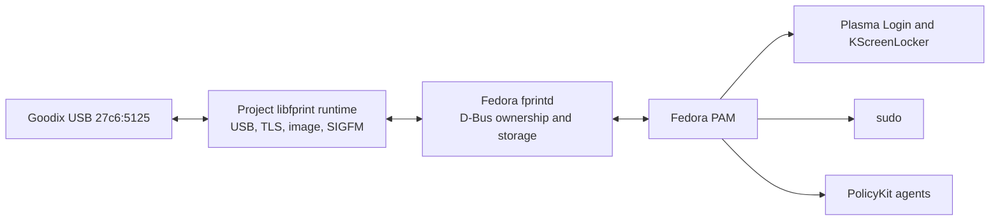
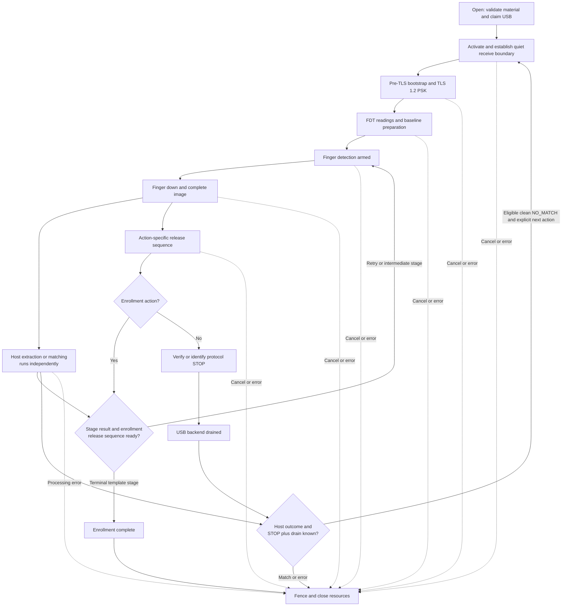
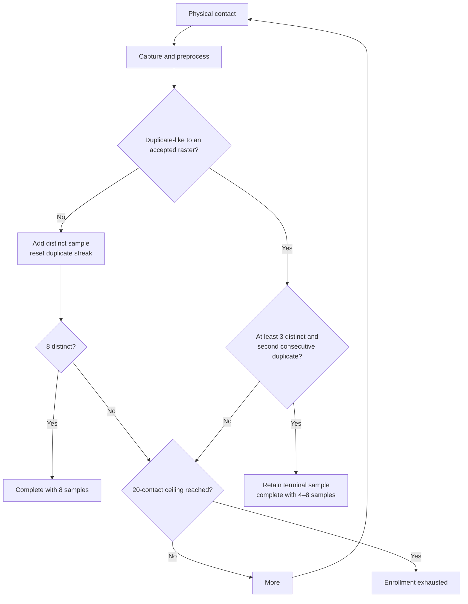
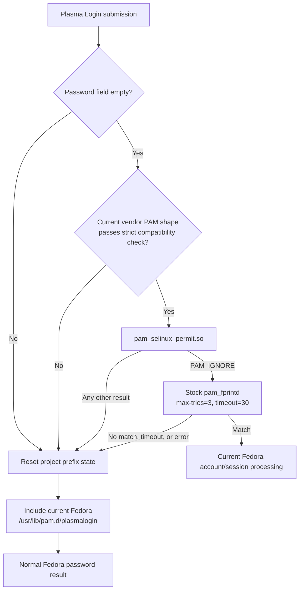
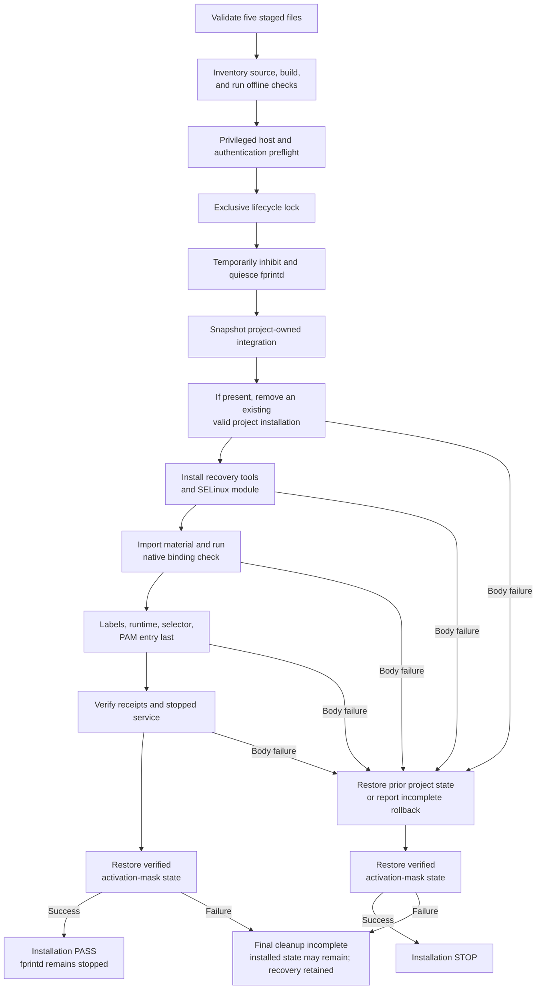

<!-- SPDX-License-Identifier: GPL-2.0-or-later -->
# Goodix USB 27c6:5125 technical manual

This is the authoritative public technical reference for this repository's
Goodix USB `27c6:5125` support. It explains the current implementation from the
USB reader to Fedora authentication consumers, including the secure session,
image and biometric pipeline, system integration, installation, recovery, and
qualification boundary.

The implementation is intentionally narrow. A successful result on the
qualified target must not be generalized to a different Goodix reader,
firmware, distribution, desktop, or authentication policy. Start with
[Installation](docs/INSTALLATION.md) for deployment instructions and use this
manual when reviewing, maintaining, or diagnosing the design.

## Contents

1. [Purpose, scope, and evidence language](#1-purpose-scope-and-evidence-language)
2. [Hardware and device identity](#2-hardware-and-device-identity)
3. [System architecture and ownership](#3-system-architecture-and-ownership)
4. [libfprint driver architecture](#4-libfprint-driver-architecture)
5. [Protected device material and secure transport](#5-protected-device-material-and-secure-transport)
6. [Device initialization and secure-session lifecycle](#6-device-initialization-and-secure-session-lifecycle)
7. [Finger detection, capture, release, and cancellation](#7-finger-detection-capture-release-and-cancellation)
8. [Image decoding and preprocessing](#8-image-decoding-and-preprocessing)
9. [SIGFM extraction, serialization, and matching](#9-sigfm-extraction-serialization-and-matching)
10. [Enrollment, verification, and identification](#10-enrollment-verification-and-identification)
11. [Templates, storage, and multi-user behavior](#11-templates-storage-and-multi-user-behavior)
12. [fprintd integration](#12-fprintd-integration)
13. [Authentication consumers](#13-authentication-consumers)
14. [SELinux and host integration](#14-selinux-and-host-integration)
15. [Build and runtime dependencies](#15-build-and-runtime-dependencies)
16. [Installation, update, and rollback](#16-installation-update-and-rollback)
17. [Removal and emergency recovery](#17-removal-and-emergency-recovery)
18. [Factory preservation, security, and privacy](#18-factory-preservation-security-and-privacy)
19. [Qualification and known limitations](#19-qualification-and-known-limitations)
20. [Troubleshooting and diagnostic principles](#20-troubleshooting-and-diagnostic-principles)
21. [Developer invariants, licensing, and references](#21-developer-invariants-licensing-and-references)

## 1. Purpose, scope, and evidence language

The project adds one image-based fingerprint reader to Fedora's existing
`libfprint`/`fprintd` architecture. It is not a generic Goodix driver family and
does not replace Fedora's authentication stack.

### 1.1 Qualified target

| Dimension | Current boundary |
| --- | --- |
| USB identity | Goodix `27c6:5125` |
| Reader application | `GF_ST411SEC_APP_12509` |
| Host | Fedora 44 KDE, x86_64 |
| Accounts | Local accounts |
| Mandatory access control | SELinux Enforcing |
| Daemon and consumers | Fedora `fprintd`, PAM, Plasma, KScreenLocker, sudo, and PolicyKit |
| Reader population | One integrated reader represented by the tested device |

Other configurations are **not qualified**. That wording means there is not
enough evidence to claim support; it does not prove that every other
configuration is incompatible.

### 1.2 How claims are stated

This manual distinguishes three kinds of evidence:

| Term | Meaning |
| --- | --- |
| Implemented | A property established by the current source and its fail-closed checks |
| Offline tested | Exercised with synthetic fixtures without real USB, host PAM, or biometric authentication |
| Qualified or observed | Reported on the stated Fedora/reader target and reviewed against the implementation and available telemetry |

Offline tests are valuable for parser, lifecycle, and recovery invariants, but
they do not establish recognition accuracy or real-system recovery. Likewise,
one successful physical qualification does not establish a broad hardware or
operating-system compatibility matrix.

## 2. Hardware and device identity

The driver registers only USB vendor/product ID `27c6:5125`; discovery itself is
based on that ID. A biometric activation proceeds only after local material has
passed open-time validation and the live secure bootstrap has confirmed the
supported `GF_ST411SEC_APP_12509` identity and target binding.

Interface 0 supplies the bulk transport used by the implementation:

| Property | Current value |
| --- | --- |
| Bulk OUT endpoint | `0x01` |
| Bulk IN endpoint | `0x81` |
| Outbound B0 TLS chunk | Fixed 64-byte submission, zero-padded as needed |
| Canonical image geometry | 80 × 64 pixels |
| Canonical sample count | 5,120 |
| Driver identifier | `goodix_27c6_5125` |

The `IRQ` labels used later in this manual name Goodix protocol notifications,
not a separately used USB interrupt endpoint. Host commands, responses, secure
records, and acquisition notifications are all coordinated over bulk IN/OUT by
one router.

The implementation does not claim a physical DPI, pixels-per-millimetre value,
or final human-facing orientation. The 80 × 64 raster has a stable canonical
orientation for preprocessing and matching; that is different from a calibrated
physical orientation claim.

Firmware flashing, application replacement, key provisioning, OTP writes,
factory-data writes, and persistent identity or mode changes are outside the
supported path.

## 3. System architecture and ownership

The public runtime keeps the normal Fedora ownership boundaries. Only the
device-specific `libfprint` implementation, its narrowly required private
libraries, protected reader material, and a small Plasma Login selector are
project-owned.



| Layer | Responsibility | Explicit non-responsibility |
| --- | --- | --- |
| Reader | Sensing, Goodix command protocol, TLS client role | Linux user identity and host template storage |
| Goodix driver | USB framing, secure session, capture, preprocessing, SIGFM extraction/matching, cancellation fences | D-Bus authorization, PAM policy, account lifecycle |
| `libfprint` | Device/action abstraction and print serialization | System user authorization |
| Fedora `fprintd` | D-Bus API, exclusive client claim, action orchestration, per-user template files | Goodix protected-material acquisition |
| Fedora PAM and KDE | Authentication policy and user interaction | USB or biometric algorithm implementation |
| Installer/recovery tools | Build, validation, system integration, safe replacement/removal | Biometric authentication and reader reprogramming |

The stock daemon remains `/usr/libexec/fprintd`. A systemd drop-in sets only a
private `LD_LIBRARY_PATH` so that this daemon resolves the project-built
`libfprint` and its four required OpenCV libraries. The project does not ship a
forked `fprintd`, greeter, sudo, PolicyKit service, or global PAM policy.

This separation matters during failure: a driver action may fail without
granting authentication; a PAM consumer may refuse a fingerprint even when the
driver works; and removal can expose current Fedora authentication files without
restoring an obsolete snapshot.

## 4. libfprint driver architecture

The device is implemented as an image device with enroll, verify, identify,
press/release reporting, and cancellation support. One per-open device context
owns the resources that must agree about an action:

| Context member | Role |
| --- | --- |
| Protected-material view | Validated target identity, transport material, configuration, and FDT data |
| USB backend | Bounded asynchronous bulk transfers on interface 0 |
| Frame router | Sole owner of physical bulk-IN reception and A0/B0 demultiplexing |
| Secure-session machine | Ordered pre-TLS bootstrap and response validation |
| TLS engine | In-memory TLS 1.2 PSK server state and recordization |
| Post-TLS lifecycle | Baseline, FDT preparation, finger detection, image, release, and STOP |
| Biometric pipeline | Decode, preprocess, SIGFM extract or match |
| Action fences | Generation tokens, cancellation state, callback drains, and poison state |

### 4.1 Open and close boundary

Opening the libfprint device validates and binds runtime material, allocates the
context, and claims USB interface 0. It deliberately submits no USB traffic.
Activation is the boundary that starts receive synchronization and the secure
reader preparation for an enroll, verify, or identify action.

Closing fences new work, invalidates the active generation, drains host-side
callbacks, releases the USB interface, and clears context and secret state. This
is the recovery boundary after a poisoned or uncertain transport epoch.

### 4.2 Single receive owner

There is never a competing USB reader for command and TLS traffic. The router
owns the physical bulk-IN stream and directs validated frames to either:

- A0 command/response processing; or
- B0 TLS-record processing.

Logical protocol lengths are not inferred from the size of one USB transfer.
Parsers accumulate bounded input, validate framing and checksums, reject trailing
or out-of-phase data, and only then deliver a typed event to the active state
machine.

### 4.3 Action generations and stale work

Every activation has a generation. Asynchronous callbacks and results are
accepted only for the generation that created them. Cancellation invalidates
that generation and waits for outstanding host callbacks to drain.

Generation checks prevent an old callback from completing a new action, but do
not prove that the reader cannot still emit old bytes. A bounded quiet-IN
synchronization therefore precedes every new secure session. If a clean boundary
cannot be proven, the context is poisoned and must be closed rather than reused.

## 5. Protected device material and secure transport

The driver cannot invent the target's existing PSK or factory-derived runtime
data. The user must supply exactly five protected files from a lawfully available
compatible environment. They stay outside the source tree and are imported into
`/var/lib/goodix-5125-poc/` as root-owned, root-only material.

| File | Technical role | Security treatment |
| --- | --- | --- |
| `target-material-manifest.json` | Declares the schema, USB/application target, and digests binding all material and selected live responses | Bounded ASCII JSON; exact schema and fields required |
| `transport-material.bin` | Carries the existing TLS PSK and compatibility validator in a versioned envelope | Secret; never generated, printed, or distributed by the project |
| `target-config-90.bin` | Supplies the validated 224-byte runtime configuration record | Length, structure, finalizer, and manifest binding checked |
| `gfusb.dll` | Provides a qualified OEM compatibility data source | Parsed as inert bounded data; never loaded or executed |
| `fdt-cache.bin` | Supplies the validated FDT seed/cache associated with the target | Length, CRC, manifest binding, and live reader binding checked |

The manifest binds the bundle to `27c6:5125`, the supported application, the
other four files, and target responses used during initialization. File names,
types, modes, ownership, hard-link count, sizes, formats, and digests are checked
before import. The native runtime loader repeats the security-critical content
checks. Symlinks, extra files, writable-by-others inputs, malformed structures,
and a bundle belonging to another target fail closed.

The installed directory is mode `0700`; its regular files are root-owned mode
`0600`. Import uses no-replace semantics. An already installed bundle is retained
only when the complete validated set is byte-identical; an install is not an
implicit mechanism for swapping one reader's secrets for another's.

See [Device materials](docs/DEVICE_MATERIALS.md) for the complete public
contract and acquisition boundary. Do not attach these files, their contents,
raw USB captures, or derived secrets to a bug report.

### 5.1 TLS roles and boundaries

The reader is the TLS client and the host driver is the TLS server. The session
uses TLS 1.2 with the reader's existing PSK. OpenSSL runs over memory BIOs; TLS
records are carried inside the validated B0 transport rather than on a socket.
The implementation pins `PSK-AES128-GCM-SHA256`, disables session tickets, and
requires the expected client identity.

The implementation:

- accepts only the expected PSK identity/secret relationship;
- copies the PSK into the TLS engine through one controlled callback;
- clears temporary secret buffers after the TLS engine has copied them;
- retains one TLS engine for post-handshake control and image records;
- rejects unexpected record types, lengths, phase changes, and extra bytes; and
- fails closed rather than downgrading or manufacturing replacement material.

The pre-TLS compatibility validator and the PSK have different roles. A valid
compatibility response does not reveal or replace the secret, and the OEM DLL is
not treated as the unique identity of a physical reader.

## 6. Device initialization and secure-session lifecycle

In the supported stock-fprintd path, every biometric activation starts from an
owned USB interface and a fresh transport epoch. No normal action assumes that
a prior process left the reader in a useful state. A compiled prepared-login
interface is a separate exception discussed in
[Preparation latency](#122-preparation-latency); no current public consumer
invokes it.



### 6.1 Pre-session receive synchronization

Activation first arms the receive path and looks for a bounded quiet boundary.
Received bytes are discarded during this synchronization phase and the receive
is rearmed; no protocol command is sent first. A zero-byte USB timeout after the
250 ms quiet interval, with the backend drained, is the successful boundary.

This is not an unlimited flush. At most 16 received completions, 64 KiB of data,
or two seconds total are allowed. A non-timeout transfer error, an empty
successful completion, or exhaustion of a hard bound fails closed and poisons
the epoch.

The code does not use blind USB resets, clear-halt loops, factory writes, or
unbounded command retries to force progress. Those operations would hide the
actual state and could cross the factory-preservation boundary.

### 6.2 Pre-TLS bootstrap

The secure bootstrap is a strict phase machine. Its durable responsibilities are:

1. recover the supported application command context;
2. confirm the exact application identity;
3. validate target compatibility against the supplied material;
4. read and bind the expected chip/factory responses without writing them;
5. perform the required operations treated as session/runtime mode and register setup;
6. send the validated configuration record; and
7. enter the transport state in which the reader initiates TLS.

The current phase order is:

```text
REENTRY_RECOVERY_A2
→ A8
→ E4
→ OEM_COLD_START_A2_1
→ CHIP_82
→ OTP_A6
→ OEM_COLD_START_A2_2
→ MODE_70
→ DAC_220 → DAC_236 → DAC_238 → DAC_23A
→ CONFIG_90
→ D1
→ TLS
```

`CHIP_82` is an implementation phase name for a checked four-byte
target-bound response, not a claim that the value is an immutable chip ID.
`OTP_A6` is a read and check of a 64-byte factory/OTP-related response; it does
not write OTP. The four DAC phases apply the validated runtime values for
registers `0x0220`, `0x0236`, `0x0238`, and `0x023A`, and `CONFIG_90` sends the
validated 224-byte configuration.

Some phases require both an acknowledgement and a typed response; others have a
defined acknowledgement-only shape. The transition into TLS is special: the
next expected input is the reader's TLS ClientHello, not a fabricated command
acknowledgement. An event valid in one phase is not accepted in another.

The command-level conversation, including the phase names needed for protocol
review, is documented in the public
[real Goodix conversation appendix](docs/learning/appendix_real_goodix_conversation.md).
That appendix is descriptive; protected payloads and secrets remain outside the
repository.

### 6.3 Post-TLS preparation

After the TLS handshake, the driver drains the handshake boundary before
starting the post-handshake control and protected-data exchange. It then:

1. selects and validates the expected post-TLS controller state;
2. gathers the first two fresh FDT readings;
3. reads the returned threshold and classifies the first measured delta;
4. obtains a no-finger baseline image;
5. gathers a third reading and validates the second delta; and
6. arms finger detection.

The current post-TLS bootstrap is:

```text
A0 D4
→ A0 AF and typed AE controller state
→ A0 0x36 with current table → IRQ 0x0100 → first fresh reading
→ A0 0x50/NAV
→ A0 0x36 → IRQ 0x0100 → second fresh reading
→ post-TLS A0 0x82 → threshold and first-delta classification
→ A0 0x20 → B0/TLS no-finger baseline image
→ A0 0x36 → IRQ 0x0100 → third fresh reading
→ second-delta check
→ A0 0x32 arm
```

FDT preparation is part of each fresh action's trusted state. A threshold or
baseline from an uncertain epoch is not silently reused.

## 7. Finger detection, capture, release, and cancellation

### 7.1 Capture command graphs

Once armed, a verify/identify acquisition follows this order. A0 remains the
control protocol; protected image data travels as TLS records in B0.

```text
IRQ 0x0002 (finger down)
→ A0 0x22 image request
→ B0/TLS complete image record
→ A0 0x34 release request
→ IRQ 0x0200 release notification
→ A0 0x20 plus B0/TLS post-release protected-data payload
→ A0 0x50/NAV transition
→ protocol STOP phase
→ independent USB backend drain
```

`STOP` is the clean protocol phase; backend drain is a separate required
predicate. Neither means that the fingerprint matched. Image processing starts
as soon as the image is delivered and can finish before or after device release,
so the driver waits for the host biometric result, protocol phase, and backend
drain required by that action before teardown or permitted reuse.

Finger-up is not reported to libfprint until the complete release tail has been
accepted. This prevents the user interface from inviting another contact while
the previous contact is still active at the protocol layer.

Enrollment uses a dedicated multi-contact graph. Every contact begins with
`IRQ 0x0002`, A0 `0x22` plus its acknowledgement, and a primary B0/TLS image.
The first contact then establishes its navigation/re-arm path:

```text
A0 0x34/ACK → IRQ 0x0200
→ A0 0x20/ACK → opaque auxiliary B0/TLS payload
→ A0 0x32/ACK
→ A0 0x50/ACK → NAV
→ A0 0x32/ACK → re-arm
```

Later contacts use the repeated/terminal path:

```text
A0 0x34/ACK
→ A0 0x36/ACK → IRQ 0x0100
→ A0 0x20/ACK → opaque auxiliary B0/TLS payload
→ A0 0x34/ACK → IRQ 0x0200
→ intermediate/retry: A0 0x32/ACK → re-arm
→ terminal: finish only after the template-stage decision and release are ready
```

Thus intermediate enrollment contacts do not enter the verify/identify STOP
path, and the terminal enrollment path does not invent a `0x50/NAV` tail. Stage
delivery is deferred until the corresponding release boundary is safe.

### 7.2 One acquisition per explicit verification attempt

Verify and identify perform one physical capture for each explicit client
action. The driver does not hide an automatic loop behind one `VerifyStart`.
A clean `NO_MATCH` may be followed by a new explicit action after full release,
STOP, drain, material reacquisition, and a fresh transport epoch.

A `MATCH` or processing error terminates the current claim's reusable series.
Errors after the transport becomes uncertain also poison the device context.
This conservative boundary prevents a stale secure session or queued byte from
being interpreted as a new authentication attempt.

### 7.3 Cancellation

Cancellation is a host-side terminal fence, not a claim that a specific
device-side cancel command exists. It:

- invalidates the action generation;
- stops accepting new completions;
- cancels host asynchronous transfers;
- waits for callbacks and backend work to drain; and
- marks the epoch non-reusable if clean quiescence is not demonstrated.

The next action is then performed through teardown and reacquisition. On the
qualified system, verification was observed to work after cancellation and
after suspend/resume, but that evidence does not prove arbitrary on-device
quiescence or all power-loss states.

## 8. Image decoding and preprocessing

An accepted image-class TLS application plaintext contains one packed sensor
image. Bounds are fixed and checked before allocation or conversion.

| Representation | Size or shape | Validation |
| --- | --- | --- |
| Packed samples | 7,680 bytes | Exactly 5,120 12-bit samples |
| Image record | 7,684 bytes | Exactly 7,680 packed bytes plus a strict 4-byte record CRC |
| TLS application plaintext | 7,693 bytes | Image class/control, declared length, additive/no-check policy, exact outer structure, and no trailing data |
| Canonical raster | 80 × 64 unsigned 16-bit samples | Values constrained to 12-bit range |
| SIGFM input | 80 × 64 unsigned 8-bit image | Produced by the active preprocessing chain |

The decoder unpacks paired 12-bit values and transposes the sensor's wire order
into the canonical 80 × 64 raster. The image-specific `0x88` no-check marker
permits omission of the additive image-payload checksum, but the record
CRC32/MPEG-2 is always verified. That exception must not be interpreted as
accepting an unchecked record.

### 8.1 Active preprocessing chain

Matching does not use a simple global 12-bit-to-8-bit scaling. It uses the
retained no-finger baseline and the current image:

```mermaid
flowchart LR
    TLS["Bounded TLS image record"]
    Decode["Length, class, checksum, CRC<br/>12-bit unpack and transpose"]
    U16["Canonical 80 × 64 u16 raster"]
    Base["Signed baseline correction<br/>+2048 working offset"]
    Flat["12-bit flat-field normalization<br/>radius 12"]
    Stretch["Percentile stretch<br/>1st to 99th"]
    Sharp["Unsharp enhancement<br/>boost 0.8, sigma 1.5"]
    U8["80 × 64 u8 SIGFM input"]
    Feature["SIFT feature extraction"]

    TLS --> Decode --> U16 --> Base --> Flat --> Stretch --> Sharp --> U8 --> Feature
```



The baseline correction preserves signed differences in a bounded 12-bit
working range. Local flat-field normalization compensates for spatial response;
the percentile stretch avoids allowing a small number of extremes to define the
entire contrast range; and the unsharp stage strengthens local ridge structure
before feature extraction.

Each fresh stock transport session obtains and validates its own FDT baseline.
For SIGFM normalization, however, the first decoded baseline in a
verify/identify series is pinned across clean rollovers in the same libfprint
open context. A rollover obtains a new session baseline for protocol preparation
but continues to normalize against that pinned reference. Enrollment sets and
pins its own initial baseline for all contacts in the action, replacing any
baseline used by its preceding duplicate check. The pinned raster is finally
cleansed when the device context closes.

Sensitive wrapper buffers such as retained baseline, frame, and candidate data
are explicitly cleared where implemented. Not every preprocessing temporary is
guaranteed to be overwritten before it is freed, and complete clearing of
internal allocations made by external libraries such as OpenCV cannot be
guaranteed.

## 9. SIGFM extraction, serialization, and matching

The active biometric implementation is SIGFM, using SIFT features through
OpenCV. It is not the stock NBIS minutiae pipeline.

### 9.1 Feature extraction

The extractor requires the exact 80 × 64, 8-bit input and accepts between 25
and 1,024 validated keypoints. Coordinates must lie inside the image and all
keypoint and descriptor values must be finite. The descriptor matrix must have
one 128-element floating-point row per keypoint.

OpenCV is used only for the bounded feature/matcher operations needed by SIGFM:
SIFT extraction, descriptor matching, and their `core`, `features2d`, `flann`,
and `imgproc` dependencies. USB, TLS, image decoding, baseline correction, and
the surrounding state machines do not depend on OpenCV algorithms.

### 9.2 Serialized sample envelope

Each accepted sample is serialized in a strict `GSF1` envelope. The envelope
contains a version, endianness marker, keypoint count, payload length, and CRC32
around the SIGFM payload. Deserialization rechecks:

- the exact header and supported version;
- integer bounds and total length;
- the 25–1,024 keypoint gate;
- image-coordinate and finite-value constraints;
- the expected descriptor matrix shape;
- CRC correctness; and
- canonical reserialization.

Malformed or non-canonical records are errors, not non-matches. Enrolled sample
envelopes are stored as sensitive libfprint print data, not as public interchange
files.

### 9.3 Matcher and cutoff

The matcher applies nearest-neighbour descriptor ratio filtering followed by
geometric-consistency scoring. Current constants include a `0.75` descriptor
ratio; at least five ratio-test descriptor hits are required before constructing
pairwise records, and at least five length-coherent angle records are required
before final scoring. Pairwise displacement-length and angular coherence each
uses a `0.05` tolerance. The current libfprint cutoff is a score of 40.

That cutoff is an implementation and target-functional threshold. It has **not**
been calibrated into a universal false-acceptance or false-rejection rate and
must not be presented as a security-strength measurement. Matching tests on the
qualified reader establish functional behavior only within the stated scope.

## 10. Enrollment, verification, and identification

### 10.1 Action comparison

| Action | Candidate print set | Physical acquisitions | Terminal behavior |
| --- | --- | --- | --- |
| Enroll duplicate precheck | Existing prints in the user's gallery | One identify acquisition | Existing match stops as duplicate; clean no-match permits enrollment to begin |
| Enroll | New finger | Repeated explicit contacts, bounded at 20 | Completes with 4–8 stored samples or terminates with an error by the contact ceiling |
| Verify | One selected print | One per explicit action | Match, no-match, or processing error |
| Identify | A gallery of prints | One per explicit action | First score meeting cutoff, clean no-match after all samples, or error |

When fprintd verifies one known template it uses verify. When it verifies `any`
against multiple enrolled fingers, or checks enrollment for an existing print,
the driver advertises and uses identify.

### 10.2 Dynamic enrollment policy

Enrollment balances diversity with convergence rather than requiring exactly
eight stored contacts.

| Rule | Value |
| --- | --- |
| Minimum distinct samples before convergence can finish | 3 |
| Maximum distinct/stored samples | 8 |
| Consecutive duplicate-like contacts for convergence | 2 |
| Maximum physical contacts, including retries | 20 |
| Duplicate-like threshold | Mean absolute pixel difference below 8 on the 5,120-byte processed raster |

For every accepted-quality image, the processed raster is compared with all
distinct accepted rasters. A duplicate-like contact before convergence requests
a retry and is not silently stored. Once at least three distinct samples exist,
the second consecutive duplicate-like contact completes convergence and that
terminal image is retained. This gives a final template of 4–8 samples. Eight
distinct samples also complete enrollment.

The 20-contact ceiling includes duplicate retries and prevents an unbounded or
hidden capture loop. Exhaustion is a terminal error that fences the context, not
a reusable no-match. Allocation, preprocessing, extraction, or serialization
failure likewise terminates the action; it does not increment a stage behind
the user's back.



The structural libfprint SIGFM container permits up to 21 sample envelopes, but
the active enrollment policy stores only 4–8. Container capacity does not change
the enrollment rule.

### 10.3 Match outcomes and retry ownership

The driver reports a biometric `MATCH`, clean `NO_MATCH`, or processing/device
error. It does not reinterpret a parser, TLS, template, or allocation failure as
a wrong finger.

Retry policy belongs to the client stack. In the installed Plasma Login PAM
entry, stock `pam_fprintd` is configured with `max-tries=3 timeout=30`. A clean
no-match may let PAM request another explicit attempt. An untouched-reader
timeout ends that PAM call with authentication information unavailable; it
should not be described as three automatic consecutive 30-second waits.

## 11. Templates, storage, and multi-user behavior

Protected reader material and biometric templates are different data classes:

| Data | Scope | Owner | Location | Removed by project removal? |
| --- | --- | --- | --- | --- |
| Reader material | System-wide, target-bound | Project runtime/root | `/var/lib/goodix-5125-poc/` | No |
| Biometric template | Per local username/finger | Fedora `fprintd` | `/var/lib/fprint/` | No |
| Raw image | One in-memory action | Driver process | Not intentionally persisted | Not applicable |

fprintd stores an FP3 print containing metadata and one or more `GSF1` SIGFM
sample envelopes. The storage hierarchy is conceptually:

```text
/var/lib/fprint/<username>/<driver>/<device-id>/<finger-hex>
```

For this implementation the driver name is `goodix_27c6_5125`; the current
device identifier is `0`. fprintd checks driver/device compatibility when loading
a print. The final path component is fprintd's hexadecimal identifier for one of
the standard ten finger positions. The driver does not store templates on the
reader.

fprintd resolves the D-Bus caller's UID through the system account database.
Normal operations target that caller's username; acting on another username is
subject to fprintd/PolicyKit authorization. New local accounts do not require a
driver reinstall: their storage appears lazily when they enroll.

The project does not install an account-deletion hook. Renaming or deleting a
username does not automatically migrate or erase its template directory, and a
later reuse of the same username can encounter retained biometric state. Remove
enrollments through KDE or fprintd before deleting or renaming an account when
cleanup is required.

## 12. fprintd integration

Fedora's stock `fprintd` remains the system authority for fingerprint clients.
It is normally D-Bus activated, serializes ownership through its device claim,
maps clients to users, starts libfprint actions, reports status to PAM/KDE, and
stores the resulting templates.

The service unit remains Fedora-owned and its `ExecStart` remains
`/usr/libexec/fprintd`. The project installs only:

```text
/etc/systemd/system/fprintd.service.d/90-goodix-5125-runtime.conf
```

with the private library directory in `LD_LIBRARY_PATH`. The installer rejects
an unrecognized local service drop-in, an incompatible effective executable,
`LD_PRELOAD`, or a conflicting library environment rather than composing with
unknown authentication code. Fedora-packaged drop-ins under `/usr/lib` remain
eligible when the resulting service still satisfies those checks.

### 12.1 Claim and action lifetime

One D-Bus client claims a device before beginning an action. The driver can
perform clean explicit action rollovers inside a claim, notably:

- a no-match identify duplicate check followed by enrollment; and
- a clean no-match followed by another explicit verify/identify request.

Every rollover still performs full release/STOP/drain and establishes fresh
action resources. A match, processing error, cancellation with uncertain state,
or transport error ends that reusable series.

### 12.2 Preparation latency

The device is not prepared during libfprint open and stock fprintd does not
prepare it before PAM starts a biometric action. The secure bootstrap, TLS, FDT,
and baseline work therefore occurs after the user selects fingerprint. On the
qualified Plasma Login system, allowing roughly one second before placing the
finger produced the expected behavior.

Removing that interval would require a consumer/daemon design that prepares the
reader earlier and safely transfers ownership of the prepared state. The current
release deliberately keeps stock fprintd and accepts the bounded startup cost.

The compiled driver contains a private prepared-login interface that can create
TLS/FDT/baseline state before an authentication action, attach the first verify
or identify action to it, and retain a clean drained session for at most three
explicit no-match attempts. Stock fprintd and the Fedora greeter do not call
that interface, so it is not part of the installed consumer path or current
qualification.

## 13. Authentication consumers

| Consumer | Integration | How fingerprint is selected | Password boundary |
| --- | --- | --- | --- |
| Plasma Login | Project PAM selector plus stock `pam_fprintd` | Submit an empty password field explicitly | A nonempty password immediately enters Fedora's vendor PAM chain |
| KScreenLocker | Stock Fedora PAM/authselect path | Current Fedora policy/UI | Password remains available |
| Ordinary sudo | Stock Fedora PAM/authselect path | May offer fingerprint before password | Untouched reader normally times out to password in about 30 seconds |
| PolicyKit/KDE agent | Stock Fedora PAM/authselect path | Current Fedora policy/UI | Password remains available |

### 13.1 Plasma Login selector

Fedora's observed Plasma Login stack is password-oriented, so the project owns a
small prefix at `/etc/pam.d/plasmalogin` and a module at
`/usr/local/lib64/goodix-plasma-login/pam_goodix_login_gate.so`.



The gate only selects a path. It never authenticates, opens the reader, spawns a
helper, copies a password, or persists/logs a password. Fingerprint routing is
enabled only if the installed Fedora vendor file and its included authentication
files have the expected compatible shape. On a future incompatible layout, the
gate fails safe to Fedora's password path. A failed fingerprint attempt grants
nothing; PAM continues through the current Fedora authentication include with
the token supplied by the greeter.

The prefix also calls `pam_selinux_permit.so`. Only its `PAM_IGNORE` result
continues to `pam_fprintd`; any other result skips fingerprint, resets the
project prefix state, and delegates to the current Fedora authentication stack.
The reset step never grants authentication.

Account, password, and session processing always include the current Fedora
vendor file. No frozen vendor PAM copy is installed. Removal deletes the
project-owned service file first, exposing Fedora's current configuration.

### 13.2 KScreenLocker, sudo, and PolicyKit

No project-specific configuration is installed for these consumers. They use
fingerprint only when the host's current Fedora authentication policy enables
`pam_fprintd`; the installer does not change authselect or global PAM files.

The qualified fresh Fedora baseline used authselect `with-fingerprint` and
observed password and fingerprint success for KScreenLocker, ordinary sudo, and
a KDE PolicyKit dialog. This does not qualify every sudo variant or every
possible PolicyKit action. Password-encrypted KWallet is independent and may
still ask for a password after fingerprint login.

## 14. SELinux and host integration

SELinux remains Enforcing. The installation has two narrow SELinux effects:

| Effect | Purpose | Security boundary |
| --- | --- | --- |
| Exact local file-context mapping for `/var/lib/goodix-5125-poc(/.*)?` | Let `fprintd_t` read validated protected material with the Fedora `fprintd_var_lib_t` type | Ownership is recorded; unrelated mappings are not changed |
| Installer-generated priority-400 module `goodix_5125_hugepage` | Suppress the known denied oneTBB read probe of `nr_hugepages` | `dontaudit` only; grants no read permission |

The module generated by this installer contains the narrow
type/class/permission relationship
`fprintd_t -> sysctl_vm_t:file read`. It exists because the bundled OpenCV path
can cause oneTBB to probe `/proc/sys/vm/nr_hugepages`; denial is non-fatal but
otherwise creates a known audit event.

Module lifecycle identification uses the exact name and priority reported by
`semodule`. A single pre-existing entry named `goodix_5125_hugepage` at priority
400 is treated as this module without inspecting its content, and removal later
deletes that identity. Such a name/priority collision is not part of the clean
qualified baseline and should be resolved before installation.

Because SELinux policy is type-based, the suppression can also hide a different
denied read with the same source type, target type, class, and permission. The
absence of that AVC is therefore not proof that no such access was attempted.
The rule still grants no access. Both normal and emergency removal delete the
project module and restore Fedora's normal audit visibility.

The systemd service drop-in does **not** hide the sysctl path or weaken the
service sandbox. Its only current setting is the private runtime
`LD_LIBRARY_PATH`.

## 15. Build and runtime dependencies

### 15.1 Fedora packages

| Purpose | Packages |
| --- | --- |
| Bootstrap | `git`, `python3` |
| Build toolchain | `gcc`, `gcc-c++`, `meson`, `ninja-build`, `pkgconf-pkg-config`, `binutils` |
| Development headers | `glib2-devel`, `libgusb-devel`, `openssl-devel`, `opencv-devel`, `pam-devel` |
| Runtime/integration | `fprintd`, `fprintd-pam`, `policycoreutils-python-utils` |

The builder runs as the invoking unprivileged user and requires Fedora 44
x86_64. It constructs a source inventory by content, so a source-only copy does
not depend on Git history. It builds the Goodix-enabled libfprint, selector, and
native material checker; verifies ABI and stock-fprintd symbol resolution; runs
offline suites; and records relevant package versions and source digests.

### 15.2 Private and system libraries

The private runtime contains the built libfprint and only the resolved Fedora
OpenCV SONAME files for `core`, `features2d`, `flann`, and `imgproc`, with the
links and notices needed by the build. A restricted OpenCV package description
prevents unrelated modules from entering the link closure.

Fedora's `libgusb`, OpenSSL, GLib, PAM, and remaining system libraries continue
to resolve from system locations. The build verifies that `/usr/libexec/fprintd`
loads the intended private libfprint without unresolved symbols and that
test-only symbols are absent.

The installed source/provenance records are content and package evidence, not a
claim of a byte-reproducible build or an exhaustive software bill of materials.

## 16. Installation, update, and rollback

`install.sh` is the public entry point. It must be run by a normal user, resolves
its own source directory, checks the material staging directory, installs Fedora
prerequisites, and invokes the build/install orchestrator. Privileged mutation
of project-owned integration is isolated to the later apply phase; the earlier
package-manager step also uses sudo to install Fedora prerequisites.



### 16.1 Preflight

Before project-owned integration mutation, the installer requires:

- Fedora 44 on x86_64 with SELinux Enforcing;
- a trusted, package-owned Fedora Plasma Login PAM file;
- the stock fprintd unit and `/usr/libexec/fprintd` executable;
- no unrecognized local fprintd drop-in or preload; and
- either no project library setting or exactly the expected project setting.

The complete staged bundle is validated before build. Inside the locked,
quiescent apply transaction, a root-owned copy of the built native checker
repeats the compatibility binding check without opening USB. Failure triggers
transaction rollback rather than a successful installation. The PAM selector
separately checks the exact vendor, `password-auth`, and `postlogin` shapes at
authentication time before it enables the fingerprint path.

### 16.2 Quiescence and activation inhibition

Install, update, and removal take an exclusive lifecycle lock. They temporarily
mask fprintd through a verified `/run/systemd/system/fprintd.service` link, reload
systemd, stop the service, and require all of these before replacing runtime
code:

```text
ActiveState=inactive
MainPID=0
LoadState=masked
```

A mask that predates the operation is preserved. A temporary mask created by the
operation is removed only after its inode and target still prove ownership.
Unknown ownership is retained and reported rather than deleted by assumption.

The integrated reader remains connected. Lifecycle tools do not enumerate it,
open USB, send commands, or initiate capture. Stopping an already active daemon
may allow that daemon to perform its normal cleanup, but the installer itself
does not start a biometric action or post-install fingerprint test.

### 16.3 Installed paths

| Path | Owner and purpose |
| --- | --- |
| `/usr/local/lib64/goodix-27c6-5125/` | Private libfprint/OpenCV runtime, links, notices, and receipts |
| `/etc/systemd/system/fprintd.service.d/90-goodix-5125-runtime.conf` | Private runtime environment for stock fprintd |
| `/var/lib/goodix-5125-poc/` | Preserved root-only protected reader material |
| `/usr/local/lib64/goodix-plasma-login/` | PAM selector module and metadata |
| `/etc/pam.d/plasmalogin` | Project-owned opt-in prefix and includes of current Fedora PAM |
| `/usr/local/bin/goodix-uninstall` | Receipt-validating normal removal |
| `/usr/local/bin/goodix-force-remove` | Fixed-inventory emergency removal |
| `/usr/local/share/goodix-recovery/` | Recovery receipt and metadata |

Recovery commands are installed before riskier authentication integration. The
Plasma PAM entry is installed last, after runtime and removal paths are ready.
Successful installation leaves fprintd stopped; the next normal consumer causes
Fedora to activate it.

### 16.4 Update and material retention

There is no separate binary updater. Updating means obtaining current public
source and running the same builder/installer. A valid existing installation is
removed and replaced transactionally while fprintd is quiescent.

Existing templates are never part of replacement. An existing valid protected
bundle is retained byte-for-byte when it equals the staged bundle. A different
bundle is refused: changing target secrets is a separate, explicit problem, not
a software update side effect.

### 16.5 Rollback boundary

Before replacement, the installer snapshots project-owned software and records
the material-label state and whether the SELinux module was already present. On
a failure inside the replacement body it attempts to restore the previous
project runtime, integration, labels, and prior module presence. Recovery tools
are retained where possible if rollback is incomplete.

Releasing the temporary activation mask is the final lifecycle step. A failure
there occurs outside the replacement body's rollback handler: it reports final
cleanup as incomplete and retains recovery commands, even if project software
was already installed. That outcome is not an installation success.

Rollback is not a host snapshot. It does not remove Fedora packages installed
earlier by the package manager, undo unrelated host changes, or delete newly
imported protected material. A missing final success marker or an
`incomplete rollback` result is failure and requires recovery.

## 17. Removal and emergency recovery

Two standalone commands are installed because the safe choice depends on the
integrity of the project installation.

| Property | `goodix-uninstall` | `goodix-force-remove` |
| --- | --- | --- |
| Intended use | Healthy installation from a working desktop | Partial, damaged, or login-blocking project state |
| Receipts and hashes | Required and validated | Not required |
| Inventory | Recorded project ownership, links, and expected files | Fixed narrow list of project paths |
| Missing/partial files | Refuses unexplained drift | Tolerates absence and continues safely |
| Clone/build directory needed | No | No |
| Fedora vendor PAM shape needed | No | No |
| Data preservation | Material and templates preserved | Material and templates preserved |

Both use the same safety order:

1. remove the project Plasma Login entry;
2. remove the fprintd runtime drop-in and reload service configuration;
3. inhibit activation and prove fprintd quiescent;
4. remove the project SELinux module;
5. remove the selector and owned material-label effect;
6. remove the private runtime only when quiescence is proven; and
7. remove recovery commands last, only after complete success.

If activation inhibition or service quiescence cannot be proven, the private
fprintd runtime that an old daemon might still have loaded is retained and the
operation reports failure. Material labels are likewise not changed under an
uncertain live runtime. A pre-existing service mask is never claimed as
project-owned.

Both commands preserve:

- `/var/lib/goodix-5125-poc/` and all five material files;
- `/var/lib/fprint/` and enrolled templates;
- staging files and the public clone;
- firmware, existing keys, and persistent reader state.

The owned material file-context mapping can be removed and current Fedora labels
reapplied without reading or changing file contents. Restart after successful
removal so no old login or authentication process retains project code.
Normal removal preserves a compatible mapping recorded as pre-existing;
emergency removal deletes only the exact known project mapping and leaves
unrelated SELinux rules untouched.

Removal exposes the current Fedora configuration. It does not replay a saved PAM
snapshot or repair an independently broken password stack. Emergency use still
requires a working console and administrative password; follow
[Uninstall and emergency recovery](docs/UNINSTALL.md) exactly.

## 18. Factory preservation, security, and privacy

### 18.1 Factory-preserving command boundary

Supported operation uses only allowlisted reads and commands treated by the
implementation as session/runtime operations needed for initialization and
capture. It excludes:

- firmware flashing or in-application programming;
- application clearing or replacement;
- OTP or factory-data writes;
- PSK generation, replacement, or provisioning;
- persistent VID:PID or mode changes; and
- unknown command families used as speculative recovery.

Failure at an unknown phase stops the action. The driver does not try arbitrary
reset/write sequences in the hope of recovering.

This is a code and protocol design property, not proof from an exhaustive
factory-state readback. Successful Linux use does not establish universal
Windows interoperability or absolute non-mutation under every device failure.

### 18.2 Secret and biometric handling

Protected material is outside the repository, imported root-only, and never
printed by the normal tools. The OEM DLL is parsed for bounded compatibility
data and is never loaded as executable code. Selected project buffers—including
the PSK/material transfer buffers and specific normalization wrapper buffers—are
explicitly cleared at their lifetime boundary. This is not a claim that every
project-owned image or feature allocation is overwritten before release.

Raw images are processed in memory and are not intentionally persisted.
Templates are sensitive derivative biometric data stored by fprintd; they are
not reversible promises of anonymity and must be protected and deleted through
normal biometric management when no longer needed.

The project cannot guarantee erasure of copies made inside third-party library
allocators, kernel buffers, crash dumps, or external diagnostic tooling. Do not
enable indiscriminate debug capture on a production account.

Normal-level journal messages can contain biometric-derived metadata such as
keypoint counts and per-template-sample match scores/outcomes. They do not
intentionally contain raw images or serialized templates, but journal exports
should still be treated as sensitive and redacted to the minimum needed for a
report.

### 18.3 Authentication safety boundary

A fingerprint result is only one input to Fedora authentication policy. The
driver never grants a login itself. PAM account/session checks, D-Bus/PolicyKit
authorization, and password recovery remain Fedora responsibilities.

Password access must be kept working before installation and during updates.
The selector is designed so a nonempty Plasma Login password reaches Fedora's
current vendor path without a forced fingerprint wait. Other consumers can
offer fingerprint first according to stock Fedora policy, so an untouched
reader may have to time out before password entry.

See [Security and privacy](docs/SECURITY.md) for reporting rules and the concise
threat boundary.

## 19. Qualification and known limitations

### 19.1 Current qualification evidence

Results are operator-reported observations reviewed against the implementation
and available telemetry.

| Area | Current evidence | Boundary |
| --- | --- | --- |
| Public install | Complete build/import/install passed on fresh and updated Fedora 44 KDE VM and physical target, SELinux Enforcing | One distribution/release, architecture, reader, and application |
| Enrollment/verification | Enrollment completed; registered finger matched; wrong finger produced clean no-match | Functional evidence, not statistical accuracy |
| Plasma Login | Empty-field fingerprint selection and immediate nonempty-password path reached desktop | Current Fedora vendor PAM layout |
| KScreenLocker | Password and fingerprint unlock reached desktop | Qualified stock policy only |
| Ordinary sudo | Password and fingerprint authentication succeeded | Login-shell and all command variants not separately qualified |
| PolicyKit | Password and fingerprint succeeded through a KDE agent | Not every action/agent combination |
| Suspend/resume | Verification observed before and after suspend | Not a broad power-management campaign |
| Cancellation | Waiting and early-action cancellations were followed by a valid reacquired action | Not proof of arbitrary device-side cancellation |
| Normal removal | Project paths removed; password desktop remained usable | Metadata-based material/template preservation evidence |
| Emergency removal | Successful console removal with reader connected was reported | Exact final output and every resulting state check were not supplied |

Offline suites additionally cover material validation, unsafe file types,
binding failures, parser bounds, image checks, enrollment diversity, action
fences, service quiescence, partial-install rollback, ownership/drift handling,
and normal/emergency removal with substituted privileged operations.

### 19.2 Known limitations

| Limitation | Consequence |
| --- | --- |
| One reader/application and Fedora target | No compatibility claim for other Goodix devices, firmware, distributions, desktops, architectures, or multiple readers |
| Local-account qualification only | Network/LDAP/AD account behavior is not established |
| No FAR/FRR study | Score 40 is not a universal biometric security calibration |
| Unknown physical DPI/orientation/polarity | Do not label captures 500 DPI or promise a natural-facing or calibrated-polarity raster |
| Device material is user-supplied | No automated acquisition tool is shipped or qualified; cross-reader interchangeability is not qualified and a different installed/staged bundle is not silently swapped |
| Secure preparation starts with the action | Plasma fingerprint selection has about one second of observed startup latency |
| Stock policy controls most consumers | Altered authselect/PAM may not offer fingerprints; the installer does not rewrite global policy |
| PAM layout evolves | Future Fedora changes may cause the Plasma selector to fall back to password until reviewed |
| KWallet is separate | A password-encrypted wallet may prompt after fingerprint login |
| Account cleanup is not automated | Username rename/delete/reuse requires deliberate template management |
| Hotplug and physical removal | Disconnect/reconnect during an action or lifecycle operation is not qualified |
| Concurrency beyond stock serialization | Competing low-level clients or bypass of fprintd's claim model is not qualified |
| Fault/stale-traffic stress | Process crash, injected faults, and exhaustive late-byte or cross-generation stress are not qualified |
| SELinux audit suppression is type-based | The known denied read tuple can be hidden even when caused by a future process path |
| Factory/Windows proof is incomplete | No exhaustive factory readback, Windows campaign, power-loss campaign, or future-update guarantee |

A concise release qualification boundary is maintained in
[Validation scope and known limitations](docs/VALIDATION.md); the additional
protocol observations above retain narrower evidence from the implementation's
target qualification.

## 20. Troubleshooting and diagnostic principles

Diagnose by ownership layer. A successful build does not prove USB; a successful
USB action does not prove PAM; and a working password does not prove biometric
matching.

| Symptom | First boundary to inspect | Safe evidence |
| --- | --- | --- |
| Reader absent | USB identity/hardware | `lsusb -d 27c6:5125` (from `usbutils`) and non-secret kernel messages |
| Service fails before opening reader | Runtime linking/systemd | `systemctl status fprintd`, service journal, exact loader error |
| Material rejected | Staging/import contract | Exact validator error and file metadata, never file contents |
| TLS/bootstrap failure | Target binding or protocol phase | Exact phase/error name with protected bytes redacted |
| Capture but processing error | Image bounds/preprocessing/template parser | Error class and action, never image/template data |
| Clean no-match | Biometric result | Which explicit attempt and enrolled finger label; do not recast as transport failure |
| Plasma password works, fingerprint path does not | Empty-field selection, PAM compatibility, preparation timing | Whether input was empty and the first non-secret PAM/fprintd error |
| Other consumers omit fingerprint | Fedora authselect/PAM policy | Current host policy; no manual project workaround |
| Removal refuses drift | Receipt/ownership protection | Use the exact reported path; choose documented emergency removal only when needed |

### 20.1 Safe operating rules

- Stop at the first meaningful error and preserve its exact non-secret text.
- Treat missing final `PASS` markers or incomplete rollback as failure.
- Do not disable SELinux, bypass a preflight check, hide/disconnect the reader,
  edit Fedora PAM manually, or delete material/templates as a diagnostic shortcut.
- Do not run KDE enrollment, `fprintd-enroll`, and verification clients
  concurrently; fprintd intentionally serializes its device claim.
- After a cancellation or transport error, allow fprintd to close/reopen the
  device instead of issuing USB resets or replaying commands manually.
- Use `goodix-uninstall` for intact state and `goodix-force-remove` for a partial
  or damaged project installation.
- Keep the reader connected and a working password available throughout install
  and removal.

### 20.2 What to report

Include the Fedora version, kernel version, USB identity, reader application if
known, project revision, exact command or consumer, action being performed,
first non-secret error, and whether password/desktop access still works.

Do **not** share the material directory, manifest, transport material, OEM DLL,
FDT cache, configuration payload, raw USB captures, fingerprint images,
templates, core dumps containing them, or unredacted secret-bearing logs.

## 21. Developer invariants, licensing, and references

### 21.1 Invariants for changes

A change to the driver, builder, or integration should preserve all of these
boundaries unless it explicitly redesigns and requalifies them:

1. exact USB/application targeting and fail-closed material binding;
2. no firmware, OTP, key, factory-data, or persistent-mode writes;
3. one owner for bulk-IN routing and strict A0/B0 phase validation;
4. TLS 1.2 PSK with reader as client and host as server;
5. bounded 80 × 64 image parsing with record CRC verification;
6. baseline-aware active preprocessing before SIGFM;
7. strict `GSF1` parsing and sensitive template handling;
8. one acquisition per explicit verify/identify action;
9. bounded 4–8-sample enrollment and 20-contact ceiling;
10. release/STOP/drain before clean reuse, with poison on uncertainty;
11. stock fprintd/PAM/KDE ownership and working password fallback;
12. service quiescence before runtime replacement or removal;
13. preservation of protected material and fprintd templates; and
14. no expansion of qualification claims without matching evidence.

Protocol and biometric changes need both focused offline tests and target
qualification. Installer changes need fresh-install, update, rollback, normal
removal, and emergency-removal review. Authentication changes need password as
well as fingerprint tests for every affected consumer.

### 21.2 Licensing and provenance

Licensing is per file. The combined Goodix-enabled libfprint is conveyed under
GPL-3.0-or-later because it combines components with compatible but distinct
licenses, including GPL-2.0-or-later preprocessing and Apache-2.0-linked code.
Individual source files retain their own SPDX declarations.

The SIGFM implementation is derived from the documented Rockytkg fork; the
preprocessing/diversity work records its upstream adaptation point. Fedora's
libfprint 1.94.100 source and package provenance are retained in the public
reference tree. The builder installs source-content digests, Fedora package
versions, OpenCV notices, and license texts needed to review the produced
runtime. These records do not claim a complete SBOM.

Use these public references for further detail:

- [Installation](docs/INSTALLATION.md)
- [Removal and emergency recovery](docs/UNINSTALL.md)
- [Security and privacy](docs/SECURITY.md)
- [Validation and limitations](docs/VALIDATION.md)
- [Protected device-material contract](docs/DEVICE_MATERIALS.md)
- [Licensing and provenance](docs/LICENSING_AND_PROVENANCE.md)
- [External references](docs/REFERENCES.md)
- [Build and offline checks](production/README.md)
- [Driver source overview](libfprint-driver/README.md)
- [Learning guide](docs/learning/README.md)

The source itself remains the final authority for exact parser bounds and state
transitions. When this manual and the current implementation differ, treat that
as a documentation defect to resolve—not permission to weaken a runtime check.
