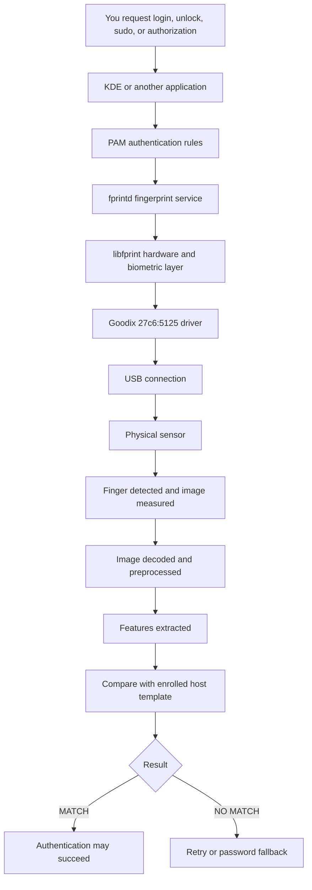

<!-- SPDX-License-Identifier: GPL-2.0-or-later -->
# 1. A two-minute tour

## 👀 What you see

You choose fingerprint authentication, place a finger on the reader, and wait
for a result.

```text
Touch the sensor
       ↓
The computer recognizes you
```

That description is correct, but it hides nearly everything interesting.

## 🧠 What is really happening

KDE does not directly understand this Goodix sensor. It asks the normal Linux
authentication system for help. The request travels down through several
specialists until the Goodix driver can speak to the reader over Universal
Serial Bus (USB).

The answer then travels back up in the opposite direction.



For enrollment, the last part is different. Linux collects several useful
views and saves their feature representations as a template for later use.

## 🏠 A simple analogy

Imagine a hotel:

- KDE, `sudo`, or PolicyKit is the guest asking to enter a room.
- PAM is the hotel's rulebook for proving identity.
- `fprintd` is the fingerprint desk at reception.
- `libfprint` is the specialist who knows the common procedures for readers.
- the Goodix driver is the interpreter who speaks this sensor's language.
- USB is the telephone line to the sensor.
- the sensor is a small camera and measurement device, not the hotel manager.
- the matcher is the clerk comparing today's evidence with the record on file.

No single layer needs to know every other layer's job.

## Two journeys that look similar

### Authentication

Authentication asks: **does this new touch match an enrolled template?**

```text
new touch → new features → compare → MATCH / NO MATCH
```

### Enrollment

Enrollment asks: **can we collect enough useful views to make a reusable
template?**

```text
touch 1 ─┐
touch 2 ─┤
touch 3 ─┤──► accepted feature samples ──► saved template
   ...  ─┘
```

Enrollment is therefore not a successful login repeated several times. It is
the separate job of building the reference that later logins will use.

## What the project adds

Fedora already provides `fprintd`, PAM, KDE integration, and most of
`libfprint`. This project adds the Goodix-specific device path and SIGFM
biometric support needed for this reader. It also adds a small, removable
selector for fingerprint login at Plasma Login on the tested Fedora setup.

The intended boundary is:

```text
Goodix-specific work: sensor protocol + image path + matching
Fedora-owned work:     fprintd + PAM + KDE + sudo + PolicyKit
```

Keeping that boundary small matters. If the fingerprint driver breaks after a
future system change, the password path and desktop should remain Fedora's
normal path.

## What a result does—and does not—mean

- **MATCH** means the current biometric representation crossed the matcher's
  configured comparison threshold against at least one stored sample.
- **NO MATCH** means that comparison did not cross the threshold.
- A bad capture or processing error is not automatically a NO MATCH.
- A MATCH is useful evidence for authentication; it is not proof of perfect
  recognition accuracy for every person and every sensor.
- The fingerprint result is one input to the calling authentication policy.
  PAM and the application still control the final user experience.

## ✅ What to remember

- The visible prompt is only the top of a long chain.
- The sensor measures a finger; host software performs the template comparison.
- Enrollment creates the reference. Verification compares a new touch with it.
- Fedora owns the general authentication layers; the project owns the
  Goodix-specific path.

---

[← Learning home](README.md) | [Next: From Fedora to the sensor →](02_from_fedora_to_the_sensor.md)
