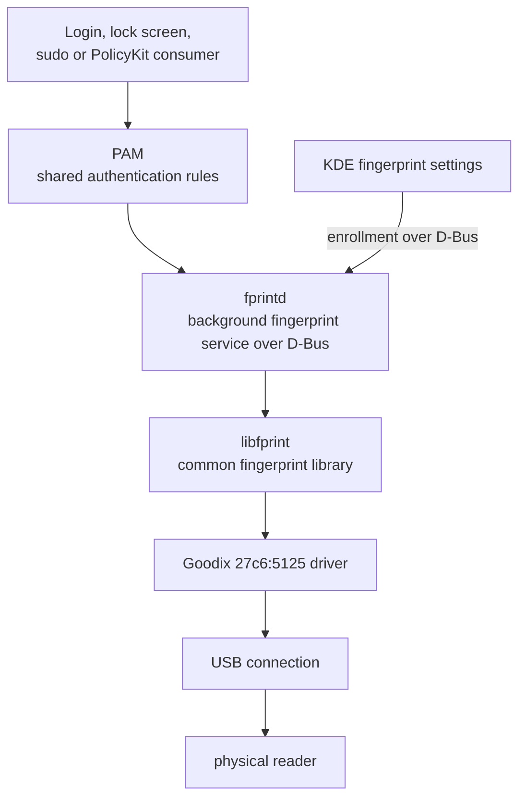

<!-- SPDX-License-Identifier: GPL-2.0-or-later -->
# 2. From Fedora to the sensor

## 🗺️ The software layers

**Pluggable Authentication Modules (PAM)** is Linux's shared authentication
plumbing. Instead of every program
inventing password and fingerprint rules, a program asks PAM to authenticate.
Enrollment management does not need to pass through PAM: KDE's settings can
contact the fingerprint service through **D-Bus**, Linux's message-delivery
system for programs.

**fprintd** is a background service—a program that waits for requests. Think of
it as the receptionist. **libfprint** is the workshop behind the desk: it gives
fprintd one common way to operate many makes of reader. The Goodix driver is the
device specialist inside that workshop.

| Layer | Its question |
|---|---|
| Application or desktop | "May this user continue?" |
| PAM | "Which authentication methods should I try?" |
| fprintd | "Please enroll or verify this finger." |
| libfprint | "Which driver operates this reader?" |
| Goodix driver | "Which USB messages and image steps does this model need?" |

In this repository, Fedora still supplies fprintd, its D-Bus interface, PAM,
and the Plasma components. The project supplies a Goodix-enabled libfprint and
a small, login-only PAM choice described later.

> 🔎 **Want to see this in the repository?** The authoritative division of
> responsibilities is summarized in the [technical manual](../../TECHNICAL_MANUAL.md#architecture).

## ✅ What to remember

KDE does not send USB commands. Each layer has a smaller, clearer job. fprintd
and libfprint are related, but not interchangeable: service desk versus
hardware workshop.

[← Previous](01_what_are_we_building.md) · [Contents](README.md) · [Next →](03_how_linux_talks_to_goodix.md)
