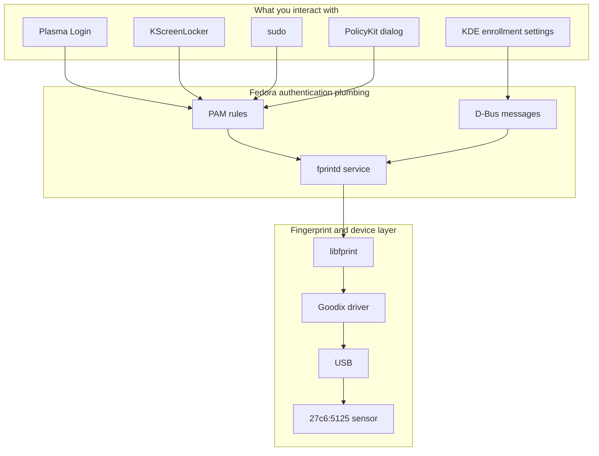

<!-- SPDX-License-Identifier: GPL-2.0-or-later -->
# 2. From Fedora to the sensor

## One request, several jobs

When a program needs to authenticate you, four different questions appear:

1. **Who wants authentication?** A login screen, lock screen, `sudo`, or an
   authorization dialog.
2. **Which methods are allowed?** Password, fingerprint, or another method.
3. **How do we ask for a fingerprint?** Through the system fingerprint service.
4. **How does this particular reader work?** Through `libfprint` and its Goodix
   driver.

Linux keeps these jobs separate so that every application does not need its own
copy of every fingerprint driver.

## 🗺️ The software layers

## PAM: the rulebook

First understand the idea: Linux applications should not each invent their own
password and fingerprint policy.

The shared framework for those rules is **PAM**, short for *Pluggable
Authentication Modules*. A PAM configuration says which checks an application
uses and how success, failure, and fallback are combined.

PAM does not decode fingerprint images. It is the rulebook that can ask the
fingerprint module to try, then continue to a password path when policy allows.

## D-Bus: the intercom

Programs also need a safe way to ask a background service to do work. Think of
**D-Bus** as an intercom inside the operating system.

Instead of opening the sensor itself, a client sends a structured request such
as "start verification" to `fprintd`. `fprintd` later sends structured status
messages back, such as match, no match, or retry.

## Why `fprintd` and `libfprint` both exist

These names are similar, but their jobs are different.

| Layer | Simple role | Hotel analogy |
| --- | --- | --- |
| `fprintd` | A background service that offers fingerprint operations to the rest of Linux | The reception desk that takes requests and manages who is using the reader |
| `libfprint` | A library that provides hardware drivers, image-device behavior, template handling, and matching | The fingerprint specialist behind the desk |
| Goodix driver | The device-specific part inside the fingerprint layer | The interpreter for one particular reader |

`fprintd` uses `libfprint`; it does not replace it. `libfprint` knows how to
operate supported hardware; it does not decide KDE's complete login policy.

## The claim: one customer at a time

Fingerprint operations are stateful. Two programs cannot safely run unrelated
captures through one reader at the same time.

`fprintd` therefore lets a client **claim** the device for an operation. The
client starts enrollment or verification, receives status, stops the operation,
and releases the claim. This is like checking out a shared tool and returning
it when finished.

## Generic Linux versus this Fedora project

| Generally true | True for the tested project setup |
| --- | --- |
| PAM is a Linux authentication framework. | Fedora's current PAM policy offers fingerprint to KScreenLocker, ordinary `sudo`, and PolicyKit on the qualified system. |
| `fprintd` exposes fingerprint work over D-Bus. | Fedora's stock `fprintd` is used; the project does not ship a private replacement daemon. |
| `libfprint` hosts fingerprint drivers and biometric logic. | A project-built Goodix-enabled `libfprint` is loaded for `fprintd`. |
| Desktop behavior depends on its PAM/service integration. | Plasma Login uses a small project-owned selector: a nonempty password goes directly to Fedora's password stack; an empty submission explicitly selects fingerprint. |

The installer does not turn on fingerprint authentication everywhere. Consumers
use it only where the current Fedora policy enables it.

## 🔎 In our Goodix project

The project keeps Fedora's service command and D-Bus interface. A narrow service
drop-in makes stock `fprintd` load the Goodix-enabled library. The architecture
is summarized in the [Technical manual](../../TECHNICAL_MANUAL.md#architecture).

The small Plasma Login selector lives under
[`deployment/plasma-login-opt-in/`](../../deployment/plasma-login-opt-in/).
It is not used for KScreenLocker, `sudo`, or PolicyKit.

## ✅ What to remember

- Applications ask for authentication; they do not speak the Goodix USB
  protocol.
- PAM chooses and combines authentication methods.
- D-Bus carries structured requests to the `fprintd` background service.
- `fprintd` manages the service boundary; `libfprint` handles devices and
  biometrics.
- The Goodix driver is the last software specialist before USB and the sensor.

---

[← Previous: A two-minute tour](01_what_are_we_building.md) | [Up: Learning home](README.md) | [Next: Preparing the sensor →](03_preparing_the_sensor.md)
