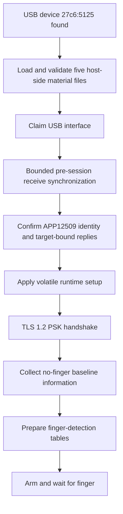

<!-- SPDX-License-Identifier: GPL-2.0-or-later -->
# 3. Preparing a tiny computer

## 👀 What you see

At Plasma Login, the tested setup can take roughly a second after you select
fingerprint authentication before the reader is ready for the first touch.

That is not an artificial waiting animation. The sensor must be opened and
prepared.

## 🧠 What is really happening

A fingerprint reader is a tiny computer with firmware, memory, configuration,
and its own communication rules. Plugged in does not mean ready to capture.

Before the first image, the driver must:

1. recognize the supported USB device;
2. load and validate the reader-specific host material;
3. take temporary ownership of the USB interface;
4. make sure no stale bytes from an earlier session are being mistaken for a
   new reply;
5. confirm the expected APP12509 identity and other target-bound replies;
6. apply the known runtime configuration for this session;
7. establish an encrypted TLS session using the reader's existing key;
8. measure a no-finger baseline and prepare finger detection;
9. arm the sensor and wait for a finger-down event.



If an expected reply, checksum, shape, or state is wrong, the driver stops
rather than improvising.

## 🏠 A simple analogy

Think of opening a secure workshop:

- check the sign on the door;
- use the existing key—do not replace the lock;
- set the workbench for today's job;
- take a photo of the empty bench so later changes are visible;
- switch on the doorbell and wait.

The preparation is mostly temporary. Closing the operation releases host-side
resources and clears sensitive working copies.

## Secure communication: TLS and PSK

**TLS** is a way to create an encrypted, integrity-checked conversation. It is
the same broad idea used for secure websites, although this sensor uses a
device-specific arrangement.

**PSK** means *pre-shared key*: both sides already possess matching secret
material before the conversation begins. In this project, the host acts as the
TLS server and the reader acts as the client.

The important safety point is what the project does **not** do:

```text
use existing reader PSK ✓
replace or provision a PSK ✗
```

No secret value belongs in this guide, the repository, logs, or bug reports.

## Runtime setup is not factory reprogramming

Some values must be sent to place the sensor in the correct state for the
current session. That is **runtime configuration**: temporary working state.

It is different from persistent factory state, which survives power cycles and
belongs to the original device setup.

```text
runtime:     arrange the desk for today's task
persistent:  rebuild the desk or change its serial number
```

The supported project path excludes firmware-update and device-reset
operations, one-time-programmable (OTP) memory writes, PSK replacement, and
persistent identity changes.

## The five host-side material files

Normal operation uses a validated five-file bundle already prepared for the
reader. At a high level it supplies:

- a manifest describing and binding the set;
- transport and secure-session material;
- target runtime configuration;
- validated input derived from the original equipment manufacturer's (OEM)
  software, which is parsed, not executed;
- finger-detection calibration/cache input.

The normal fingerprint flow reads this material from a root-only host
directory. It does not extract it from the sensor each time and does not write
it back into factory storage.

Chapter 9 explains where these files live and how they differ from fingerprint
templates.

## Under the hood, without the byte soup

The real secure-session state machine includes identity checks, selected
device-response validation, runtime mode/configuration steps, and finally the
TLS handshake. After TLS, a second state machine prepares finger detection and
image capture.

Those details are intentionally not the chapter structure. The beginner's
model is enough:

```text
identify → validate → configure for this session → encrypt → calibrate → arm
```

> 🔎 **Want to see this in the repository?**
> The high-level secure-session sequence is in
> [`goodix_secure_session.c`](../../libfprint-driver/goodix_secure_session.c).
> Runtime material loading is in
> [`goodix_runtime_material.c`](../../libfprint-driver/goodix_runtime_material.c),
> and post-TLS preparation is in
> [`goodix_post_tls_lifecycle.c`](../../libfprint-driver/goodix_post_tls_lifecycle.c).

## ✅ What to remember

- The sensor is a small computer, not a passive button.
- It must be identified, validated, configured, secured, and calibrated before
  capture.
- TLS protects the conversation using the existing reader PSK.
- Runtime setup is temporary; it is not permission to alter factory state.
- Preparation time explains the small delay before the first accepted touch.

---

[← Previous: From Fedora to the sensor](02_from_fedora_to_the_sensor.md) | [Up: Learning home](README.md) | [Next: From finger to image →](04_from_finger_to_image.md)
