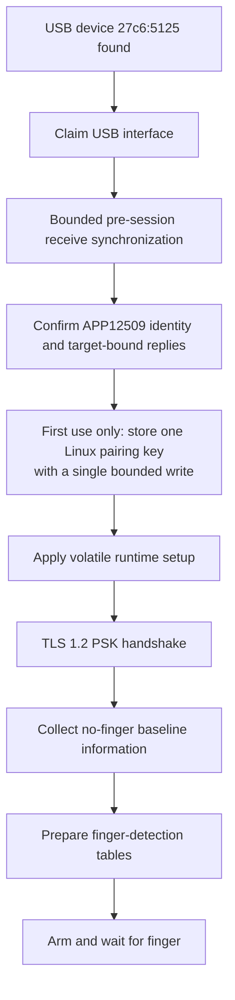

<!-- SPDX-License-Identifier: GPL-2.0-or-later -->
# 3. Preparing a tiny computer

## 👀 What you see

At Plasma Login, the tested setup can take roughly a second after you select
fingerprint authentication before the reader is ready for the first touch.

That is not an artificial waiting animation. The sensor must be opened and
prepared.

## 🧠 What is really happening

A fingerprint reader is a tiny computer with firmware, memory, configuration,
and its own communication rules. Plugged in does not mean ready to capture.

Before the first image, the driver must:

1. recognize the supported USB device;
2. take temporary ownership of the USB interface;
3. make sure no stale bytes from an earlier session are being mistaken for a
   new reply;
4. confirm the expected APP12509 identity and other target-bound replies, and
   read the factory data this session's configuration is built from;
5. on first use only, agree a Linux pairing key and store it with one bounded
   write to the reader;
6. apply the known runtime configuration for this session;
7. establish an encrypted TLS session using the stored Linux pairing key;
8. measure a no-finger baseline and prepare finger detection;
9. arm the sensor and wait for a finger-down event.


```mermaid
flowchart TD
    A["USB device 27c6:5125 found"] --> C["Claim USB interface"]
    C --> D["Bounded pre-session receive synchronization"]
    D --> E["Confirm APP12509 identity and target-bound replies"]
    E --> P["First use only: store one Linux pairing key<br/>with a single bounded write"]
    P --> F["Apply volatile runtime setup"]
    F --> G["TLS 1.2 PSK handshake"]
    G --> H["Collect no-finger baseline information"]
    H --> I["Prepare finger-detection tables"]
    I --> J["Arm and wait for finger"]
```

If an expected reply, checksum, shape, or state is wrong, the driver stops
rather than improvising.

## 🏠 A simple analogy

Think of opening a secure workshop:

- check the sign on the door;
- cut one key of your own for the existing lock—never change the lock;
- set the workbench for today's job;
- take a photo of the empty bench so later changes are visible;
- switch on the doorbell and wait.

The preparation is mostly temporary. Closing the operation releases host-side
resources and clears sensitive working copies.

## Secure communication: TLS and PSK

**TLS** is a way to create an encrypted, integrity-checked conversation. It is
the same broad idea used for secure websites, although this sensor uses a
device-specific arrangement.

**PSK** means *pre-shared key*: both sides already possess matching secret
material before the conversation begins. In this project, the host acts as the
TLS server and the reader acts as the client.

The important safety point is where the boundary sits:

```text
factory key and factory data left untouched ✓
one bounded Linux host pairing, stored root-only ✓
repeated, automatic or retried pairing writes ✗
sharing the Linux key with Windows ✗
```

No secret value belongs in this guide, the repository, logs, or bug reports.

## Runtime setup is not factory reprogramming

Some values must be sent to place the sensor in the correct state for the
current session. That is **runtime configuration**: temporary working state.

It is different from persistent factory state, which survives power cycles and
belongs to the original device setup.

```text
runtime:     arrange the desk for today's task
persistent:  rebuild the desk or change its serial number
```

The supported project path excludes firmware-update and device-reset
operations, one-time-programmable (OTP) memory writes, factory key replacement,
and persistent identity changes. The single exception is the one bounded
host-pairing write described above; ordinary later use repeats no write at all.

## Where the session inputs come from

The driver builds what it needs from the reader itself. A bounded read-only
preflight confirms the identity, reads the factory/OTP data and the reader's
current pairing record, and derives the exact runtime configuration locally.
Finger-detection calibration is learned live from a no-finger baseline, so no
imported cache file is needed. The Linux pairing key is generated locally and
stored root-only on the host, never read out of the sensor.

Nothing has to be prepared in advance and nothing has to be copied from another
operating system:

- the reader's identity and factory data are read during the preflight;
- the runtime configuration is derived from that OTP data on the host;
- the pairing key is generated locally and stored under `/var/lib/fprint/`;
- finger-detection calibration is measured fresh for each action.

The driver reads the factory data it needs and cross-checks every reply against
the reader before use. It does not write that data back into factory storage.

Chapter 9 explains where the host pairing state lives and how it differs from
fingerprint templates.

## The simple map, without the byte soup

The real secure-session state machine includes identity checks, selected
device-response validation, runtime mode/configuration steps, and finally the
TLS handshake. After TLS, a second state machine prepares finger detection and
image capture.

Those details are intentionally not the chapter structure. The beginner's
model is enough:

```text
identify → validate → configure for this session → encrypt → calibrate → arm
```

## 🔬 Under the hood: the conversation has real steps

Those six verbs are not placeholders for a single magic "start" command. The
current driver expands them into a checked state machine. At the human level,
the conversation looks like this:

```text
enter the project's checked re-entry path
        ↓
confirm the expected firmware target
        ↓
validate the target-bound replies and read the factory data
        ↓
perform the known cold-start preparation
        ↓
select the operating mode and apply runtime tuning
        ↓
send the validated runtime configuration block
        ↓
transition into TLS and complete the protected handshake
        ↓
begin the post-TLS working sequence
        ↓
collect fresh finger-detection information and a no-finger baseline
        ↓
arm the reader and wait
```

The implementation gives every step a precise phase label. These are the real
labels, followed by a cautious beginner translation:

| Current phase | Beginner translation |
| --- | --- |
| `REENTRY_RECOVERY_A2` | Run one bounded project re-entry step before identification. This label does not mean a factory reset. |
| `A8` | Require the exact `GF_ST411SEC_APP_12509` identity expected by this driver. |
| `E4` | Check the expected validator derived from the stored Linux pairing key. The validator is not the PSK. |
| `OEM_COLD_START_A2_1` | Perform the first known cold-start preparation step. |
| `CHIP_82` | Read four target-bound bytes and require their saved data fingerprint (cryptographic digest) to match the recorded expected value. The code does not prove that they are an immutable chip ID. |
| `OTP_A6` | Read and check the expected factory/OTP-related response; do not write factory information. |
| `OEM_COLD_START_A2_2` | Perform the second known cold-start preparation step. |
| `MODE_70` | Select the required runtime operating mode. |
| `DAC_220` through `DAC_23A` | Apply four validated runtime tuning values using command `0x80`. |
| `CONFIG_90` | Send the validated 224-byte runtime configuration block, derived locally from the live OTP read. |
| `D1` | Leave the ordinary pre-TLS request/reply sequence and begin the `B0`-wrapped secure-transport transition. |
| `TLS` | Complete the TLS 1.2 PSK handshake with the host as server and the reader as client. |
| `D4` then `AF` | Begin the post-TLS sequence and confirm the reader controller is in the expected state. |
| FDT bootstrap | Gather fresh detection readings, obtain the no-finger baseline, derive or validate tables, and send the first `0x32` arm command. |

That sequence is what an ordinary reopen runs. On first use - or after Windows
has replaced the pairing - a bounded read-only preflight runs first and exactly
one pairing write may occur before TLS. Every later Linux session reuses the
stored key and writes nothing.

In exact phase order, the secure-session portion is:

```text
REENTRY_RECOVERY_A2 → A8 → E4 → OEM_COLD_START_A2_1
→ CHIP_82 → OTP_A6 → OEM_COLD_START_A2_2 → MODE_70
→ DAC_220 → DAC_236 → DAC_238 → DAC_23A → CONFIG_90
→ D1 → TLS
```

The post-TLS lifecycle then continues with `D4 → AF → FDT preparation →
0x32 arm → wait for a finger`. Each transition checks the expected message
class, order, shape, acknowledgement, or typed reply. A mismatch stops the
session instead of guessing what the reader meant.

> [!NOTE]
> The phase names are exact implementation labels. The translations beside
> them are deliberately cautious: they explain what the current code checks,
> not undocumented internal firmware behavior.

> 🧪 **Want to open the box one level further?**
> See [Appendix — The real Goodix conversation](appendix_real_goodix_conversation.md)
> for a beginner-friendly walk-through of `A8`, `E4`, `D1`, `D4`, `AF`, FDT,
> and the other labels.

> 🔎 **Want to see this in the repository?**
> The high-level secure-session sequence is in
> [`goodix_secure_session.c`](../../libfprint-driver/goodix_secure_session.c).
> The read-only preflight is in
> [`goodix_live_preflight.c`](../../libfprint-driver/goodix_live_preflight.c),
> the single bounded pairing write is in
> [`goodix_pairing_activation.c`](../../libfprint-driver/goodix_pairing_activation.c),
> and the root-only host state is in
> [`goodix_self_state.c`](../../libfprint-driver/goodix_self_state.c).
> Legacy material loading is in
> [`goodix_runtime_material.c`](../../libfprint-driver/goodix_runtime_material.c),
> and post-TLS preparation is in
> [`goodix_post_tls_lifecycle.c`](../../libfprint-driver/goodix_post_tls_lifecycle.c).

## ✅ What to remember

- The sensor is a small computer, not a passive button.
- It must be identified, validated, configured, secured, and calibrated before
  capture.
- TLS protects the conversation using the stored Linux pairing key.
- First use performs one bounded pairing write; ordinary later use writes
  nothing.
- Runtime setup is temporary; it is not permission to alter factory state.
- The simple lifecycle maps to a real, ordered, fail-closed protocol state
  machine.
- Preparation time explains the small delay before the first accepted touch.

---

[← Previous: From Fedora to the sensor](02_from_fedora_to_the_sensor.md) | [Up: Learning home](README.md) | [Next: From finger to image →](04_from_finger_to_image.md)
