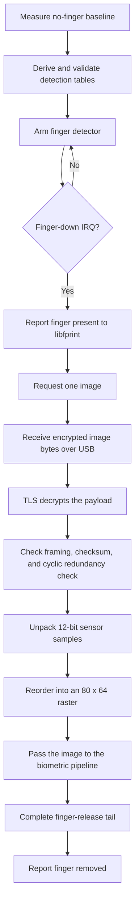

<!-- SPDX-License-Identifier: GPL-2.0-or-later -->
# 4. From finger detection to image

## The doorbell and the camera

Detecting a finger and reading a fingerprint are not the same operation.

> Finger detection is the doorbell: **someone is here**.
> Image acquisition is the camera: **take the picture now**.

If the sensor captured full images continuously, it would move more data, do
more work, and create more opportunities for confused state. Instead, the
driver prepares a low-level finger detector and waits for a meaningful event.

## A no-finger baseline

Before waiting, the current driver collects information about the sensor with
no finger present. This baseline gives it a reference for what "empty" looks
like in the current session.

The project calls this area **FDT**, short for finger-detection data. You can
think of it as a small set of readings used to distinguish the empty sensor
from a changed surface.

The driver derives and validates small detection tables from those readings.
It then arms the sensor.

## An interrupt: the sensor rings the bell

The reader can report an **interrupt**, often shortened to **IRQ**. An interrupt
is simply a device saying, "an event happened; please pay attention."

For this reader, a validated finger-down event uses IRQ `0x0002`. The driver
reports "finger present" to `libfprint`, then asks the sensor for the image.

The hexadecimal number is not important to remember. The important separation
is:

```text
finger-down event ≠ fingerprint image
```

## 🗺️ The capture flow



## Raw bytes are not yet a picture

USB delivers bytes. The driver must prove that they have the exact expected
shape before treating them as an image.

The current decoder checks the message framing, its checksum policy, and a
record cyclic redundancy check (CRC), which helps detect corrupted data. It
then unpacks compact 12-bit samples and rearranges their wire order into a
normal two-dimensional raster.

The result is:

```text
width:  80 pixels
height: 64 pixels
total:  5,120 sensor samples
```

That is a small grayscale fingerprint image. It is not a name, user account,
or authentication result.

## The release tail matters

After the main image, the protocol still has work to do. The reader reports a
finger-up event, and the driver completes a bounded release sequence. It
refreshes the finger-detection state, consumes protocol-internal data, and only
then tells `libfprint` that the finger is gone.

This ordering prevents the next capture from starting while the current
physical contact is still being cleaned up.

```text
image received
   ≠ operation fully finished

image received
   + finger-up
   + release sequence complete
   = safe contact boundary
```

## An image is not recognition

Reaching an 80×64 image was a major engineering milestone, but it answers only:

> Did we receive and decode a plausible fingerprint image?

Recognition asks a later and different question:

> Do features extracted from this image match features saved during enrollment?

The next chapter crosses that boundary.

> 🔎 **Want to see this in the repository?**
> Finger detection and release sequencing live in
> [`goodix_post_tls_lifecycle.c`](../../libfprint-driver/goodix_post_tls_lifecycle.c).
> Image framing, CRC, 12-bit unpacking, and raster order are in
> [`goodix_image_decoder.c`](../../libfprint-driver/goodix_image_decoder.c).

## ✅ What to remember

- Finger detection is a lightweight event; image capture is a separate action.
- A no-finger baseline helps the reader notice a real contact.
- The image crosses USB inside the secure session.
- The driver validates and decodes bytes into an 80×64 raster.
- Capture is not complete until the finger-release sequence is safely finished.
- A decoded image still does not mean the person has been recognized.

---

[← Previous: Preparing the sensor](03_preparing_the_sensor.md) | [Up: Learning home](README.md) | [Next: From image to template →](05_from_image_to_template.md)
