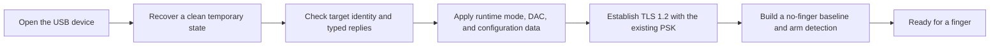

<!-- SPDX-License-Identifier: GPL-2.0-or-later -->
# 4. Waking and preparing the sensor

The reader is a tiny computer. Before it can take a fingerprint image, the
driver must identify the expected target, put volatile (temporary) working
state in order, load the right runtime settings, and establish a secure session.

The exact conversation has named protocol phases, including identity checks,
runtime mode and digital-to-analog converter (DAC) settings, configuration,
and then Transport Layer Security (**TLS**). Those names are useful to
engineers, but the beginner's picture is simply: **check, configure, secure,
measure the empty sensor, then wait**.

## 🔐 The secure conversation

TLS is a protected tunnel between host and reader. This target uses a
**pre-shared key (PSK)**: a secret the existing device and qualified host input
already know. Here the host acts as the TLS server and the reader as client.
The project consumes the reader's existing material; it does not print,
replace, generate, or provision that key.

This is like opening a sealed phone line using an agreed passphrase. The
passphrase proves the participants can begin the protected conversation. It is
not the user's fingerprint template.

Configuration used while operating is runtime state. A restart or a new
session can require preparation again. That is deliberately different from
rewriting permanent factory state.

> 🔎 **Repository view:** the state sequence is defined in
> [`goodix_secure_session.h`](../../libfprint-driver/goodix_secure_session.h)
> and the later capture preparation in
> [`goodix_post_tls_lifecycle.h`](../../libfprint-driver/goodix_post_tls_lifecycle.h).

## ✅ What to remember

- Ready-to-use is a state reached through checked steps.
- TLS protects the link; the existing PSK is protected material.
- Preparing the reader does not mean reflashing or reprovisioning it.

[← Previous](03_how_linux_talks_to_goodix.md) · [Contents](README.md) · [Next →](05_waiting_for_a_finger.md)
