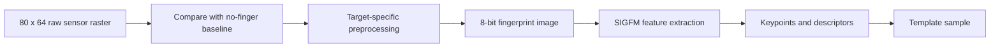

<!-- SPDX-License-Identifier: GPL-2.0-or-later -->
# 5. From image to fingerprint template

## A photograph is not the best comparison tool

Suppose you take two photos of the same finger. The finger may be shifted,
rotated, pressed more firmly, or slightly drier in one photo. Comparing the two
images pixel by pixel would be fragile.

Biometric software therefore looks for a more useful representation: stable,
distinctive structures that can still be compared when the pictures are not
identical.

That reusable representation is called a **template**.

## The project-specific image pipeline

The production path for this project uses **SIGFM**. This is the name of the
feature extraction and matching method integrated into the Goodix-enabled
`libfprint` build.

The path is:



### 1. Raw raster

The decoder produces 5,120 values. Each describes one small location on the
sensor.

### 2. Preprocessing

The current pipeline uses the session's no-finger image as a baseline. It
combines that baseline with the finger image and produces an 8-bit grayscale
raster suitable for SIGFM.

This is closer to preparing a scanned page before optical character recognition
than to recognizing the person directly. It improves the input; it does not
make the final identity decision.

### 3. Feature extraction

SIGFM finds **keypoints** and builds numerical **descriptors** around them.
A keypoint is a locally interesting place in the fingerprint image. A
descriptor summarizes what the nearby pattern looks like so that it can be
compared later.

Many fingerprint explanations use the word **minutiae** for ridge endings and
bifurcations. That is a useful general concept, but it would be misleading to
say that this production path stores only a classic minutiae list. Its actual
stored samples are SIGFM keypoints and descriptors.

### 4. Template sample

The extracted representation becomes one sample inside a `libfprint`
fingerprint template. Enrollment can place several accepted samples into the
same template so later touches have more than one useful reference.

## What is saved—and what is not

The template is not meant to be a normal photograph. `libfprint` serializes the
SIGFM feature representation together with metadata needed to understand it.
The raw debugging image is not the normal stored identity record.

This does not make templates harmless. A biometric template is sensitive
personal data and must not be published, attached to bug reports, or committed
to source control.

## Matching is a score, then a decision

During verification, SIGFM extracts one new probe sample. It compares that
probe with the enrolled samples one at a time and produces a similarity score.

```text
probe sample
    │
    ├─ compare with enrolled sample 1
    ├─ compare with enrolled sample 2
    └─ compare with enrolled sample 3 ...

any score reaches the configured threshold → MATCH
no score reaches it                         → NO MATCH
matcher cannot process valid data           → ERROR
```

A threshold is a boundary chosen by the implementation. It is not a statement
that two fingerprints are mathematically identical.

## Features are not identity by themselves

A feature sample has no Linux username magically embedded in it. The username,
finger label, device compatibility information, and samples are assembled by
the host software into a stored record. `fprintd` associates that record with
the user account and finger label.

The sensor does not receive a list of local Linux users and does not choose one.

> 🔎 **Want to see this in the repository?**
> Baseline-aware image preprocessing is connected in
> [`goodix_fpimage_pipeline.c`](../../libfprint-driver/goodix_fpimage_pipeline.c).
> The SIGFM extraction, score, and safe serialization boundary is in
> [`goodix_sigfm_metrics.cpp`](../../libfprint-driver/goodix_sigfm_metrics.cpp).

## ✅ What to remember

- Pixel-for-pixel comparison would be too fragile.
- Preprocessing prepares the image; it does not identify the user.
- The current production representation is SIGFM keypoints and descriptors,
  not merely a traditional minutiae list.
- A template can contain several accepted feature samples.
- Matching compares a new probe with stored samples and applies a threshold.
- Templates are sensitive biometric data even though they are not ordinary
  fingerprint photographs.

---

[← Previous: From finger to image](04_from_finger_to_image.md) | [Up: Learning home](README.md) | [Next: Enrollment →](06_enrollment.md)
