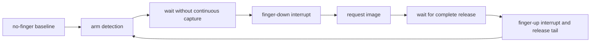

<!-- SPDX-License-Identifier: GPL-2.0-or-later -->
# 5. Waiting for a finger

## 🚪 Doorbell first, camera second

Continuously taking full images would waste work and confuse contact with a
usable capture. The sensor instead behaves like a motion sensor beside a
camera: first notice someone, then take the picture.

The driver first obtains a **baseline**, a measurement of the sensor with no
finger. It prepares finger-detection data and arms the reader. The reader later
reports an **interrupt** (often shortened to IRQ): a small "pay attention now"
signal. Checked flags and fresh detection data tell the state machine whether
the expected finger-down or finger-up event occurred.

Finger release matters. It separates one physical touch from the next and
allows fresh detection information before rearming. During enrollment it also
keeps a later sample tied to a new physical touch rather than one unchanged
contact.

The names `IRQ2`, `IRQ0200`, and finger-detection-table (FDT) appear in the
implementation. They are target-specific protocol labels, not universal Linux
fingerprint rules.

## ✅ What to remember

- Detection says "a finger is here"; it is not an image or identity result.
- A baseline helps distinguish contact from the empty sensor.
- A complete finger-up path makes the next touch a new attempt.

[← Previous](04_waking_up_and_preparing_the_sensor.md) · [Contents](README.md) · [Next →](06_from_finger_to_image.md)
