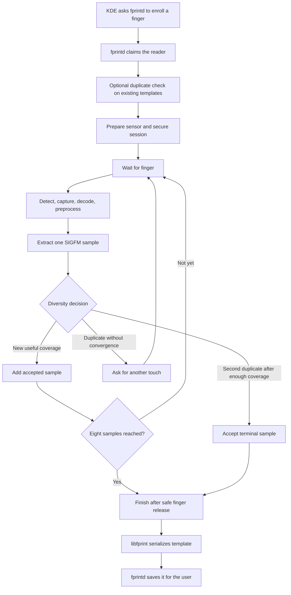

<!-- SPDX-License-Identifier: GPL-2.0-or-later -->
# 6. Enrollment

## 👀 What you see

KDE asks you to touch and lift the same finger several times. A progress
indicator advances until the finger is enrolled.

It can feel repetitive, but each useful touch sees a slightly different part
or pressure pattern.

## 🏠 A simple analogy

Imagine teaching someone to recognize a handwritten signature. One example is
helpful, but several natural examples show what changes and what stays stable.

Fingerprint enrollment does the same kind of job:

```text
one finger, several views → a reusable reference
```

It does **not** average the images into a prettier photograph. Each accepted
view contributes its own SIGFM feature sample to the template.

## 🗺️ The enrollment flow



## How many touches?

The current Goodix path is bounded but not simply "always eight touches."

- It accepts at most eight template samples.
- It wants at least three distinct views before early convergence is possible.
- A capture that is too similar to accepted coverage can be rejected and the
  same enrollment stage retried.
- After enough distinct coverage, two duplicate-like captures in a row can
  signal convergence; the final one becomes the terminal accepted sample.
- This makes the stored template contain between four and eight accepted
  samples.
- A hard ceiling of 20 physical enrollment contacts prevents endless retries.

The enrollment exercised on the tested reader reached all eight accepted
stages. The dynamic rules above describe the current implementation, not a
promise that every finger will finish in the same number of touches.

## Why lifting the finger matters

A physical touch is not finished the instant its image is available. The
driver must observe the release boundary and complete the protocol tail.

Only then is it safe to arm the next stage. This is why good enrollment prompts
alternate between touching and lifting instead of asking you to hold the finger
while the system silently takes unlimited pictures.

## Who is responsible for what?

| Component | Enrollment responsibility |
| --- | --- |
| KDE settings | Shows the user interface and progress. |
| `fprintd` | Checks permission, claims the reader, starts/stops enrollment, labels the finger, and saves the completed record. |
| `libfprint` | Builds the host template, reports progress, serializes the result, and coordinates image processing. |
| Goodix driver | Prepares the reader and performs bounded finger detection, image capture, release, and diversity decisions for this sensor. |
| SIGFM | Extracts one feature sample from each accepted preprocessed image. |
| Sensor | Measures the finger and returns device data; it does not save the Linux user's final template in this project. |

## What happens when a sample is poor or repetitive?

Three outcomes are easy to confuse:

- **accepted:** the sample advances the template;
- **retry:** the physical contact was consumed, but the sample did not add
  useful new coverage;
- **fatal processing or protocol error:** enrollment stops safely rather than
  hiding another sensor acquisition.

The current driver deliberately fails closed after certain processing failures.
That prevents a completed sensor-side acquisition from silently turning into an
unexpected extra contact.

## When does saving happen?

The driver does not write the finished template into the sensor. It hands the
accepted samples to `libfprint`. `libfprint` serializes the biometric
representation, and `fprintd` stores it under the host's fingerprint storage
area for the selected user and finger label.

That division becomes important during uninstall: removing the driver can
preserve the user's templates for later reinstallation.

> 🔎 **Want to see this in the repository?**
> The diversity policy and its bounds are in
> [`goodix_enrollment_diversity.c`](../../libfprint-driver/goodix_enrollment_diversity.c).
> The protocol-stage model is in
> [`goodix_enrollment_model.c`](../../libfprint-driver/goodix_enrollment_model.c).

## ✅ What to remember

- Enrollment teaches the host using several views of one finger.
- Accepted images become separate SIGFM feature samples in one template.
- The current policy stores four to eight accepted samples and bounds physical
  contacts at 20.
- Finger release is part of every safe stage boundary.
- `fprintd` saves the completed host template; the sensor does not become a
  database of Linux users.

---

[← Previous: From image to template](05_from_image_to_template.md) | [Up: Learning home](README.md) | [Next: Verification and matching →](07_verification_and_matching.md)
