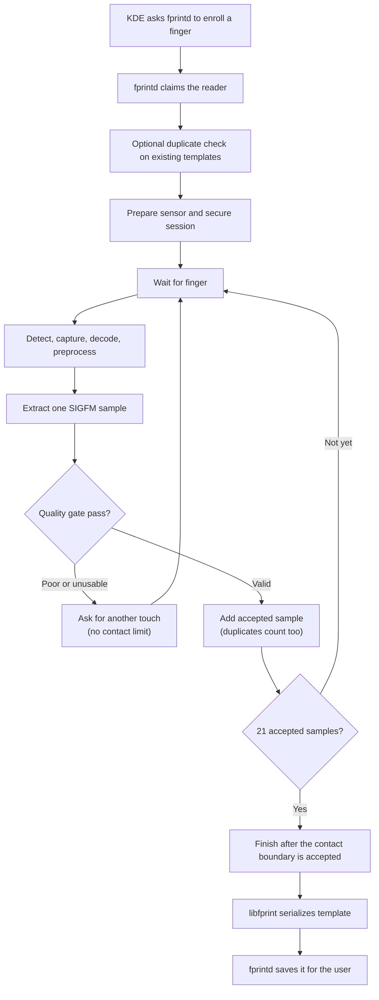

<!-- SPDX-License-Identifier: GPL-2.0-or-later -->
# 6. Enrollment

## 👀 What you see

KDE asks you to touch and lift the same finger several times. A progress
indicator advances until the finger is enrolled.

It can feel repetitive, but each useful touch sees a slightly different part
or pressure pattern.

## 🏠 A simple analogy

Imagine teaching someone to recognize a handwritten signature. One example is
helpful, but several natural examples show what changes and what stays stable.

Fingerprint enrollment does the same kind of job:

```text
one finger, several views → a reusable reference
```

It does **not** average the images into a prettier photograph. Each accepted
view contributes its own SIGFM feature sample to the template.

## 🗺️ The enrollment flow


```mermaid
flowchart TD
    A["KDE asks fprintd to enroll a finger"] --> B["fprintd claims the reader"]
    B --> C["Optional duplicate check on existing templates"]
    C --> D["Prepare sensor and secure session"]
    D --> E["Wait for finger"]
    E --> F["Detect, capture, decode, preprocess"]
    F --> G["Extract one SIGFM sample"]
    G --> H{"Quality gate pass?"}
    H -->|Poor or unusable| J["Ask for another touch<br/>(no contact limit)"]
    H -->|Valid| I["Add accepted sample<br/>(duplicates count too)"]
    I --> K{"21 accepted samples?"}
    J --> E
    K -->|Not yet| E
    K -->|Yes| L["Finish after the contact boundary is accepted"]
    L --> M["libfprint serializes template"]
    M --> N["fprintd saves it for the user"]
```

## How many touches?

The current source implements the fixed-21 enrollment policy:

- Enrollment completes exactly at the 21st accepted valid sample.
- There is no early completion: 20 accepted samples never finish enrollment.
- A 22nd accepted sample is unreachable.
- Poor or unusable contacts request a retry without progress; they never count
  toward the 21.
- Physical contacts are not capped: retries may push the contact count beyond
  21 without ending enrollment.
- Valid duplicate and near-duplicate contacts are accepted and count like any
  other valid sample; their detection is diagnostic only and never completes,
  delays or blocks enrollment.

The policy combines the SIGFM keypoint/coverage and raster quality gate for
poor-sample retries with per-contact diversity diagnostics. It has passed
offline policy tests, but the fixed-21 behavior has not yet been qualified on
the real reader. The earlier target qualification reached eight accepted
stages under the superseded policy.

## Why lifting the finger matters

A physical touch is not finished the instant its image is available. In the
ordinary path, the driver observes the release boundary and completes the
protocol tail before arming the next stage.

Enrollment also handles a specific zero-mask sensor report by keeping the image
already captured and skipping the extra acquisition. Normal sample checks still
apply before another touch is requested; a final sample can complete without a
separate release notification. The [technical manual](../../TECHNICAL_MANUAL.md#74-enrollment-zero-mask-recovery)
describes this bounded rule and its remaining late-event limitation.

Keep following the touch-and-lift prompts. The driver does not silently take
unlimited pictures while you hold the finger in place.

## Who is responsible for what?

| Component | Enrollment responsibility |
| --- | --- |
| KDE settings | Shows the user interface and progress. |
| `fprintd` | Checks permission, claims the reader, starts/stops enrollment, labels the finger, and saves the completed record. |
| `libfprint` | Builds the host template, reports progress, serializes the result, and coordinates image processing. |
| Goodix driver | Prepares the reader and performs bounded finger detection, image capture, release, and fixed-21 acceptance decisions for this sensor. |
| SIGFM | Extracts one feature sample from each accepted preprocessed image. |
| Sensor | Measures the finger and returns device data; it does not save the Linux user's final template in this project. |

## What happens when a sample is poor or repetitive?

Three outcomes are easy to confuse:

- **accepted:** the sample advances the template; a valid duplicate or
  near-duplicate is also accepted and counts toward the 21, and its detection
  is only a diagnostic;
- **retry:** the physical contact was consumed, but the sample was poor or
  unusable and did not enter the template;
- **fatal processing or protocol error:** enrollment stops safely rather than
  hiding another sensor acquisition.

The current driver deliberately fails closed after certain processing failures.
That prevents a completed sensor-side acquisition from silently turning into an
unexpected extra contact.

## When does saving happen?

The driver does not write the finished template into the sensor. It hands the
accepted samples to `libfprint`. `libfprint` serializes the biometric
representation, and `fprintd` stores it under the host's fingerprint storage
area for the selected user and finger label.

That division becomes important during uninstall: removing the driver can
preserve the user's templates for later reinstallation.

> 🔎 **Want to see this in the repository?**
> The fixed-21 acceptance policy and its diagnostics are in
> [`goodix_enrollment_diversity.c`](../../libfprint-driver/goodix_enrollment_diversity.c).
> The protocol-stage model is in
> [`goodix_enrollment_model.c`](../../libfprint-driver/goodix_enrollment_model.c).

## ✅ What to remember

- Enrollment teaches the host using several views of one finger.
- Accepted images become separate SIGFM feature samples in one template.
- The current policy stores exactly 21 accepted samples, with no early
  completion and no policy-side cap on physical contacts; target-live
  qualification is still pending.
- Each stage follows its contact-completion rules before requesting another touch.
- `fprintd` saves the completed host template; the sensor does not become a
  database of Linux users.

---

[← Previous: From image to template](05_from_image_to_template.md) | [Up: Learning home](README.md) | [Next: Verification and matching →](07_verification_and_matching.md)
