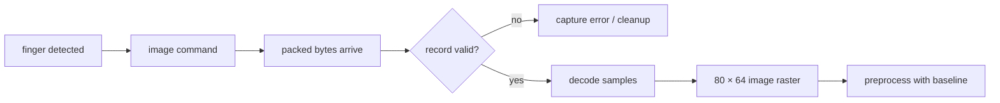

<!-- SPDX-License-Identifier: GPL-2.0-or-later -->
# 6. From finger to image

After finger-down detection, the driver asks for image data. USB delivers raw
bytes inside a protocol record. Receiving bytes is only the start: the record
must have the exact expected size and shape before the decoder accepts it.

A **raster** is a grid of pixels. This implementation decodes 80 columns by
64 rows. The values are sensor measurements, not a ready-made family photo.
The project pipeline uses the empty-sensor baseline to preprocess the capture
for its SIGFM path. It preserves the current orientation and does not invent a
physical pixels-per-millimetre value that has not been established.

## Two very different milestones

| Milestone | What it proves |
|---|---|
| Image received and decoded | The device supplied a structurally valid capture. |
| Person matched | Extracted features compare successfully with an enrolled template. |

A valid image can still be too poor for useful features. A beautiful image can
belong to the wrong finger. Neither condition is a protocol failure.

> 🔎 **Repository view:** see
> [`goodix_image_decoder.c`](../../libfprint-driver/goodix_image_decoder.c) and
> [`goodix_fpimage_pipeline.c`](../../libfprint-driver/goodix_fpimage_pipeline.c).

[← Previous](05_waiting_for_a_finger.md) · [Contents](README.md) · [Next →](07_from_image_to_fingerprint.md)
