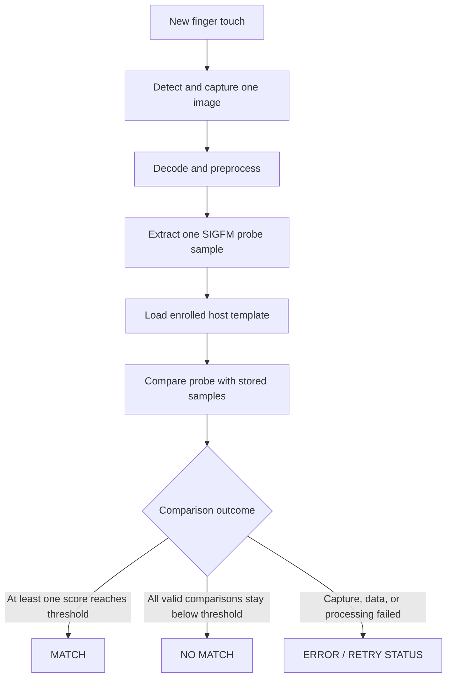

<!-- SPDX-License-Identifier: GPL-2.0-or-later -->
# 7. Verification and matching

## The question changes

Enrollment asks, "can we build a reference?"

Verification asks, "does this new touch match the reference already saved for
this user?"



## MATCH

A MATCH means at least one enrolled sample produced a score at or above the
configured threshold.

The matcher stops after the first matching sample. The driver then treats that
capture result as terminal for the current verification attempt and performs
cleanup.

MATCH does not mean that the raw images were identical. It means their feature
representations were similar enough under the current matcher.

## NO MATCH

NO MATCH means the system obtained a valid probe, made valid comparisons, and
none reached the threshold.

This is different from a broken USB transfer, malformed image, cancelled
operation, or feature-extraction failure.

After a clean NO MATCH and complete cleanup, a consumer may start another
explicit verification attempt.

## Failed capture and retry

A **retry** tells the user that no trustworthy match/no-match decision was
made. Perhaps the image could not be processed or the finger needs to be placed
again.

The exact retry behavior is shared between the consumer, `fprintd`,
`libfprint`, and driver. In this project, failures that could make the device
state ambiguous do not trigger hidden extra captures. They stop or fence the
operation so a fresh, explicit action is required.

That leads to an important rule:

```text
NO MATCH = a valid biometric comparison said no
ERROR    = the system could not safely make that comparison
```

## Where the attempt limit lives

One Goodix verification action captures one probe. The program using the
fingerprint stack decides whether to ask again.

On the tested Fedora PAM path, `pam_fprintd` uses three attempts by default.
After a clean NO MATCH, it can issue another explicit request. It stops on the
first MATCH or when the attempt series is exhausted.

The Plasma Login selector also explicitly bounds fingerprint selection to
three physical attempts:

```text
attempt 1: MATCH → stop and continue login
           NO MATCH → offer attempt 2

attempt 2: MATCH → stop and continue login
           NO MATCH → offer attempt 3

attempt 3: MATCH → stop and continue login
           NO MATCH → fingerprint series ends

attempt 4: not part of the series
```

There is no promise that every Linux distribution or every consumer uses the
same number. Three is the current Fedora/project behavior described here.

## Cancellation

Cancellation can happen because the user closes a prompt, the client goes
away, or the authentication action ends.

The driver then fences new work, cancels host-side transfers, waits for their
callbacks to drain, releases resources, and clears sensitive session state.
It does not invent an unproven device-side cancel command.

If safe device-side quiescence is uncertain, the open session is marked
unusable instead of pretending it can continue.

## Verify one finger or identify among several?

Two closely related operations exist:

- **verify:** compare the probe with one selected enrolled template;
- **identify:** compare the probe with a gallery of enrolled templates and
  report which one matched, if any.

`fprintd` can use identification when the user chooses "any" enrolled finger.
Both still use the same capture, feature extraction, and SIGFM comparison
ideas.

## ✅ What to remember

- Verification creates one new probe and compares it with stored samples.
- MATCH, NO MATCH, and ERROR are different outcomes.
- A clean NO MATCH may be followed by another explicit attempt after cleanup.
- The tested PAM and Plasma Login series allow at most three attempts and stop
  on the first MATCH.
- Cancellation cleans up host resources; uncertain protocol state fails closed.

---

[← Previous: Enrollment](06_enrollment.md) | [Up: Learning home](README.md) | [Next: Desktop authentication →](08_desktop_authentication.md)
