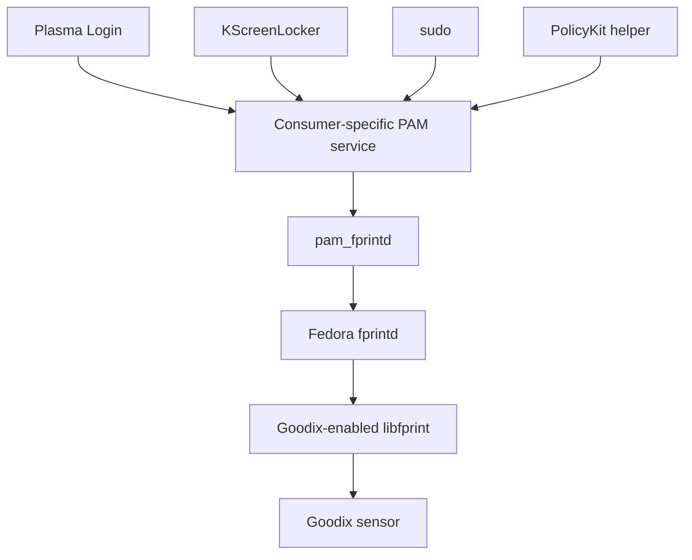

<!-- SPDX-License-Identifier: GPL-2.0-or-later -->
# 8. Login, lock screen, sudo, and PolicyKit

## One fingerprint stack, different front doors

The same reader can appear in several places:

- the login screen before your desktop starts;
- the lock screen inside an existing session;
- `sudo` in a terminal;
- a graphical PolicyKit authorization dialog;
- KDE's fingerprint enrollment settings.

These experiences look different because the **consumer** controls the prompt,
conversation, timeout, and fallback. The lower fingerprint path can remain the
same.

## Plasma Login

On the tested Fedora setup, the stock Plasma Login password service does not by
itself expose the required fingerprint choice. The project adds a small,
removable selector.

Its user-facing rule is simple:

| What you submit | What happens |
| --- | --- |
| A nonempty password | It goes immediately to Fedora's current password stack, with no forced fingerprint wait. |
| An empty password field | It explicitly selects fingerprint authentication, bounded to three attempts. |

After selecting fingerprint, allow roughly one second before placing the
finger. The stock service begins opening and preparing the Goodix reader only
when PAM enters the fingerprint path. The current release accepts this small
delay to avoid replacing Fedora's `fprintd` or Plasma greeter with private
versions.

If the fingerprint path cannot be used, keep password access available. The
selector does not turn a broken password stack into a working one.

## KScreenLocker

The lock screen runs after you already have a desktop session. On the qualified
Fedora system, KDE's stock lock-screen authentication path can call the normal
fingerprint stack.

It is still not the same program as the login greeter. It can have different
PAM service files, prompts, and timing even though the request eventually
reaches the same `pam_fprintd` → `fprintd` → `libfprint` chain.

## `sudo`

`sudo` asks PAM to authenticate before running an authorized command with a
different privilege level.

On the qualified Fedora policy, fingerprint can be offered before password.
There is no project-specific graphical method chooser for ordinary `sudo`.
If you do not touch the reader, the normal fingerprint attempt can wait for its
timeout before the password conversation continues. The stock default timeout
is 30 seconds per attempt unless the PAM configuration says otherwise.

The project does not install a custom `sudo` module or edit `sudoers` to make
this happen.

## PolicyKit

PolicyKit is used when a desktop application needs authorization for a
privileged action. KDE normally shows a graphical agent for that conversation.

On the tested Fedora setup, the stock PolicyKit helper reaches the normal PAM
stack and can use `pam_fprintd`. The project does not install a custom
PolicyKit rule or daemon for fingerprint matching.

Do not confuse two uses of the name PolicyKit:

- PolicyKit can authorize whether a client may ask `fprintd` to enroll or
  verify fingerprints.
- PolicyKit can also be the application-level consumer asking you to authorize
  some unrelated privileged desktop action.

## Enrollment settings

KDE's settings page is not authenticating a login. It is a management client.
It talks to `fprintd` over D-Bus to list, enroll, or delete fingerprints, subject
to the system's permissions.

## Why password fallback matters

Biometrics should be an additional path, not the only way back into the
computer.

The release boundary is designed so that a fingerprint failure remains a
fingerprint failure. Fedora continues to own the password, desktop, `sudo`, and
PolicyKit paths.

Also remember that a fingerprint login does not provide the text of your
password. A password-encrypted KWallet may therefore ask for its password after
you enter the desktop.

## Project-specific, not universal Linux behavior

The behavior in this chapter depends on the tested Fedora 44 KDE policy. The
installer does not enable fingerprint globally through `authselect`. A host
where the administrator disabled `pam_fprintd`, changed PAM services, or uses a
different desktop may behave differently.

See [Validation and limitations](../VALIDATION.md) for exactly what was
exercised.

## ✅ What to remember

- Login, unlock, `sudo`, and PolicyKit are different consumers of the same
  lower fingerprint stack.
- The consumer controls the prompt, timing, and fallback.
- Plasma Login uses an empty submission as an explicit fingerprint choice;
  a nonempty password stays on Fedora's password path.
- Other qualified consumers use Fedora's stock PAM behavior.
- Fingerprint login may not unlock a password-encrypted KWallet.
- Keep a working password path.

---

[← Previous: Verification and matching](07_verification_and_matching.md) | [Up: Learning home](README.md) | [Next: What is stored →](09_what_is_stored.md)
