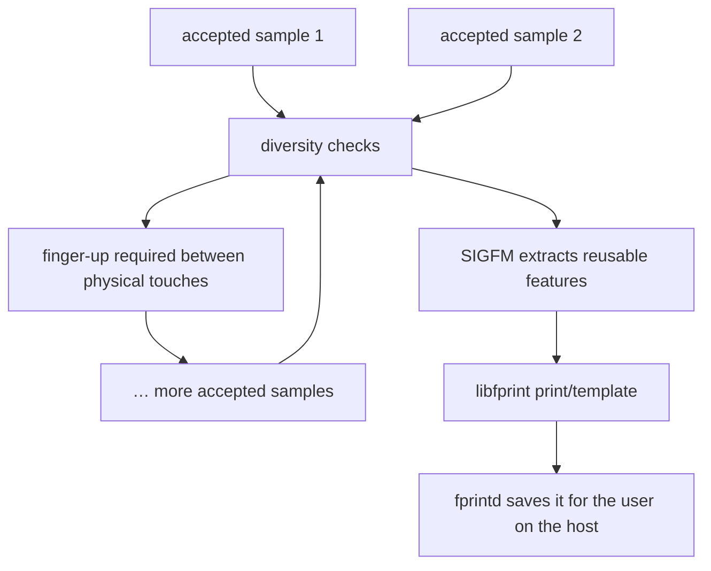

<!-- SPDX-License-Identifier: GPL-2.0-or-later -->
# 8. Enrollment: teaching Linux your finger

## 👀 What you see

KDE asks you to touch, lift, and touch again. The repetition is intentional.
One press sees only one placement; several distinct samples describe normal
small differences in angle, position, and pressure.

## 🗺️ The current project flow

This driver checks diversity instead of blindly counting touches. Enrollment
can converge after at least three distinct samples when later captures confirm
the pattern, and it stores at most eight distinct samples for this stage. It
also stops after a bounded twenty physical attempts. The driver waits for final
finger release before reporting success. An attempted capture need not become
an accepted sample: a near-duplicate can prompt another touch, while invalid
data, insufficient useful features, or cancellation can retry or end the action.

Responsibility is shared:

- the Goodix driver prepares the reader and delivers checked images;
- the image and SIGFM pipeline builds the biometric representation;
- libfprint manages the fingerprint-device action and print object;
- fprintd serves the request and stores the enrolled template for the user;
- KDE provides the friendly enrollment screen.

Enrollment does **not** teach PAM and does not save a finger into this sensor's
factory memory. PAM later decides when authentication may request verification.

## ✅ What to remember

Enrollment is a small course, not a single snapshot. The diversity check can
finish before its eight-sample cap, not every touch is automatically accepted,
and completion waits for release.

[← Previous](07_from_image_to_fingerprint.md) · [Contents](README.md) · [Next →](09_verification_and_matching.md)
