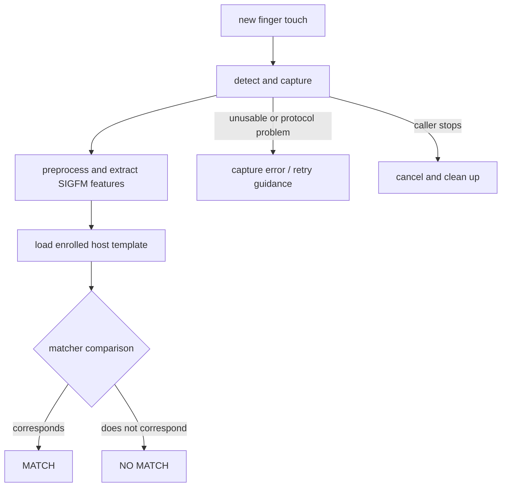

<!-- SPDX-License-Identifier: GPL-2.0-or-later -->
# 9. Verification and matching

**Verification** asks a narrow question: does this new touch match an enrolled
fingerprint for the requested user?

- **MATCH** means this comparison satisfied the matcher's rule.
- **NO MATCH** is a clean comparison that did not correspond. It is not the
  same as a broken USB transfer.
- A **failed capture** means no trustworthy comparison could be completed.
- A **retry** is a new explicit attempt, not a hidden endless camera loop.
- **Cancellation** means the caller or user stopped; owned transfers and state
  are cleaned up before another action.

The driver owns one action at a time. After a clean NO MATCH and cleanup, a
consumer may explicitly request another action. Match and processing-error
paths do not secretly resubmit capture. For the project's Plasma Login choice,
the request series is limited to three attempts and stops at the first match;
the 30-second setting applies to each attempt.

Those bounds belong to this tested integration. They are not a claim that all
Linux desktops, PAM configurations, or fprintd clients use the same numbers.

## ✅ What to remember

NO MATCH, bad capture, timeout, and cancellation are distinct outcomes. Bounds
keep authentication understandable and leave password access available.

[← Previous](08_enrollment.md) · [Contents](README.md) · [Next →](10_login_sudo_polkit_and_lockscreen.md)
