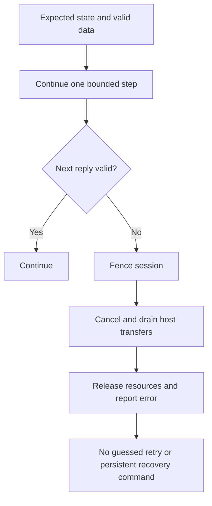

<!-- SPDX-License-Identifier: GPL-2.0-or-later -->
# 10. Safety and factory preservation

## The central idea

```text
Linux support ≠ reprogramming the sensor
```

The goal is to let Linux use the reader while leaving its original factory and
Windows-compatible path intact.

That shapes both the driver and the project around it.

## Use what already exists

The supported path uses the reader's existing firmware, identity, secure key,
and persistent state. It prepares temporary runtime state, communicates through
the established secure protocol, captures images, and closes the session.

It deliberately excludes destructive shortcuts such as:

- firmware flashing;
- firmware-update or device-reset operations;
- one-time-programmable (OTP) memory writes;
- PSK generation, replacement, or provisioning;
- factory-data writes;
- persistent mode or USB identity changes;
- unknown wire commands that might have persistent effects.

These are not missing tutorial steps. They are outside the supported design.

## 🏠 A simple analogy

Suppose you rent a furnished apartment.

You may move a chair while you work, use the existing key, and return the room
to its normal state when you leave. You do not replace the locks, rewrite the
building registry, or knock down a wall just because it makes today's task
easier.

Runtime configuration is moving the chair. Factory reprogramming is changing
the building.

## Fail closed

The driver expects exact states, reply shapes, checksums, and bounded sequences.
When something important is unknown or inconsistent, it stops.



Failing closed can be less convenient than automatically retrying, but it
avoids turning uncertain device state into hidden extra captures or unsafe
commands.

## Fedora owns Fedora

Safety also applies above the sensor.

The project keeps Fedora's `fprintd`, PAM, KDE, `sudo`, and PolicyKit components.
It adds a device library, a narrow service environment drop-in, and the minimum
tested Plasma Login selector.

The intended failure model is:

```text
fingerprint path becomes unavailable
        ↓
password login and desktop remain normal
        ↓
repair, reinstall, update, or remove the fingerprint software
```

The project provides normal and emergency removal commands that remove
project-owned influence while preserving templates and device material. They
cannot repair an independently broken Fedora password or authorization stack.

## Safety claims have boundaries

A successful fingerprint match does not prove every safety property.

The project has evidence on one qualified reader and Fedora setup. That does
not establish:

- exhaustive Windows compatibility after every possible event;
- a complete byte-for-byte factory-state readback;
- universal support for other Goodix firmware or devices;
- a universal false-acceptance or false-rejection rate;
- compatibility with every future Fedora update;
- perfect recovery from power loss at every instant.

Good engineering says what was observed and what remains unproven.

## Protected material stays protected

Factory preservation and privacy reinforce each other. The project does not
publish the reader PSK, fingerprint data, private captures, or OEM-proprietary
material. Normal logs and educational documents should describe shapes and
flows, not secrets or biometric contents.

## Where to go next

- [Technical manual](../../TECHNICAL_MANUAL.md) — current public architecture and engineering boundary.
- [Security and privacy](../SECURITY.md) — handling rules and host security boundary.
- [Validation and limitations](../VALIDATION.md) — what was exercised and what was not.
- [Device material contract](../DEVICE_MATERIALS.md) — exact operational requirements for the protected bundle.

## ✅ What to remember

- Linux support uses the existing reader state; it does not require
  reprovisioning the sensor.
- Runtime configuration is temporary and different from persistent factory
  modification.
- Unknown or inconsistent protocol state fails closed.
- Fedora continues to own the general authentication stack and password path.
- Templates and protected device material stay private and are preserved by
  project removal.
- Evidence has a scope; successful use on one setup is not a universal claim.

---

[← Previous: What is stored](09_what_is_stored.md) | [Up: Learning home](README.md) | [Next: Building your device-material bundle →](11_building_your_device_material_bundle.md)
