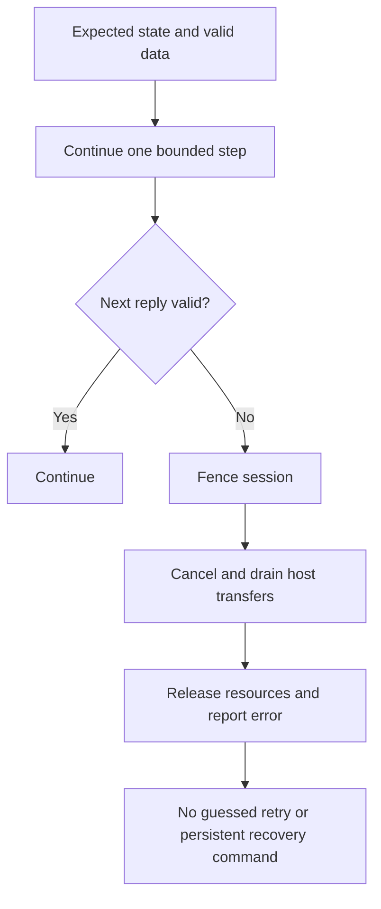

<!-- SPDX-License-Identifier: GPL-2.0-or-later -->
# 10. Safety and factory preservation

## The central idea

```text
Linux support ≠ reprogramming the sensor
```

The goal is to let Linux use the reader while leaving its original factory and
Windows-compatible path intact.

That shapes both the driver and the project around it.

## Use what already exists

The supported path uses the reader's existing firmware, identity and factory
state. It prepares temporary runtime state, communicates through the established
secure protocol, captures images, and closes the session.

It deliberately excludes destructive shortcuts such as:

- firmware flashing;
- firmware-update or device-reset operations;
- one-time-programmable (OTP) memory writes;
- factory key replacement or factory-data writes;
- persistent mode or USB identity changes;
- unknown wire commands that might have persistent effects.

These are not missing tutorial steps. They are outside the supported design.

There is exactly one persistent change the driver makes: a single bounded
host-pairing write that registers its own locally generated Linux key. It keeps
the reader's existing pairing record byte-for-byte, proves the result by readback
and by completing an encrypted handshake before the key is used, is never retried
automatically, and is not repeated by ordinary later use.

## 🏠 A simple analogy

Suppose you rent a furnished apartment.

You may move a chair while you work, add your own key to the existing lock, and
return the room to its normal state when you leave. You do not replace the locks,
rewrite the building registry, or knock down a wall just because it makes today's
task easier.

Runtime configuration is moving the chair. Factory reprogramming is changing
the building.

## Fail closed

The driver expects exact states, reply shapes, checksums, and bounded sequences.
When something important is unknown or inconsistent, it stops.


```mermaid
flowchart TD
    A["Expected state and valid data"] --> B["Continue one bounded step"]
    B --> C{"Next reply valid?"}
    C -->|Yes| D["Continue"]
    C -->|No| E["Fence session"]
    E --> F["Cancel and drain host transfers"]
    F --> G["Release resources and report error"]
    G --> H["No guessed retry or persistent recovery command"]
```

Failing closed can be less convenient than automatically retrying, but it
avoids turning uncertain device state into hidden extra captures or unsafe
commands.

## Fedora owns Fedora

Safety also applies above the sensor.

The project keeps Fedora's `fprintd`, PAM, KDE, `sudo`, and PolicyKit components.
It adds a device library, a narrow service environment drop-in, and the minimum
tested Plasma Login selector.

The intended failure model is:

```text
fingerprint path becomes unavailable
        ↓
password login and desktop remain normal
        ↓
repair, reinstall, update, or remove the fingerprint software
```

The project provides normal and emergency removal commands that remove
project-owned influence while preserving templates and host pairing state. They
cannot repair an independently broken Fedora password or authorization stack.

## Safety claims have boundaries

A successful fingerprint match does not prove every safety property.

The project has evidence on one qualified reader and Fedora setup. That does
not establish:

- exhaustive Windows compatibility after every possible event, beyond the
  qualified bounded ping-pong;
- a complete byte-for-byte factory-state readback;
- universal support for other Goodix firmware or devices;
- a universal false-acceptance or false-rejection rate;
- compatibility with every future Fedora update;
- perfect recovery from power loss at every instant.

Good engineering says what was observed and what remains unproven.

## Protected material stays protected

Factory preservation and privacy reinforce each other. The project does not
publish the Linux pairing key, fingerprint data, private captures, or
OEM-proprietary material. Normal logs and educational documents should describe
shapes and flows, not secrets or biometric contents.

## Where to go next

- [Technical manual](../../TECHNICAL_MANUAL.md) — current public architecture and engineering boundary.
- [Security and privacy](../SECURITY.md) — handling rules and host security boundary.
- [Validation and limitations](../VALIDATION.md) — what was exercised and what was not.

## ✅ What to remember

- Linux support does not reprogram firmware, OTP or factory data; its only
  persistent change is one bounded host-pairing write.
- Runtime configuration is temporary and different from persistent factory
  modification.
- Unknown or inconsistent protocol state fails closed.
- Fedora continues to own the general authentication stack and password path.
- Templates and host pairing state stay private and are preserved by project
  removal.
- Evidence has a scope; successful use on one setup is not a universal claim.

---

[← Previous: What is stored](09_what_is_stored.md) | [Up: Learning home](README.md) | [Next: Glossary →](glossary.md)
