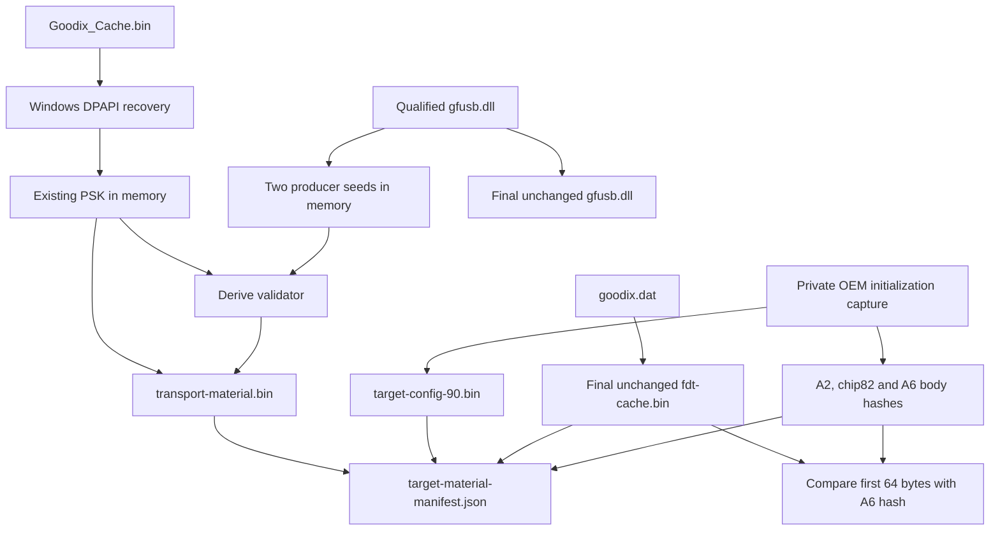

<!-- SPDX-License-Identifier: GPL-2.0-or-later -->
# 11. 🧰 Building your device-material bundle

You have the right fingerprint reader. Linux still needs a small, private
folder of information from that reader's existing Windows environment. This
chapter explains how to assemble it, starting with ordinary Windows tools.

This is a practical companion to the [device-material contract](../DEVICE_MATERIALS.md),
not a replacement for it. The release **consumes and validates** a finished
bundle; it does not ship supported acquisition scripts. The helper prompts
below describe independently generated, locally run code. A helper reporting
PASS is not a certification of that code or a promise that installation will
succeed. The installer and runtime remain the final acceptance authority.

> [!WARNING]
> Work only with your own `27c6:5125` reader and its qualified OEM Windows
> environment. Do not borrow another reader's files, invent missing values,
> replace a key, flash firmware, enter IAP, invoke ClearApp, write OTP, or
> change the USB identity. Stop when a check fails.

## 👀 1. The destination: five files, not five mysteries

The finished folder contains exactly this:

```text
goodix-5125-materials/
├── target-material-manifest.json
├── transport-material.bin
├── target-config-90.bin
├── gfusb.dll
└── fdt-cache.bin
```

A **binary file** is a sequence of bytes, not a document to edit in Notepad.
Renaming a binary copy is fine; opening and saving it as text is not. The JSON
manifest is the only text file in this folder.

| Final file | Plain-English job | How you obtain it | Privacy and identity |
| --- | --- | --- | --- |
| `target-material-manifest.json` | The bundle's packing list and expected digital fingerprints | Generate ten text fields from local evidence | Contains reader-specific pins; keep private |
| `transport-material.bin` | Existing secure-channel key plus its producer-bound validator | Derive an 88-byte binary record locally | Contains the actual PSK; especially sensitive |
| `target-config-90.bin` | Runtime configuration sent by the qualified Windows driver | Extract one 224-byte message body | Reader-bound material; keep private |
| `gfusb.dll` | Qualified OEM implementation used as a compatibility reference | Copy the exact DLL unchanged | Proprietary OEM file; not a reader-identity value |
| `fdt-cache.bin` | Factory/OTP-linked cache used for finger-detection setup | Copy `goodix.dat` unchanged | Reader-specific material; keep private |

The DLL is the exception to “specific to my reader.” Two readers may use the
same qualified DLL. Its public expected hash identifies an implementation,
not either physical reader. The other inputs must come from the **same
physical reader**, without mixing sessions from different readers.

### The dependency map — read this before starting



DPAPI opens the Windows-protected cache; it does not ask the reader to change
its key. The DLL supplies two small producer inputs, not the PSK. The USB
capture supplies configuration and three identity pins, not a replacement
secret. A hash connects a file or reply to the bundle without copying its raw
bytes into the manifest.

## 🧭 2. The whole journey before you touch anything

| Step | You do this | You finish with |
| --- | --- | --- |
| 1 | Check prerequisites and identify the physical reader | Confirmed Windows device and driver |
| 2 | Create an access-restricted, non-synced work folder | Separate sources, captures, helpers and bundle folders |
| 3 | Copy the three OEM source files | Private cache, `goodix.dat`, qualified DLL |
| 4 | Copy and check the FDT cache | First completed final file |
| 5 | Install/check the capture tools | Wireshark, USBPcap and TShark available |
| 6 | Record ordinary OEM initialization | One private `.pcapng` capture |
| 7 | Extract and validate its configuration and response pins | CONFIG90 file and an intermediate evidence record |
| 8 | Check local DPAPI recovery without displaying the key | A PASS/FAIL result, no key file |
| 9 | Check the DLL and derive transport material | Qualified DLL copy and 88-byte transport file |
| 10 | Generate and independently inspect the manifest | Fifth final file |
| 11 | Validate all content and same-reader connections | A locally checked five-file bundle |
| 12 | Transfer only those five files privately to Linux | Installer staging folder and private backup |

Do not rush to step 12 just because five filenames exist. A wrong file can
have the right name and even the right length.

## 🧰 3. What you need

You need the same physical Goodix USB `27c6:5125`, a functioning OEM Windows
installation for it, the qualified Goodix driver `1.1.125.14`, permission to
read your files, and Windows administrator access for capture setup and device
disable/enable. Keep several gigabytes of private free space available; a
root-hub capture can include unrelated USB traffic and grow quickly.

The qualified application identity is `GF_ST411SEC_APP_12509`. A friendly
Windows device name does not prove that firmware identity: the captured A8
reply and eventual runtime validation supply that check. This procedure is
not a way to upgrade another firmware or driver into the supported target.

**Native Windows** means Windows runs directly on the computer. A **Windows
virtual machine (VM)** runs inside another operating system. USB passthrough
temporarily gives the real reader to the guest; a virtual device with a
similar name is not enough. Only one operating system may own the reader at
a time.

Use an already qualified environment. Merely copying a cache into a new VM
does not copy its Windows DPAPI protection context. If you no longer have the
original usable context, stop at the DPAPI boundary; administrator access
alone is not a cure.

This chapter uses Windows PowerShell for commands and Python 3 for local
helpers. Python makes the binary parsing manageable; one additional library,
`cryptography`, provides the required AES operations. We deliberately avoid
requiring you to implement cryptography by hand. An LLM is optional: someone
who can implement and review the same public specifications locally can
provide the helpers instead. The repository does not provide those helpers.

## 🔒 4. Create a private working folder

Open Start, type **Windows PowerShell**, and open it normally. Do not start
by running an administrator terminal for every step. In command boxes, copy
the commands, not a preceding `PS>` prompt. `$Work` and similar names are
temporary variables; a new PowerShell window does not remember them.

We use Local AppData because Documents and Desktop may be redirected into
OneDrive. First confirm your organization does not sync or externally back
up this location. Do not use Dropbox, Google Drive, a repository directory,
email attachments, an online converter, or a shared VM folder for this work.

Run this **once**, in your own account:

```powershell
$ErrorActionPreference = 'Stop'
$Work = Join-Path $env:LOCALAPPDATA 'GoodixMaterialWork'
if (Test-Path -LiteralPath $Work) { throw 'STOP: work folder already exists; inspect it, do not overwrite it.' }
New-Item -ItemType Directory -Path $Work | Out-Null
$UserSid = [Security.Principal.WindowsIdentity]::GetCurrent().User.Value
& icacls.exe $Work /inheritance:r /grant:r "*${UserSid}:(OI)(CI)F" '*S-1-5-18:(OI)(CI)F'
if ($LASTEXITCODE -ne 0) { throw 'STOP: could not restrict folder access.' }
'sources','captures','helpers','evidence','bundle' | ForEach-Object {
    New-Item -ItemType Directory -Path (Join-Path $Work $_) | Out-Null
}
& icacls.exe $Work
explorer.exe $Work
```

The access list should grant your account and SYSTEM access, not Everyone,
Users, or Authenticated Users. `(OI)(CI)` makes new files/subfolders inherit
the restriction. This is access control, **not encryption** and not a defense
against administrators or malware. Use a trusted computer with disk encryption.
If the access-list command fails, stop before copying any protected file.

Inside File Explorer, enable **View → Show → File name extensions** and
**Hidden items** (Windows 10: the View ribbon checkboxes). This avoids saving
`helper.py.txt` when you intended `helper.py`.

In each later PowerShell window, restore the working variables:

```powershell
$ErrorActionPreference = 'Stop'
$Work = Join-Path $env:LOCALAPPDATA 'GoodixMaterialWork'
$Sources = Join-Path $Work 'sources'
$Bundle = Join-Path $Work 'bundle'
$Helpers = Join-Path $Work 'helpers'
$Evidence = Join-Path $Work 'evidence'
$Py = Join-Path $Work '.venv\Scripts\python.exe'
$Capture = Join-Path $Work 'captures\oem-init.pcapng'
$Tshark = Join-Path $env:ProgramFiles 'Wireshark\tshark.exe'
$UsbPcap = Join-Path $env:ProgramFiles 'USBPcap\USBPcapCMD.exe'
```

> [!NOTE]
> **Checkpoint:** the five subfolders exist and are empty. Nothing is inside
> a Git checkout or cloud-synced folder. You have not opened any binary file
> in an editor or copied its contents into a chat.

### The local-helper boundary

The workflow is **public instructions → generated code → local execution →
non-secret result**. Send an LLM the prompt text, not the input files. Save
its complete code locally; review it or have a trusted programmer review it;
run synthetic self-tests before giving it real inputs. Look especially for
network calls, telemetry, debug dumps, shell commands, permissive file access,
or attempts to disable a failed validation. Do not run code you cannot trust.

An LLM cannot infer your PSK, reconstruct missing reader evidence, or certify
its own implementation by saying “tested.” If a script fails, share only the
check name, redacted error text, filenames, sizes and booleans. Remove private
user paths. Do not share full per-reader hashes unless there is a separately
justified need; normally a redacted hash or equality result is enough.

Never upload caches, DLLs, transport files, captures, fingerprint images,
biometric templates, directory dumps, seeds, validators, or recovered keys.
Do not grant a cloud coding agent access to this work folder. The prompts
below are specifications, not bundled or previously validated programs.

### 🤖 Optional but recommended: have a second LLM review the helper

If you are not comfortable reviewing Python yourself, ask a second independent
LLM to review the generated helper **before** running it on private inputs.
Give it only the public helper prompt/specification from this guide and the
generated source code, after checking that the code contains no private data.
Never provide captures, `Goodix_Cache.bin`, `goodix.dat`, `gfusb.dll`, hashes
from your reader, PSK/validator/seed bytes, biometric data or other protected
material. This optional review supplements, not replaces, the existing
synthetic tests and validation checks; an LLM's PASS is not a safety guarantee.

Use this one reviewer prompt for any of the helpers:

```text
Review the following locally generated helper script line-by-line against
the public specification that follows. Do not redesign the workflow or
weaken any validation. Check especially:
- file/layout bounds and byte order;
- cryptographic parameters;
- ambiguity handling and fail-closed behavior;
- secret logging/output;
- network or telemetry calls;
- temporary secret files;
- accidental bypasses of validation.

List every discrepancy with severity and exact code location.
Return REVIEW=PASS only if no unresolved material discrepancy remains.
Otherwise return REVIEW=CORRECTIVE and explain the required corrections.

I will provide only:
1. the public specification;
2. the generated source code.

Do not ask me for captures, caches, DLLs, hashes from my reader, PSKs,
validators, seeds, biometric data or other private inputs.
```

### Install the helper runtime once

Use the [official Python Windows instructions](https://docs.python.org/3/using/windows.html)
and download the Python Install Manager from [python.org](https://www.python.org/downloads/windows/).
Open the installer and choose Install. Reopen PowerShell, restore the variables
above, then run:

```powershell
py --version
py -m venv (Join-Path $Work '.venv')
& $Py -m pip install cryptography
if ($LASTEXITCODE -ne 0) { throw 'STOP: helper dependency installation failed.' }
& $Py -c "import sys, cryptography; print(sys.version.split()[0]); print(cryptography.__version__)"
```

Expect a Python 3 version and a library version. If `py` is missing or starts
the Store unexpectedly, follow Python's official troubleshooting before
continuing. Downloading the runtime/library requires network access; the
helpers themselves must perform no uploads and can run offline afterwards.
No PowerShell execution-policy change or environment activation is needed:
we call the virtual environment's executable directly. See the official
[virtual-environment guide](https://docs.python.org/3/library/venv.html).

To save any generated helper, run `notepad` with the specified path, paste
only its Python code, and save. In Save As, choose **All files**, use the exact
`.py` filename, and select UTF-8. Check the extension in File Explorer. Each
prompt below specifies the command interface so the following commands work.

## 🔎 5. Identify the exact reader

Right-click Start → **Device Manager** → expand **Biometric devices** → open
the Goodix device's Properties. On **Details**, select **Hardware Ids**.
Look for `VID_27C6` and `PID_5125`. On **Driver**, check the version. If the
name is generic, the hardware IDs matter more than the friendly name.

In PowerShell:

```powershell
$Readers = @(Get-PnpDevice -PresentOnly | Where-Object {
    $_.InstanceId -like 'USB\VID_27C6&PID_5125\*'
})
$Readers | Format-List Status,Class,FriendlyName,InstanceId
if ($Readers.Count -ne 1) { throw 'STOP: expected exactly one present Goodix parent device.' }
$ReaderId = $Readers[0].InstanceId
```

This selects the USB parent, not a composite interface whose ID contains
`&MI_`. “Present” does not necessarily mean “enabled.” Do not select the first
device from a list of several. Resolve absent, duplicated or unexpected
devices first. [Microsoft documents the device query](https://learn.microsoft.com/en-us/powershell/module/pnpdevice/get-pnpdevice).

For capture mapping, also note **Details → Location paths** and use Device
Manager's **View → Devices by connection** to find the reader's USB controller,
hub and port. Do not disable a whole hub, keyboard, storage device or controller.

> [!IMPORTANT]
> **Checkpoint:** one present parent matches both IDs; its OEM driver is
> qualified. If the firmware evidence later differs from
> `GF_ST411SEC_APP_12509`, stop. Do not “fix” that by changing the manifest.

## 📁 6. Find and copy the three OEM sources

The usual source locations are:

```text
C:\ProgramData\Goodix\Goodix_Cache.bin
C:\ProgramData\Goodix\goodix.dat
C:\Windows\System32\drivers\UMDF\gfusb.dll
```

`ProgramData` is hidden by default. In File Explorer, click the address bar,
paste `C:\ProgramData\Goodix`, and press Enter. Copy, **do not move**, the two
cache files into your work folder's `sources`. Visit the UMDF directory and
copy `gfusb.dll` there too. An administrator prompt may be needed to read a
source; do not change its permissions or ownership to force access.

The equivalent copy commands are:

```powershell
Copy-Item -LiteralPath 'C:\ProgramData\Goodix\Goodix_Cache.bin' -Destination (Join-Path $Sources 'Goodix_Cache.bin')
Copy-Item -LiteralPath 'C:\ProgramData\Goodix\goodix.dat' -Destination (Join-Path $Sources 'goodix.dat')
Copy-Item -LiteralPath 'C:\Windows\System32\drivers\UMDF\gfusb.dll' -Destination (Join-Path $Sources 'gfusb.dll')
Get-ChildItem -LiteralPath $Sources -File | Select-Object Name,Length
```

Use those commands only while the destinations are absent. If a copy fails,
check the missing file/access error; do not keep going with partial sources.
If elevation is necessary, open PowerShell as administrator **under the same
account**, restore the variables, and repeat only the failed copy. A different
administrator account has a different Local AppData and DPAPI context.

### If the DLL is not in UMDF

SHA-256 calculates a digital fingerprint of a file: 32 digest bytes,
normally written as 64 hexadecimal characters. The same bytes give the same
hash; a changed hash means a different file, even if its name is unchanged.

Driver packages can also keep it in the DriverStore. This read-only search
lists candidates; it does not select one or install anything:

```powershell
Get-ChildItem -LiteralPath 'C:\Windows\System32\DriverStore\FileRepository' -Filter gfusb.dll -File -Recurse -ErrorAction SilentlyContinue |
    ForEach-Object {
        [pscustomobject]@{
            Path = $_.FullName
            Length = $_.Length
            SHA256 = (Get-FileHash -LiteralPath $_.FullName -Algorithm SHA256).Hash.ToLowerInvariant()
        }
    } | Format-List
```

The qualified DLL is **5,771,496 bytes** with this intentionally public
implementation hash:

```text
904eab1d9dbfab2609da361aa6ddba549a9d503f85b4e439b0294908f4cbc7e2
```

Select only a candidate matching **both**, then copy it using File Explorer
to `sources\gfusb.dll`. Identical copies in multiple packages are not different
implementations; still keep a note of which qualified package supplied yours.
Do not download a DLL from a file-sharing site, use the first search result,
or substitute an unqualified version because its name matches.

Check the selected copy:

```powershell
$Dll = Join-Path $Sources 'gfusb.dll'
if ((Get-Item -LiteralPath $Dll).Length -ne 5771496) { throw 'STOP: unqualified DLL size.' }
$DllHash = (Get-FileHash -LiteralPath $Dll -Algorithm SHA256).Hash.ToLowerInvariant()
if ($DllHash -ne '904eab1d9dbfab2609da361aa6ddba549a9d503f85b4e439b0294908f4cbc7e2') { throw 'STOP: unqualified DLL hash.' }
'DLL_QUALIFICATION=PASS'
```

> [!NOTE]
> **Checkpoint:** `sources` contains three unchanged copies. The DLL passes
> qualification. `Goodix_Cache.bin` and `goodix.dat` are different inputs;
> neither is a renamed copy of the other. Missing caches require investigation
> of the qualified OEM setup, not empty files or downloaded replacements.

## ✅ 7. The easy final file: `fdt-cache.bin`

This is exactly your `goodix.dat`, copied under the final required name:

```powershell
if (Test-Path -LiteralPath (Join-Path $Bundle 'fdt-cache.bin')) { throw 'STOP: output already exists.' }
Copy-Item -LiteralPath (Join-Path $Sources 'goodix.dat') -Destination (Join-Path $Bundle 'fdt-cache.bin')
(Get-Item -LiteralPath (Join-Path $Bundle 'fdt-cache.bin')).Length
```

Expect `13520`. Do not add a header, convert to hex text, trim bytes, or save
it through Notepad. Later, the capture will prove that its first 64 bytes
match this reader's A6 reply.

The cache has a **CRC**, a small corruption check. Here it is CRC-32/MPEG-2,
not the differently parameterized CRC often used for ZIP files. The last
four bytes hold the expected value in **little-endian** order: the least
significant byte comes first. The helper computes the CRC of the preceding
13,516 bytes and compares them without displaying the cache.

### Copyable helper prompt 1 — cache check

```text
Write one complete Python 3 standard-library script named check_fdt.py for
local Windows use. Do not ask me to upload the source files or secret bytes.
The script must run locally. Do not print the PSK or other protected values.
No network, telemetry, raw-byte dumps or secret-bearing exception messages.
Do not weaken checks or invent missing data; stop on ambiguity. Use argparse.

CLI: --self-test OR --file PATH. Refuse non-regular/reparse-point inputs and
unexpected lengths; detect changing/short reads. For --file, require exactly
13520 bytes. CRC-32/MPEG-2: width32, polynomial 0x04c11db7, init 0xffffffff,
no input/output reflection, xorout0. Compute over bytes [0:13516]; compare
with unsigned little-endian uint32 at [13516:13520]. Require at least one
nonzero byte in the 12-byte FDT seed at [64:76]. Never modify the input.
Print only FDT_CACHE=PASS or a named, non-secret failure; nonzero exit on fail.

Self-test must use synthetic data only: CRC of ASCII 123456789 is 0x0376e6e7;
test a generated correct cache, corruption, wrong length and absent FDT seed.
Do not use zlib.crc32 as a substitute. Return complete code, explain how to
save it with a .py rather than .py.txt extension, and provide copy-paste
PowerShell commands using $Work\helpers and $Work\.venv\Scripts\python.exe.
No dependencies beyond the standard library.
```

Save the response to the path opened by:

```powershell
notepad (Join-Path $Helpers 'check_fdt.py')
```

Then run:

```powershell
& $Py (Join-Path $Helpers 'check_fdt.py') --self-test
if ($LASTEXITCODE -ne 0) { throw 'STOP: helper self-test failed.' }
& $Py (Join-Path $Helpers 'check_fdt.py') --file (Join-Path $Bundle 'fdt-cache.bin')
if ($LASTEXITCODE -ne 0) { throw 'STOP: FDT cache validation failed.' }
```

> [!IMPORTANT]
> **Checkpoint:** size and CRC pass; the FDT seed is present. One final file
> exists. This does not yet establish same-reader provenance: the A6 comparison
> still has to pass.

## 🎥 8. Why a USB capture is necessary

Windows does not conveniently save every needed reply in a named file.
We observe the existing OEM driver's ordinary initialization conversation
with your reader. **Wireshark** displays recorded traffic. **USBPcap** is the
Windows capture component that records USB transfers. **TShark** is Wireshark's
command-line reader. A **pcapng** file is a container for captured packets and
their interface/timing information, not a file to edit as text.

We need the runtime configuration body and three typed replies. We do **not**
need you to enroll a fingerprint, touch the reader, or record fingerprint
images. Nevertheless, regard the entire capture as sensitive. Capturing a USB
root hub may also record your keyboard, storage or other devices on that hub.
Close unrelated applications and avoid typing passwords while capture runs.

## 📦 9. Install and verify Wireshark, USBPcap and TShark

1. Visit [Wireshark's official download page](https://www.wireshark.org/download.html).
   On the x64 Windows environment used here, choose the Windows x64 **`.exe`
   installer**, not a portable package.
2. Run it, approve the Windows administrator prompt, and follow the wizard.
   On **Choose Components**, keep **TShark** selected along with Wireshark.
3. The network-capture component **Npcap** is not USBPcap. Installing Npcap
   alone will not create USB capture interfaces.
4. On the installer's **USB Capture** page, select **Install USBPcap** if not
   already installed; complete the separate USBPcap installer it launches.
   The displayed version and wording can vary. If the option is unavailable,
   inspect the existing installation rather than installing random drivers.
5. Reboot Windows after installing USBPcap, then reopen PowerShell and restore
   your work variables.

The official [Windows installation guide](https://www.wireshark.org/docs/wsug_html/#ChWin32Install)
documents components; the [installer source](https://github.com/wireshark/wireshark/blob/master/packaging/nsis/wireshark.nsi)
also documents the separate USB Capture page and reboot request.

```powershell
$Tshark = Join-Path $env:ProgramFiles 'Wireshark\tshark.exe'
$UsbPcap = Join-Path $env:ProgramFiles 'USBPcap\USBPcapCMD.exe'
Test-Path -LiteralPath $Tshark
Test-Path -LiteralPath $UsbPcap
& $Tshark --version
& $UsbPcap --help
```

Both path checks should be `True`, followed by version/help text. For a
nondefault installation, find the actual executable in its installed folder
and set the relevant variable to that full path. Do not assume an internal
Wireshark `extcap` subdirectory always has the same layout. If no USBPcap
interfaces appear after reboot, stop and repair the official installation.

## 🔌 10. Record one clean OEM initialization

**Preferred when available:** use an existing qualified Windows VM and attach
the reader manually **after capture has started**. This most directly follows
the canonical “capture first, attach reader second” sequence. A VM is not
mandatory: for native Windows or an integrated reader that cannot be passed
through, use the exact-device disable/enable procedure below as the fallback.
It may trigger useful OEM initialization, but is not guaranteed to reproduce
every cold-start message. In either path, success means the extractor finds
all required, unambiguous evidence—not simply that the procedure completed.

### Find the controller rather than guessing its number

Open an administrator PowerShell **as your own account**, restore variables,
set `$UsbPcap` as above, then run:

```powershell
& $UsbPcap
```

USBPcap lists root hubs such as `\\.\USBPcap1` and their attached-device
trees. Match the Goodix device using its name and the hub/port connection
you inspected in Device Manager. The name alone is insufficient if there are
several similar devices. Wireshark's USBPcap interface options also show an
**Attached USB Devices** tree. See the [official USBPcap tour](https://desowin.org/usbpcap/tour.html).

Write down the **observed** root-hub interface. Press Ctrl+C to leave the
interactive listing without recording. Do not infer that `USBPcap2` will mean
USB bus ID 2 inside the saved file. If the mapping is unclear, stop here.

### Native Windows: start recording before restarting the device

The following uses normal Windows disable/enable on the exact Goodix parent.
It causes an OEM driver-start attempt, not a guaranteed cold hardware reset.
Some setups may not repeat every required message; completeness is checked
afterwards, never assumed.

1. Leave the reader untouched. Close fingerprint settings and enrollment
   dialogs. Keep password sign-in available.
2. In a **second** administrator PowerShell window, restore the variables,
   repeat the reader-identification command from section 5, and check the one
   printed instance again. Keep this window open.
3. In that second window, disable **only that parent**:

   ```powershell
   Disable-PnpDevice -InstanceId $ReaderId -Confirm:$true
   ```

   Read the confirmation carefully. If the target is not your exact Goodix
   reader, cancel. Never disable its parent hub or controller.
4. In the first window, enter the observed capture interface and start:

   ```powershell
   $CaptureInterface = Read-Host 'Paste the observed root-hub path, for example \\.\USBPcap2'
   $CaptureFile = Join-Path $Work 'captures\oem-init.pcap'
   if (Test-Path -LiteralPath $CaptureFile) { throw 'STOP: capture already exists; choose a new attempt name.' }
   & $UsbPcap -d $CaptureInterface -A --capture-from-new-devices --inject-descriptors -o $CaptureFile
   ```

   Leave this window running. `-A` includes the root hub's devices; the next
   option includes newly attached devices; injected descriptors aid identity
   mapping. This broad capture is another reason to keep it short and private.
5. In the second window, re-enable the same reader:

   ```powershell
   Enable-PnpDevice -InstanceId $ReaderId -Confirm:$true
   Get-PnpDevice -InstanceId $ReaderId | Format-List Status,FriendlyName,InstanceId
   ```

6. Allow ordinary OEM initialization to settle, without touching the reader
   or opening an enrollment flow. Stop the capture promptly with **Ctrl+C**
   in the first window. Restore the reader to enabled even if recording fails.

Microsoft documents the administrator requirement for
[Disable-PnpDevice](https://learn.microsoft.com/en-us/powershell/module/pnpdevice/disable-pnpdevice)
and [Enable-PnpDevice](https://learn.microsoft.com/en-us/powershell/module/pnpdevice/enable-pnpdevice).
The capture flags are documented by the
[USBPcap command implementation](https://github.com/desowin/usbpcap/blob/master/USBPcapCMD/cmd.c).
These are operator instructions, not commands for a remote assistant to run
against your hardware.

### Existing qualified Windows VM: attach after capture starts

Use capture tools **inside the guest**. Map the guest's virtual controller
while Goodix is attached, then detach only Goodix through the hypervisor's
USB menu. Prevent automatic attachment from happening before recording starts.
With Goodix still detached, start USBPcap in the guest on the mapped controller
using this narrower command instead of the native Windows command above:

```powershell
$CaptureInterface = Read-Host 'Paste the observed guest root-hub path, for example \\.\USBPcap2'
$CaptureFile = Join-Path $Work 'captures\oem-init.pcap'
if (Test-Path -LiteralPath $CaptureFile) { throw 'STOP: capture already exists; choose a new attempt name.' }
& $UsbPcap -d $CaptureInterface --capture-from-new-devices -o $CaptureFile
```

Then manually attach only the same reader to the guest. Wait for normal OEM
initialization, do not touch it, and stop with Ctrl+C. Omitting `-A` reduces
unrelated traffic, capture size and exposure of keyboard/storage activity
from devices already present. The
[USBPcap command implementation](https://github.com/desowin/usbpcap/blob/master/USBPcapCMD/cmd.c)
and [new-device filter setup](https://github.com/desowin/usbpcap/blob/master/USBPcapCMD/thread.c)
support this mode without an existing-device selection. Descriptor injection
is unnecessary for the reader's actual post-start attachment. This is not a
VID/PID filter: other devices newly attached or re-enumerated on that root hub
can also be included, so keep the capture private and attach no other devices.
The native fallback retains `-A` because disabling/enabling the PnP device
does not guarantee a new USB attachment.

For VirtualBox, manual attachment is under **Devices → USB**; enabled matching
USB filters can attach devices automatically. This ordering follows from the
documented mechanisms in the [VirtualBox USB guide](https://docs.oracle.com/en/virtualization/virtualbox/7.2/user/working-with-vms.html).
Other hypervisors have different menus: use their own documentation rather
than guessing. If the guest never receives the actual `27c6:5125`, there is
no useful target capture. Do not create a new VM and assume an old cache will
decrypt there.

### Save as pcapng and check the recording

USBPcapCMD's direct output here is `oem-init.pcap`. Open Wireshark → **File →
Open** → select it in your private `captures` folder. Choose **File → Save As**,
select **pcapng** as the type, and save `oem-init.pcapng` in the same folder.
Do not export “displayed packets only”: the helper needs the full original
context. Keep both files private; neither belongs in the final bundle.

In Wireshark's display-filter box enter:

```text
usb.idVendor == 0x27c6 && usb.idProduct == 0x5125
```

Select a matching descriptor packet and expand its USB details to see bus
and device address. This filter locates **descriptors**, not every later
Goodix vendor packet. A corresponding read-only terminal check is:

```powershell
$Capture = Join-Path $Work 'captures\oem-init.pcapng'
& $Tshark -r $Capture -Y 'usb.idVendor == 0x27c6 && usb.idProduct == 0x5125' -T fields -e frame.number -e usb.bus_id -e usb.device_address
```

Expect at least one target descriptor, not necessarily one line. No matches
means missing identity evidence or the wrong recording; do not guess a device
address. Several addresses can mean re-enumeration: they must not be silently
merged. TShark's field output is described in its
[official manual](https://www.wireshark.org/docs/man-pages/tshark.html).

> [!IMPORTANT]
> **Checkpoint:** you have a private, nonempty pcapng file with target
> descriptor evidence and ordinary initialization. No finger capture was
> requested. The reader is enabled again. The next helper, not the recording's
> filename, decides whether all required messages are present.

Recording is finished. Close the administrator terminals and return to a
**normal PowerShell under your own account** for the remaining helpers.
Paste the shared variable block from section 4 again; it restores the capture
and tool paths too. If you chose a different capture filename or installation
directory, adjust that path to the one you actually used.

## 🧩 11. What is hiding inside the capture?

An **endpoint** is a numbered USB communication channel. In this qualified
conversation, endpoint `0x01` carries host-to-reader bulk data; `0x81` carries
reader-to-host bulk data. A capture packet is a recorded transfer, not
necessarily one complete Goodix message.

Think of USB transfers as delivery boxes and a Goodix frame as a letter.
One letter may span boxes; a box may contain several letters. **Reassembly**
puts those bytes back in order. A **frame** includes an envelope; its **body**
is the information inside. Saving an entire USB packet instead of the body
will create the wrong file.

There is an important direction-specific detail. The qualified OEM **OUT**
path sends 64-byte staging chunks. A short frame, or the last chunk of a
longer frame, can have unused bytes after its declared end. Those bytes can
be nonzero; they are neither body data nor another message. The helper keeps
the original transfer boundaries so it can discard only that known staging
tail. It does not apply this rule to arbitrary extra **IN** bytes, which may
belong to another frame.

```text
CONFIG90 OUT chunks (64 bytes each):
  1: [first 64 frame bytes]
  2: [next 64 frame bytes]
  3: [next 64 frame bytes]
  4: [last 40 frame bytes][24 staging bytes: discard]
                  ↓ reassemble declared frame only
A0 frame (232): [7 bytes of headers][224-byte BODY][1-byte checksum]
                                           ↓ extract only the body
target-config-90.bin (224):          [224-byte BODY]
```

Goodix A0 frames have a four-byte outer header: marker `A0`, a two-byte
little-endian payload length, and a tag. The payload contains the wire control,
two-byte inner length, body, and one checksum byte. The wire control for the
configuration write is `0x91`; removing its low command bit gives logical
command `0x90`. These are labels for the same qualified write, not two files.

USBPcap also records a Windows transfer's submission and completion. Its
IRP direction is **not** the endpoint's USB direction. Windows uses fields
such as `usb.irp_id` and `usb.irp_info.direction`; Linux usbmon examples using
`usb.urb_type` are not suitable filters for this recording. A helper must not
count one transfer twice or globally discard identical repeated commands.
See the [USBPcap format](https://desowin.org/usbpcap/captureformat.html) and
[Wireshark USB field reference](https://www.wireshark.org/docs/dfref/u/usb.html).

## 📤 12. Extract CONFIG90 without cutting bytes by hand

The correct output is the **224-byte body**, with no USB headers, no A0
envelope, no checksum byte and no hex-text conversion. Its last two bytes
are an internal **finalizer**: add the first 111 little-endian 16-bit words;
the final word must be `(-0xA5A5 - sum) & 0xffff`. This detects malformed
configuration bodies; it is not a way to repair a wrong capture.

Manual extraction requires understanding boundaries and reassembly. Use the
helper route below instead of selecting a promising-looking byte window in
Wireshark. Inspecting packet details is useful for orientation, not sufficient
proof that the output is correct.

### Copyable helper prompt 2 — capture extractor

```text
Write one complete Python 3 standard-library script extract_capture.py for
Windows. Do not ask me to upload the source files or secret bytes.
The script must run locally. Do not print the PSK or other protected values.
No network, telemetry, raw payload output, or debug dumps. No invented data,
weakened checks or automatic repair. Stop on missing evidence or ambiguity.
Return code plus exact save/run instructions; inputs stay on my computer.

CLI: --self-test; or --capture PATH --list; or --capture PATH --fdt-cache PATH
--out-config PATH --out-pins PATH [--candidate INTEGER]. --list prints only
numbered non-secret capture identities. Auto-select only one unambiguous
target; otherwise explain the choices and require explicit selection.
No third-party Python dependencies. A bounded local pcapng parser is justified
here to retain section/interface and Windows USBPcap metadata; do not assume
a raw usb.capdata search is a protocol parser.

Validate pcapng section byte order, aligned block sizes/trailing lengths,
interface description blocks and enhanced packet blocks. Interface numbers
restart per section. Select USBPcap linktype249; reject unsupported target
packet layouts, truncation (captured length != original length), bounds errors
and unsupported identity/attachment transitions rather than guessing. Set
finite documented input/frame/buffer limits and fail before exceeding them.
Never load an arbitrarily large capture without a bound.

USBPcap headers are little-endian even in a big-endian pcapng section:
headerLen:u16@0, IRP:u64@2, status:u32@10, function:u16@14, info:u8@16,
bus:u16@17, device:u16@19, endpoint:u8@21, transfer:u8@22, dataLength:u32@23.
Validate headerLen>=27, all lengths and captured bounds; data starts at
headerLen. Use USB descriptor/control-transfer evidence to identify exactly
VID27c6 PID5125. Never assume a root-hub number equals a bus ID. Preserve
section/interface/bus/device/attachment-epoch identity; never join devices,
interfaces, reattachments or captures. Refuse unresolved candidate identity.

For target bulk transfer=3: OUT endpoint01 payload comes from submission
(info&1=0); IN endpoint81 payload comes from completion (info&1=1). Pair
submission/completion by identity, endpoint, IRP and ordering; IRP values can
be reused. Check completion status (zero success), not submission status.
Every data-bearing OUT submission needs its own successful completion;
every selected IN completion needs its matching submission. Only the explicit
trailing empty-IN exception below may be unmatched.
Count a transfer once; reject failed selected data transfers and per-record
payload lengths inconsistent with captured bounds. IN submissions and OUT
completions normally have dataLength0: do NOT require submission/completion
payload lengths to match. A trailing no-payload pending/canceled IN may be
reported as non-data only when all required evidence is complete and no
logical frame is unfinished; it contributes no bytes or successful response.
Do not globally deduplicate equal USB payloads.

Reassemble each selected endpoint/direction in order, preserving transfer
boundaries. Qualified OEM OUT uses64-byte payload chunks for both A0 and B0:
start at the next chunk's first byte, accumulate chunks until the declared
frame ends, then discard ONLY the remainder of that final64-byte staging
chunk. The staging tail may be nonzero or contain A0-looking bytes; never
interpret it as another frame or require it to be zero. Reject unsupported
OUT chunk sizes/layouts rather than guess. A CONFIG90 frame is232 bytes,
carried in four64-byte OUT chunks; the last24 staging bytes are not its body.
For IN, buffer even a split outer header; retain excess bytes and support
several frames in one transfer. Do not apply OUT tail-discard rules to IN.
At an established boundary accept A0 or B0; frame size=4+LE16(bytes1:3).
Outer tag=(marker+lengthLow+lengthHigh)&255. Consume/skip complete declared
B0 frames; never scan their TLS payload for A0. Bad tag/length, unknown
boundary or unfinished target frame means failure, not byte-scanning repair.
For A0: wireControl=byte4, innerLength=LE16(bytes5:7), body=bytes7:-1;
logicalControl=wireControl&0xfe, innerLength=bodyLength+1,
outerPayloadLength=bodyLength+4. Checksum coordinate is logicalControl for
OEM OUT commands and the unchanged wireControl for IN replies. Require
(checksumCoordinate+bodyLength+1+sum(body)+lastByte)&255 == 0xaa.

Require a target A8 IN reply with the exact 22-byte NUL-terminated body
ASCII GF_ST411SEC_APP_12509 followed by 00. Require configuration OUT exact
wire91/logical90 body224. Validate sum(first111 LE16 words)+last LE16 word
equals -0xa5a5 modulo65536. At body offsets117,121,125,129 require LE16
register addresses0220,0236,0238,023a respectively; keep following values
unchanged, never substitute another reader's tuning.
Require IN exact wirea2 body3, wire82 body4 and wirea6 body64. Ignore other
body lengths for these candidate classes, especially later two-byte 82
state replies; ACKs are not these replies. Require at least one of each;
identical repeated bodies are acceptable, two distinct valid bodies in any
required class mean STOP. Do not select the first/last conflicting body.
Require fdt-cache exactly13520 with valid CRC-32/MPEG-2 over [0:13516],
LE32 stored at13516; poly04c11db7 initffffffff no reflection xorout0;
require FDT seed [64:76] not all zero. Require SHA256(A6 body) equal to
SHA256(fdt-cache[0:64]). Do not print either digest or response bytes.

Only after all checks, exclusively create out-config as the raw224 body
and out-pins as an intermediate private JSON record with fields app,
a2_response_sha256, chip82_response_sha256, otp_a6_response_sha256,
config90_sha256, fdt_cache_sha256. Digests are lowercase SHA256 hex;
config/cache digests cover complete files, response digests cover bodies.
app is GF_ST411SEC_APP_12509. This is NOT the production manifest.
Refuse existing outputs; inherit the restricted parent ACL, reject links/
reparse points, do not leave plausible final outputs on failure. Print only
named PASS/FAIL checks, candidate IDs, counts, sizes and filenames.

Self-tests use synthetic captures only: little/big-endian sections,
multiple interfaces, wrong device, reused IRPs, failed transfer, zero-data
bookkeeping, trailing pending/canceled IN, truncation, split IN header/body,
several IN frames per transfer, short padded OUT A0,232-byte CONFIG90 across
four64-byte chunks, nonzero OUT staging tails containing A0-looking bytes,
B0 containing A0-looking bytes, bad tag/length/checksum/finalizer/register map, identical versus
conflicting candidates, wrong A8, missing response, and A6/cache mismatch.
Explain any unsupported capture feature as STOP, not silent omission.
```

The exact A8 string is 21 characters plus a terminating zero byte. The prompt
includes those details so no one has to guess whether to hash or save a
terminator. It hashes only A2/82/A6 bodies for the three production pins.

Save the code and run its tests before the real capture:

```powershell
notepad (Join-Path $Helpers 'extract_capture.py')
```

```powershell
& $Py (Join-Path $Helpers 'extract_capture.py') --self-test
if ($LASTEXITCODE -ne 0) { throw 'STOP: extractor self-test failed.' }
& $Py (Join-Path $Helpers 'extract_capture.py') --capture $Capture --list
if ($LASTEXITCODE -ne 0) { throw 'STOP: capture identity could not be established.' }
& $Py (Join-Path $Helpers 'extract_capture.py') --capture $Capture --fdt-cache (Join-Path $Bundle 'fdt-cache.bin') --out-config (Join-Path $Bundle 'target-config-90.bin') --out-pins (Join-Path $Evidence 'capture-pins.json')
if ($LASTEXITCODE -ne 0) { throw 'STOP: capture extraction failed.' }
```

Expect named PASS results and one 224-byte output. If several candidates are
listed, do not add `--candidate 1` just to proceed. Match the listed identity
to the descriptor and attachment you recorded; have the helper explain an
exact selection command, or make a cleaner separate capture. Never merge
two unsuccessful recordings to manufacture a successful initialization.

## 📌 13. The three reader-response pins

These are **three manifest values, not three extra final files**:

| Manifest field | Captured typed reply body | Why length matters |
| --- | --- | --- |
| `a2_response_sha256` | A2, 3 bytes | Not its frame or acknowledgement |
| `chip82_response_sha256` | Initial chip/state 82, 4 bytes | A later 2-byte 82 is a different response shape |
| `otp_a6_response_sha256` | A6, 64 bytes | Must also match the first 64 bytes of the cache |

SHA-256 turns any byte sequence into 32 digest bytes, usually written as 64
hexadecimal characters. “Hash the body” excludes USB metadata, framing and
checksum. One extra byte produces a different digest. A hash detects a
difference; it does not prove where the original came from. Your same-reader
workflow and cross-checks establish that connection.

The extractor stores these values in `evidence\capture-pins.json`, outside
the bundle. It also records the exact CONFIG90 and cache file hashes so a
later step can reject evidence accidentally paired with different files.
Keep this intermediate private; do not paste it into a chat.

> [!IMPORTANT]
> **Checkpoint:** two final files exist, plus one intermediate evidence file.
> A8 identity, A0 checks, CONFIG90 finalizer/register map, all three response
> lengths, unambiguous bodies and A6/cache equality pass. Stop on two distinct
> CONFIG90 bodies or any A6 mismatch; choosing the more convenient one is
> not validation.

## 🔐 14. What `Goodix_Cache.bin` contains

This cache is not the final transport record. It contains a Windows-protected
blob followed by an eight-byte trailer. **DPAPI**, Windows' Data Protection
API, protects data using a Windows security context. A valid encrypted blob
is not enough by itself: it must be opened in the appropriate original
Windows context, with the same additional input used when it was protected.

That additional input is called **optional entropy** in the API. Here
“optional” is the API's terminology; the qualified Goodix recipe requires
it. It is deterministically calculated from the trailer and a public constant.
Do not replace it with random bytes because “entropy” sounds random.

```text
Goodix_Cache.bin = [DPAPI ciphertext, variable length][8-byte trailer]
                                                        ↓ hash recipe
original Windows context + ciphertext + 48-byte entropy
                            ↓ CryptUnprotectData
                   existing 32-byte PSK, in memory
```

The PSK is the reader's existing pre-shared key. We recover it for the local
bundle; we do not generate, set, reset or provision a reader key. Microsoft
explains the usual same-machine/same-user and matching-entropy requirements
in [CryptUnprotectData](https://learn.microsoft.com/en-us/windows/win32/api/dpapi/nf-dpapi-cryptunprotectdata).
The precise cache layout and entropy recipe are project-specific facts, not
something the Windows API discovers for you.

## 🗝️ 15. Check PSK recovery without creating a key file

The first helper checks that recovery works and immediately discards the
result. The later builder repeats recovery in memory and writes the final
transport file. This small duplication keeps a loose `psk.bin` out of the
workflow and allows a clear checkpoint before the more complex derivation.

### Copyable helper prompt 3 — local DPAPI check

```text
Write one complete Python 3 standard-library script check_dpapi.py for the
original qualified Windows environment. Do not ask me to upload the source
files or secret bytes. The script must run locally. Do not print the PSK or
other protected values. No network/telemetry, byte dumps, temporary key files,
key-bearing command lines/environment variables, or secret-bearing errors.
Do not invent data, weaken checks, bypass Windows account protections or
escalate to SYSTEM. Stop on ambiguity. Use ctypes Win32 interop, no extra
dependency. CLI: --self-test OR --cache PATH.

Require a regular non-reparse-point stable file with 8<size<=1048576 bytes;
check size/read bounds and reject changing inputs. Last8 bytes are trailer,
all preceding bytes are DPAPI ciphertext. Reject all-zero trailer.
h1=SHA256(trailer); public mix=04e0b0f3f5598417dde298e467c795f7;
h2=SHA256(h1[0:16]||mix); entropy=h1[16:32]||h2, exactly48 bytes.
Call CryptUnprotectData(ciphertext, optionalEntropy=entropy), using correct
32/64-bit DATA_BLOB ctypes definitions/signatures, null reserved/prompt
arguments, CRYPTPROTECT_UI_FORBIDDEN. Check Boolean return/GetLastError.
Require output length32 and not all zero before accepting the existing PSK.
Keep it only in memory; print PSK_RECOVERY=PASS, or a non-secret check name
and Win32 numeric failure code. Nonzero exit on failure. Wipe mutable buffers
and native output in finally, then LocalFree the native allocation. Explain
that Python/OS copies mean perfect memory erasure cannot be guaranteed.

Self-test with a synthetic known32-byte nonzero value and synthetic trailer,
CryptProtectData and the same entropy, then unprotect/compare without printing
bytes; also test wrong entropy, short cache, zero trailer, wrong output size
and zero result. A synthetic round trip does not prove the real OEM cache is
recoverable or that its scope is machine-wide. Do not change the real cache.
Return the full script and exact Notepad/save/run PowerShell instructions
under $Work\helpers, using $Work\.venv\Scripts\python.exe.
```

Save, then run in the original Windows account/context:

```powershell
notepad (Join-Path $Helpers 'check_dpapi.py')
```

```powershell
& $Py (Join-Path $Helpers 'check_dpapi.py') --self-test
if ($LASTEXITCODE -ne 0) { throw 'STOP: DPAPI helper self-test failed.' }
& $Py (Join-Path $Helpers 'check_dpapi.py') --cache (Join-Path $Sources 'Goodix_Cache.bin')
if ($LASTEXITCODE -ne 0) { throw 'STOP: original cache could not be recovered.' }
```

If it fails, retain the non-secret failure code. A copied cache on another
Windows installation, different logon context, corrupted copy or unexpected
OEM format may explain failure. Do not repeatedly change accounts or permissions,
strip arbitrary bytes, brute-force entropy, or ask an LLM to “recover it”
from an uploaded blob. Resolve the original-environment question first.

> [!NOTE]
> **Checkpoint:** `PSK_RECOVERY=PASS`, no separate PSK file, no printed key.
> There are still only two final files. Recovery proves a local operation
> succeeded, not that the key belongs to whichever reader is connected today.

## 🧱 16. Why the DLL is needed twice

The same qualified `gfusb.dll` has two jobs:

```text
                         ┌─ copy unchanged → final gfusb.dll
qualified OEM gfusb.dll ──┤
                         └─ parse as data → seed A + seed B → validator
```

Linux does **not** execute this Windows DLL. It reads a qualified binary
format and extracts small producer inputs. The runtime can repeat the same
derivation, which is why keeping only the derived transport file is not enough.

A DLL is a Windows dynamic-link library. Its on-disk container is a **PE
file**, divided into sections. An **RVA** is an address relative to the loaded
image, not a byte offset in the disk file. The parser must find the relevant
section and translate the RVA into an on-disk location. Seeking directly to
byte `0x56f030` would skip that translation and is not the prescribed procedure.

## 📍 17. Obtain the two producer seeds safely

Seed A is six file-backed bytes at RVA `0x56f030`. Seed B comes from a
14-byte instruction at RVA `0x69d0`. Its first three bytes must be
`c7 45 9f`; bytes 7–9 must be `c7 45 a3`. The second seed is the concatenation
of bytes 3–6 and 10–11. Byte positions here start at zero.

Qualification also requires the instruction's **exact first 12 bytes** to
occur once in the whole DLL. Checking only whether those two three-byte
opcode shapes appear once is a different, insufficient test. Reject
out-of-range, zero, missing, non-file-backed or ambiguous seed data.

You do not need a disassembler or to copy seeds into a terminal. The combined
helper prompt in section 19 includes a `--check-pe` mode that performs these
checks and prints a result without the seeds. Its full specification is based
on the current [runtime input parser](../../libfprint-driver/goodix_runtime_inputs.c).

## 🧮 18. Understand the validator before deriving it

A **validator** here is a 32-byte result binding the existing PSK to the
qualified DLL's two producer seeds. It is not a password, the hash of the
whole DLL, a randomly generated value, or simply `SHA256(PSK)`.

```text
PSK (32 bytes) + seed A (6 bytes) + seed B (6 bytes)
                           ↓ exact public D190 recipe
                    validator (32 bytes)
```

The public function
[`goodix_d190_bind_validator()`](../../libfprint-driver/goodix_action_binding.c)
is authoritative. It combines rotations, hashes, HMAC and AES operations in
a specific order. HMAC is a keyed digest; AES performs the required block
and authenticated encryption operations. You need not become a cryptographer,
but the helper must reproduce that order and every byte exactly.

Why not let the LLM choose a modern alternative? Because this is a
compatibility calculation, not a new encryption design. Changing an algorithm,
nonce length, byte order or padding changes the answer. The Linux runtime
recomputes the validator and rejects a mismatch.

The helper uses the installed `cryptography` library for AES-ECB and AES-GCM.
The [library's official encryption documentation](https://cryptography.io/en/stable/hazmat/primitives/symmetric-encryption/)
describes these primitives. This recipe needs a **16-byte GCM nonce** and
16-byte tag. Do not substitute a usual 12-byte nonce or try to use a modern
`.NET AesGcm` class from Windows PowerShell 5.1's older .NET Framework.

## 📦 19. Build the 88-byte transport record

The final record is deliberately small:

| Offset | Length | Meaning |
| --- | --- | --- |
| 0 | 8 | ASCII magic `G5125POC` |
| 8 | 2 | Version 1 |
| 10 | 2 | Header length 24 |
| 12 | 2 | VID `0x27c6` |
| 14 | 2 | PID `0x5125` |
| 16 | 2 | Format identifier 1 |
| 18 | 2 | PSK length 32 |
| 20 | 2 | Validator length 32 |
| 22 | 2 | Reserved 0 |
| 24 | 32 | Existing PSK |
| 56 | 32 | Derived validator |

Every two-byte header number is little-endian. The file contains
`header[24] || PSK[32] || validator[32]`, not a text representation of those
values. Its length is 88 bytes. Older transfer records with `G5125XFR` are
**not** current runtime records, even though they can also be 88 bytes.

### Copyable helper prompt 4 — PE check and combined transport builder

This is intentionally detailed. Copy the whole box; it supplies the complete
public recipe so the code generator need not guess or request your files.

```text
Write a complete Windows Python 3 script build_transport.py. Use only the
standard library plus cryptography for AES; native DPAPI via ctypes.
Do not ask me to upload the source files or secret bytes.
The script must run locally. Do not print the PSK or other protected values.
No networking, telemetry, DLL execution, hardware access, secret dumps,
temporary key/seed files, or secret command-line/environment values.
Stop on ambiguity, never invent missing data or weaken any check. Handle
failures with non-secret check names and nonzero exit codes. Clear mutable
and native buffers in finally, LocalFree DPAPI allocations; acknowledge
Python/OS copies cannot be guaranteed erased. No claims of secure deletion.

CLI modes: --self-test; --check-pe --dll PATH; --cache PATH --dll PATH
--output PATH; --verify PATH --dll PATH. Last mode reads an existing record,
rederives its validator from the contained PSK and DLL, writes nothing.
Check all real inputs are stable ordinary files, no symlinks/reparse points,
bounded exact reads, reject unexpected growth/shrinkage. Output uses exclusive
creation in the user's pre-restricted folder, never overwrite or chmod an
existing file. Produce only transport-material.bin, not intermediate keys.
Do not leave a plausible final file after failure. Refuse invalid parent ACLs
instead of broadening permissions. The check-pe mode prints PE_SEEDS=PASS,
not seed contents; build prints TRANSPORT=PASS SIZE=88; verify prints
TRANSPORT_BINDING=PASS. No raw hash/PSK/seed/validator/envelope display.

DLL qualification before any extraction: size5771496, SHA256
904eab1d9dbfab2609da361aa6ddba549a9d503f85b4e439b0294908f4cbc7e2.
Parse PE as bytes: MZ, e_lfanew LE32 at0x3c, bounded PE\0\0 signature,
section count LE16 at PE+6 in1..96, optional-header size LE16 at PE+20, section table at
PE+24+optionalHeaderSize, section entries40 bytes. Per entry: VirtualSize
at+8, VirtualAddress+12, SizeOfRawData+16, PointerToRawData+20, all LE32.
Map a requested RVA as rawOffset+(RVA-VirtualAddress); require its entire
range within min(VirtualSize,SizeOfRawData), also within the file. Reject
ambiguous overlapping mappings, overflow/out-of-range/non-file-backed data.
seedA=6 bytes at RVA0x56f030. instruction=14 bytes at RVA0x69d0; require
instruction[0:3]=c7459f and [7:10]=c745a3. Exact instruction[0:12] must occur
once in entire DLL, including overlapping occurrences. seedB=instruction[3:7]
||instruction[10:12]. Both seeds length6 and not all zero. Keep in memory.

DPAPI: cache 8<size<=1048576; last8 trailer not all zero, all prior bytes
ciphertext. h1=SHA256(trailer); mix=04e0b0f3f5598417dde298e467c795f7;
h2=SHA256(h1[0:16]||mix); entropy=h1[16:32]||h2 (48 bytes).
CryptUnprotectData with matching original Windows context, this entropy,
correct ctypes DATA_BLOB signatures, null reserved/prompt, UI_FORBIDDEN;
check return/GetLastError, output exactly32 and not all zero. Never bypass
the Windows context. The output is the existing PSK, not a new key.

Implement goodix_d190_bind_validator exactly as the following public recipe.
All slices below are Python-style half-open. || denotes byte concatenation.
CRC32/MPEG2: poly04c11db7 initffffffff no reflection xorout0, unsigned32.
For EACH seed6, rotate each byte right by1, then each original byte by3,
then by5, then by7; concatenate four six-byte groups to expanded24.
Split expanded into eight consecutive 3-byte groups g0..g7. Build half16
by concatenating these eight 2-byte results in this order:
1. SHA256(g0)[0:2].
2. AES128 ECB decrypt(g1||cc repeated13), zero16-byte key, result[0:2].
3. AES128 ECB encrypt(g2||cc repeated13), zero16-byte key, result[0:2].
4. AES256 ECB decrypt(g3||cc repeated13), zero32-byte key, result[0:2].
5. AES192 ECB encrypt(g4||cc repeated13), zero24-byte key, result[0:2].
6. HMAC-SHA256(key=ASCII123456||10 zero bytes, message=g5)[0:2].
7. CRC32/MPEG2(g6) represented big-endian32, take [0:2].
8. SHA256(g7)[0:2].
ECB blocks are independent, exactly16 bytes, no padding/chaining.
producerKey=halfA||halfB (32 bytes).
label=ASCII kgoodwixg || one zero byte || ASCII kaelrgnoerlithm.
t1=HMAC-SHA256(producerKey,BE32(1)||label||BE32(384)); t2 same with BE32(2).
derived=t1||t2[0:16] (48 bytes).
innerHeader=hex02ff20000000 (6 bytes).
innerInput=innerHeader||PSK[0:8]||(LE32(3) repeated16) (78 bytes).
nonce=SHA256(innerInput)[0:16], exactly16 bytes, NOT12.
AES256-GCM key=derived[0:32], nonce as above, AAD=hex522dc1f099567d07f47f37a32a84427d,
plaintext=PSK32; get ciphertext32 and tag16. Use the documented Cipher/AES/GCM
API with that16-byte nonce and no padding. Do not swap nonce and AAD.
outer=HMAC-SHA256(derived[16:48],innerHeader||ciphertext||tag).
envelope=outer||innerHeader||nonce||ciphertext||tag, exactly102 bytes.
validator=SHA256(envelope), exactly32 bytes.

Runtime header=struct.pack('<8s8H',b'G5125POC',1,24,0x27c6,0x5125,1,32,32,0).
Write header24||PSK32||validator32, exactly88 binary bytes. The102-byte
envelope is NOT the output. Validate header/size/nonzero PSK and recomputed
validator before and after writing. --verify enforces these same checks.

Self-test before protected inputs: synthetic DPAPI roundtrip, short/zero
cache errors; PE mapping with synthetic image, overlapping/unbacked RVAs,
wrong instruction/duplicate pattern; record header, size and corruption
rejection. Synthetic PE tests exercise parser internals, never bypass the
real DLL qualification in a production CLI mode. Add this independently
checked synthetic D190 known-answer test (no real reader data):
PSK=bytes(range(32)); seedA=bytes(range(6)); seedB=bytes(range(0x10,0x16));
expected validator hex=
ee2be7da5ee352191dc55f2e77271c215bb40629691e10415f34342dd5fb1838.
This expected result comes from the current public C binder, not from your
implementation under test. Also test changed inputs and malformed lengths.
All self-test output must be named PASS/FAIL only. Return the entire script,
smallest dependency set and exact PowerShell save/run commands under $Work.
```

The known-answer test uses deliberately artificial counting sequences, not
an actual reader key, DLL seed or validator. It was checked against the public
C binder. A match tests the recipe more meaningfully than having a new helper
compare its output with itself; it still does not certify every code path.

Save the complete helper, then perform the PE checkpoint first:

```powershell
notepad (Join-Path $Helpers 'build_transport.py')
```

```powershell
& $Py (Join-Path $Helpers 'build_transport.py') --self-test
if ($LASTEXITCODE -ne 0) { throw 'STOP: builder self-test failed.' }
& $Py (Join-Path $Helpers 'build_transport.py') --check-pe --dll (Join-Path $Sources 'gfusb.dll')
if ($LASTEXITCODE -ne 0) { throw 'STOP: producer seed qualification failed.' }
```

> [!IMPORTANT]
> **PE checkpoint:** size, public DLL hash, safe RVA mapping, instruction
> shape and uniqueness pass. No seeds were displayed or saved. If this fails,
> do not proceed to derivation or change the expected DLL hash.

Now build and verify:

```powershell
& $Py (Join-Path $Helpers 'build_transport.py') --cache (Join-Path $Sources 'Goodix_Cache.bin') --dll (Join-Path $Sources 'gfusb.dll') --output (Join-Path $Bundle 'transport-material.bin')
if ($LASTEXITCODE -ne 0) { throw 'STOP: transport construction failed.' }
& $Py (Join-Path $Helpers 'build_transport.py') --verify (Join-Path $Bundle 'transport-material.bin') --dll (Join-Path $Sources 'gfusb.dll')
if ($LASTEXITCODE -ne 0) { throw 'STOP: transport binding verification failed.' }
if (Test-Path -LiteralPath (Join-Path $Bundle 'gfusb.dll')) { throw 'STOP: final DLL already exists.' }
Copy-Item -LiteralPath (Join-Path $Sources 'gfusb.dll') -Destination (Join-Path $Bundle 'gfusb.dll')
Get-ChildItem -LiteralPath $Bundle -File | Select-Object Name,Length
```

> [!NOTE]
> **Checkpoint:** four final binary files exist: transport 88 bytes,
> CONFIG90 224, DLL 5,771,496 and FDT cache 13,520. Transport structure and
> recomputed binding pass. `target-material-manifest.json` is still missing;
> do not install yet. Python buffer wiping reduces exposure but cannot promise
> that every OS or library copy was erased.

## 📝 20. Build the manifest: a packing list, not another secret container

The manifest is a JSON text object containing **exactly ten string fields**.
Four describe the contract; six are hashes:

| Field | Exact value or source |
| --- | --- |
| `schema` | `goodix-5125-device-materials-v1` |
| `vid` | `27c6` — no `0x` prefix |
| `pid` | `5125` — no `0x` prefix |
| `app` | `GF_ST411SEC_APP_12509` |
| `transport_sha256` | SHA-256 of the entire final `transport-material.bin` |
| `config90_sha256` | SHA-256 of the entire final `target-config-90.bin` |
| `fdt_cache_sha256` | SHA-256 of the entire final `fdt-cache.bin` |
| `a2_response_sha256` | Captured A2 3-byte body hash |
| `chip82_response_sha256` | Captured 82 4-byte body hash |
| `otp_a6_response_sha256` | Captured A6 64-byte body hash |

The first three hashes describe **files**; the last three describe **reply
bodies**. There is no `gfusb_sha256` field: the runtime already pins the
qualified implementation. Do not add it as an eleventh field.

This is the complete shape. The six uppercase placeholders below are
**deliberately invalid hashes**: this example is for reading, not a manifest
to save or pass to the installer. The local writer fills the real values.

```json
{
  "schema": "goodix-5125-device-materials-v1",
  "vid": "27c6",
  "pid": "5125",
  "app": "GF_ST411SEC_APP_12509",
  "transport_sha256": "LOCAL_TRANSPORT_FILE_HASH_NOT_A_USABLE_VALUE",
  "config90_sha256": "LOCAL_CONFIG90_FILE_HASH_NOT_A_USABLE_VALUE",
  "fdt_cache_sha256": "LOCAL_FDT_CACHE_FILE_HASH_NOT_A_USABLE_VALUE",
  "a2_response_sha256": "LOCAL_A2_BODY_HASH_NOT_A_USABLE_VALUE",
  "chip82_response_sha256": "LOCAL_CHIP82_BODY_HASH_NOT_A_USABLE_VALUE",
  "otp_a6_response_sha256": "LOCAL_A6_BODY_HASH_NOT_A_USABLE_VALUE"
}
```

To see how an ordinary final-file hash is calculated locally:

```powershell
(Get-FileHash -LiteralPath (Join-Path $Bundle 'target-config-90.bin') -Algorithm SHA256).Hash.ToLowerInvariant()
```

After transfer, the Linux equivalent is:

```bash
sha256sum "$HOME/goodix-5125-materials/target-config-90.bin"
```

Compare the full values **locally**, not in a chat. These examples print a
digest, not binary content, but per-reader digests are still private evidence.
[Microsoft's Get-FileHash reference](https://learn.microsoft.com/en-us/powershell/module/microsoft.powershell.utility/get-filehash)
explains the Windows command.

The JSON must be ASCII or UTF-8 **without a byte-order mark (BOM)**, at most
4,096 bytes. Windows PowerShell 5.1 text redirection/`Out-File` can produce
UTF-16, and its `-Encoding UTF8` commonly adds a BOM. Use the explicit Python
writer below. Do not append notes, comments, duplicate keys or source paths;
do not copy a historical nested manifest from development material.

### Copyable helper prompt 5 — manifest writer and final structural audit

```text
Write a complete Python 3 standard-library script bundle_manifest.py.
Do not ask me to upload the source files or secret bytes.
The script must run locally. Do not print the PSK or other protected values.
No networking, telemetry, raw bytes, full per-reader digests or secret errors.
No invented pins, weakened checks or automatic repair; stop on ambiguity.
CLI: --self-test; or --bundle DIR --pins PATH --create; or --bundle DIR
--pins PATH --check. --create requires exactly four binaries initially and
no manifest; --check requires exactly the five final ordinary files. Refuse
extra/hidden entries, subdirectories, links/reparse points, changing inputs
and existing output on create. Inherit the private directory ACL. Print only
named PASS/FAIL checks, filenames, sizes and hash-equality booleans; nonzero
exit on failure. This script checks structure/cross-links, not D190 binding;
instruct me to run build_transport.py --verify separately.

Final binary checks:
transport-material.bin exactly88, header exactly
struct.pack('<8s8H',b'G5125POC',1,24,0x27c6,0x5125,1,32,32,0), PSK[24:56]
and validator[56:88] nonzero. target-config-90.bin exactly224; first111 LE16
words plus final LE16 word == -0xa5a5 modulo65536; LE16 addresses at body
offsets117,121,125,129 must be0220,0236,0238,023a. fdt-cache.bin exactly13520;
CRC32/MPEG2 poly04c11db7 initffffffff no reflection xorout0 over [0:13516],
storedLE32 at13516; FDT seed [64:76] not all zero. gfusb.dll size5771496,
SHA256=904eab1d9dbfab2609da361aa6ddba549a9d503f85b4e439b0294908f4cbc7e2.

Pins input is an intermediate JSON object, not the production manifest.
Require exactly app,a2_response_sha256,chip82_response_sha256,
otp_a6_response_sha256,config90_sha256,fdt_cache_sha256, all strings,
app=GF_ST411SEC_APP_12509; all five hashes lowercase64hex. Reject duplicate
keys/unknown fields, BOM, NUL, malformed or trailing data; bound file size.
Require its config90/fdt_cache hashes equal actual final file hashes and
its otp_a6_response_sha256 equal SHA256(fdt-cache[0:64]). Do not replace a
mismatching pin with a new computed value. A2/chip82 pin provenance comes
from the reviewed capture extractor; this script cannot recreate that proof.

Production manifest EXACT ten string keys:
schema=goodix-5125-device-materials-v1, vid=27c6, pid=5125,
app=GF_ST411SEC_APP_12509, transport_sha256, config90_sha256, fdt_cache_sha256,
a2_response_sha256, chip82_response_sha256, otp_a6_response_sha256.
First three digest fields hash entire final binaries; last three copy the
validated response-body pins. Lowercase64hex hashes. Write JSON UTF-8 without
BOM, no comments, duplicate keys, escapes, unknown keys or trailing notes;
size<=4096. Exclusive binary/text creation, never overwrite. --check parses
the existing manifest strictly (duplicate-key detection, exactly ten strings,
exact identity, no BOM/NUL/escapes/trailing data) and checks every field against
the validated inputs; it must NOT generate a new manifest to hide a mismatch.

Self-tests: synthetic fixtures, valid/invalid CRC and CONFIG90 finalizer,
bad header, absent FDT seed, wrong lengths, changed hashes, mismatched A6,
duplicate/extra/nonstring/missing fields, BOM/UTF16/NUL/trailing text,
unexpected directory entries. Synthetic DLL/parser tests must not introduce
a production option to bypass its real size/hash check. Never use actual
protected inputs in self-tests. Return full code and exact PowerShell
save/run instructions using $Work\helpers and its virtual environment.
```

Save and run:

```powershell
notepad (Join-Path $Helpers 'bundle_manifest.py')
```

```powershell
& $Py (Join-Path $Helpers 'bundle_manifest.py') --self-test
if ($LASTEXITCODE -ne 0) { throw 'STOP: manifest helper self-test failed.' }
& $Py (Join-Path $Helpers 'bundle_manifest.py') --bundle $Bundle --pins (Join-Path $Evidence 'capture-pins.json') --create
if ($LASTEXITCODE -ne 0) { throw 'STOP: manifest creation failed.' }
& $Py (Join-Path $Helpers 'bundle_manifest.py') --bundle $Bundle --pins (Join-Path $Evidence 'capture-pins.json') --check
if ($LASTEXITCODE -ne 0) { throw 'STOP: final manifest check failed.' }
```

> [!IMPORTANT]
> **Checkpoint:** exactly five final files; the manifest has ten strings and
> all six hashes have the right sources. No placeholders remain. Evidence,
> capture, source caches and helper scripts are outside `bundle`.

## 🔍 21. Final validation: nothing up your sleeve

Run the transport verifier again, this time against the **final DLL copy**:

```powershell
& $Py (Join-Path $Helpers 'build_transport.py') --verify (Join-Path $Bundle 'transport-material.bin') --dll (Join-Path $Bundle 'gfusb.dll')
if ($LASTEXITCODE -ne 0) { throw 'STOP: final transport/DLL binding failed.' }
Get-ChildItem -LiteralPath $Bundle -Force | Select-Object Name,Length,Attributes
```

Use this checklist, not only the word PASS:

| Check | Required result |
| --- | --- |
| Folder | Exactly five expected regular files, no hidden extras, links or subfolders |
| Transport | 88 bytes, exact `G5125POC` v1 header, nonzero existing PSK, independently known-answer-tested derivation and matching recomputed validator |
| CONFIG90 | 224-byte body, valid finalizer and qualified register-address map |
| FDT | 13,520 bytes, valid MPEG-2 CRC, nonzero 12-byte seed |
| DLL | Exact 5,771,496-byte qualified hash; safe PE mapping and unique producer instruction |
| Capture evidence | Correct reader and A8; unambiguous CONFIG90/A2/82/A6; response sizes 224/3/4/64 |
| Cache-to-reader link | A6 body hash equals hash of cache bytes 0–63 |
| Manifest | Exactly ten strings, correct schema/identity, lowercase hashes, no BOM/extra data |
| File hashes | Manifest hashes match the three entire final files |
| Response hashes | Manifest pins match the reviewed extraction, not frame hashes or examples |
| Provenance | Sources, capture and existing PSK all belong to the same physical reader/OEM context |
| Privacy | No uploads, secret logs, loose key files or public copies |

The last provenance row cannot be proved merely by naming files correctly.
The helper also cannot prove the A2 and 82 bodies came from your capture by
looking only at the finished manifest. Keep the capture/evidence privately
until your workflow has been checked; do not invent a missing observation.

These checks reduce mistakes. A generated helper may still contain bugs;
the current installer/runtime independently enforce their own formats and
bindings. Local helper success is **not** a live fingerprint validation.

## 🐧 22. Move only the final five files to Linux

Use a private, trusted transfer method: for example an encrypted removable
drive you control and can unlock on both systems. Do not use email, public
links, a repository commit, an online ZIP service, or an unencrypted shared
folder. Verify the destination identity before any private network transfer.
Do not add the capture or original cache “just in case.”

On Linux, open a normal terminal. The following creates the standard staging
folder with owner-only access and refuses to overwrite an existing one:

```bash
(
    set -eu
    umask 077
    bundle_dir="$HOME/goodix-5125-materials"
    if [ -e "$bundle_dir" ] || [ -L "$bundle_dir" ]; then
        echo 'STOP: staging folder already exists; inspect it before proceeding.'
        exit 1
    fi
    mkdir -m 700 -- "$bundle_dir"
)
```

In the file manager, open your home folder, enter `goodix-5125-materials`,
and copy the **five files themselves**, not the enclosing Windows `bundle`
directory. Enable hidden-file display and confirm no sixth entry appeared.
Keep the files owned by your normal account, not root. Stop if any is a link.
Then set private, non-executable file permissions and inspect sizes:

```bash
(
    set -eu
    bundle_dir="$HOME/goodix-5125-materials"
    for name in target-material-manifest.json transport-material.bin target-config-90.bin gfusb.dll fdt-cache.bin; do
        if [ ! -f "$bundle_dir/$name" ] || [ -L "$bundle_dir/$name" ]; then
            echo "STOP: missing or non-regular file: $name"
            exit 1
        fi
    done
    chmod 700 -- "$bundle_dir"
    chmod 600 -- "$bundle_dir/target-material-manifest.json" "$bundle_dir/transport-material.bin" "$bundle_dir/target-config-90.bin" "$bundle_dir/gfusb.dll" "$bundle_dir/fdt-cache.bin"
    find "$bundle_dir" -mindepth 1 -maxdepth 1 -printf '%f %s bytes\n' | sort
)
```

Expect the four binary sizes from the checklist and a small manifest, at
most 4,096 bytes. Check transferred file integrity locally. On Windows:

```powershell
Get-ChildItem -LiteralPath $Bundle -File | ForEach-Object {
    [pscustomobject]@{ Name=$_.Name; SHA256=(Get-FileHash -LiteralPath $_.FullName -Algorithm SHA256).Hash.ToLowerInvariant() }
} | Format-Table -AutoSize
```

On Linux:

```bash
sha256sum "$HOME/goodix-5125-materials/target-material-manifest.json" "$HOME/goodix-5125-materials/transport-material.bin" "$HOME/goodix-5125-materials/target-config-90.bin" "$HOME/goodix-5125-materials/gfusb.dll" "$HOME/goodix-5125-materials/fdt-cache.bin"
```

Compare all five full digests locally. A mismatch means stop and investigate
the transfer, not recalculate the manifest to bless changed files. Do not
copy either terminal's hash listing into a public issue.

> [!IMPORTANT]
> **Checkpoint:** exactly five matching files directly in
> `$HOME/goodix-5125-materials/`, owned by your user, directory mode 700 and
> file modes 600. No scripts or capture files accompany them.

Continue with [Installation](../INSTALLATION.md). Its installer validates and
imports the bundle with the required ownership and SELinux labels. Do not
manually create or populate `/var/lib/goodix-5125-poc`, bypass the installer,
or use a historical privileged finalizer. This chapter prepares materials;
it does not install software or start a fingerprint test for you.

## 🗄️ 23. What can you remove afterwards?

Keep a private encrypted backup of the **final five-file bundle** for future
reinstallation with the same reader. It is neither a biometric-template
backup nor a portable bundle for another reader.

The Linux runtime does not need your original capture, `Goodix_Cache.bin`,
original `goodix.dat`, helper scripts or intermediate evidence after the final
bundle exists. Keep them private until validation and any troubleshooting are
finished. Then decide whether to retain an encrypted research backup or remove
the working copies through your normal file manager. Do not remove the OEM
originals from ProgramData or Windows driver directories as “cleanup.”

There is intentionally no recursive-delete command here. Ordinary deletion,
emptying the Recycle Bin or overwriting an SSD file does not guarantee secure
erasure of all backups, snapshots, flash cells or cloud copies. Good privacy
starts by preventing those copies, not by promising to erase them afterwards.
See [Security and privacy](../SECURITY.md).

## 🛑 24. Troubleshooting: follow the failed check

```text
No complete bundle yet
  ├─ Missing source or wrong DLL? → resolve the qualified OEM environment
  ├─ Capture identity/frames missing? → check mapping and start-before-attach order
  ├─ Conflicting bodies or cache/A6 mismatch? → stop; resolve provenance
  ├─ DPAPI failure? → check original Windows protection context
  ├─ Derivation self-test fails? → correct helper against public recipe
  └─ All local checks pass but installer rejects?
       → preserve its non-secret error; use the current technical contract
```

### “I cannot find `Goodix_Cache.bin`”

Paste the full ProgramData path into Explorer, with hidden files visible.
Confirm this is the original qualified OEM Windows environment and that the
copy is not blocked by access rights. If the file truly is absent, do not
create one, use someone else's, or modify factory state to force its creation.
The PSK branch is blocked until a valid source and context are available.

### “I cannot find `goodix.dat`”

Check the same Goodix directory and the qualified driver setup. This is not
`Goodix_Cache.bin` under another name. An absent or wrong-size FDT source
cannot be replaced by zeros, an extracted A6 body alone, or a cache from a
different reader.

### “My DLL hash is different”

Check the reported driver version, the copy's size, and DriverStore candidates.
The public hash pins an exact implementation. A different hash means an
unqualified DLL, not a value to put into a modified expected-hash setting.
Stop if no qualified candidate exists.

### “There is no USBPcap interface / the tool is not found”

Confirm you installed USBPcap, not only Npcap, and rebooted. Check actual
installation paths and run capture with the documented elevation. Do not
disable Windows security controls or install an unknown capture driver.

### “My capture has no CONFIG90”

Check that the right root hub was recorded and the actual reader appeared in
descriptor evidence. Was capture running **before** attach/re-enable? Did the
OEM driver initialize the reader, or was it already initialized before the
recording? Does the helper support the capture's packet layout? A missing
message is not fixed by scanning arbitrary bytes for `0x90`.

If a new ordinary initialization recording is justified, use a new filename,
the same controlled workflow, and no finger contact. Do not automate repeated
capture/reset attempts or use maintenance/firmware commands to trigger it.

### “I found two different CONFIG90 bodies”

Stop. Possible explanations include mixed readers, repeated attachment epochs,
or distinct configurations within the session. The guide does not authorize
choosing the first, last, most common, or one that happens to pass a later check.
Resolve the provenance or seek help using counts and redacted metadata only.

### “DPAPI recovery fails”

Confirm the cache is intact and recovery runs in its original Windows context.
A new VM or another account is not equivalent. Administrator rights do not
automatically supply the original protection keys. Do not upload the blob,
disable the entropy check or generate a replacement PSK.

### “A6 does not match the first 64 bytes of the cache”

Treat this as a same-reader binding failure. Check that `goodix.dat` and the
capture belong to the same physical reader and qualified environment. Do not
edit the cache, replace the captured pin with the cache's hash, or repair its
CRC to make the mismatch disappear.

### “The builder or manifest helper fails”

Separate a failing synthetic self-test from a failing real input. The former
is a code/dependency problem; correct it against the public specification
before retrying private inputs. For the latter, follow the exact failed check.
Check `.py` versus `.py.txt`, the selected Python environment, byte order,
the 16-byte GCM nonce, binary rather than text output, and UTF-8 without BOM.
Do not accept an LLM suggestion to skip the test so the file can be written.

### “The final installer rejects my bundle”

Stop at the first failure. Compare the error with the
[canonical device-material contract](../DEVICE_MATERIALS.md) and
[installation failure guidance](../INSTALLATION.md#if-installation-or-authentication-fails).
Check exact filenames, hidden extras, ownership, permissions, lengths, schema,
hashes and same-reader bindings. Report the stage, error text and booleans,
not files or secret-bearing logs. The installer is not an extraction tool;
do not bypass its check or manually place rejected material into `/var/lib`.

## 📚 25. Where to go next

You now know which files were copied, which were derived, what the capture
contributed, and why a folder of plausible filenames is not enough. Use these
references when you need the next level of detail:

- [Device-material contract](../DEVICE_MATERIALS.md) — canonical format and acquisition reference.
- [Installation](../INSTALLATION.md) — the supported consumer of your finished bundle.
- [Security](../SECURITY.md) — privacy and protected-material boundaries.
- [Technical manual](../../TECHNICAL_MANUAL.md) — current public architecture.
- [A0 codec](../../libfprint-driver/goodix_a0_protocol.c),
  [target-material loader](../../libfprint-driver/goodix_target_material.c),
  [runtime loader](../../libfprint-driver/goodix_runtime_material.c),
  [PE/FDT parser](../../libfprint-driver/goodix_runtime_inputs.c), and
  [validator recipe](../../libfprint-driver/goodix_action_binding.c) — optional source-level checks.

Keep the bundle private. Preserve the reader's existing factory state. A
failed check is useful information, not an obstacle to remove.

---

[← Previous: Safety and factory preservation](10_safety_and_factory_preservation.md) | [Up: Learning home](README.md) | [Next: Glossary →](glossary.md)
