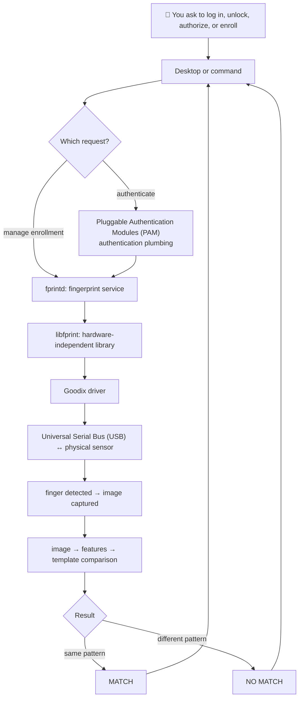

<!-- SPDX-License-Identifier: GPL-2.0-or-later -->
# 🎓 Goodix Behind the Scenes

You touch a small piece of glass. A moment later, Linux lets you in. What
happened between those two moments?

This is an **educational guide, not the canonical technical specification**.
It deliberately starts with simple pictures and adds detail slowly. For exact
protocol facts, evidence, provenance, and current engineering state, use the
[canonical technical manual](../../TECHNICAL_MANUAL.md). This guide describes
the repository's tested Fedora 44 KDE configuration and Goodix `27c6:5125`
reader; it does not claim that every Linux computer works identically.

## The whole story in one picture

Enrollment takes the same trip but saves a reusable representation instead of
asking for a yes/no answer.

## Reading path

1. [What are we building?](01_what_are_we_building.md)
2. [From Fedora to the sensor](02_from_fedora_to_the_sensor.md)
3. [How Linux talks to Goodix](03_how_linux_talks_to_goodix.md)
4. [Waking and preparing the sensor](04_waking_up_and_preparing_the_sensor.md)
5. [Waiting for a finger](05_waiting_for_a_finger.md)
6. [From finger to image](06_from_finger_to_image.md)
7. [From image to fingerprint](07_from_image_to_fingerprint.md)
8. [Enrollment](08_enrollment.md)
9. [Verification and matching](09_verification_and_matching.md)
10. [Login, sudo, PolicyKit, and the lock screen](10_login_sudo_polkit_and_lockscreen.md)
11. [What is stored, and where?](11_what_is_stored_and_where.md)
12. [Safety and factory preservation](12_safety_and_factory_preservation.md)
13. [Glossary](glossary.md)

Each chapter ends with a link forward. You can stop after any chapter and
still keep the simpler picture.

[Start chapter 1 →](01_what_are_we_building.md)
