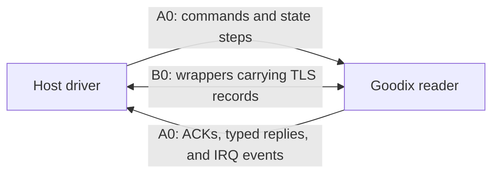

<!-- SPDX-License-Identifier: GPL-2.0-or-later -->
# 🔬 Appendix — The real Goodix conversation

*What `A8`, `E4`, `D1`, `D4`, and friends actually mean*

Chapter 3 describes preparation as:

```text
identify → validate → configure for this session → encrypt → calibrate → arm
```

This optional appendix opens that box one level further. It follows the
current implementation for the Goodix `27c6:5125` reader with
`GF_ST411SEC_APP_12509` firmware. It is a learning aid, not a protocol
specification or a recipe for other devices.

> [!IMPORTANT]
> The descriptions below explain public phase labels, ordering, and checks.
> They contain no PSK, protected blob, biometric data, raw capture, or private
> material. The [Technical manual](../../TECHNICAL_MANUAL.md) remains the
> canonical public specification.

## First: `A8` is a number, not an acronym

Labels such as `A8`, `E4`, `A2`, `82`, and `D1` are principally numeric
command or control values written in **hexadecimal**.

Hexadecimal uses:

```text
0 1 2 3 4 5 6 7 8 9 A B C D E F
```

The `0x` prefix simply says, "this number is written in hexadecimal":

```text
A8 == 0xA8
```

A useful mental translation is **"Goodix command number A8."** Names such as
`REENTRY_RECOVERY_A2` or `CONFIG_90` are driver phase names that add context
to a numeric command. `TLS` and `FDT` name larger processes rather than single
command numbers.

> [!TIP]
> You do not need to memorize `A8`, `E4`, `D1`, or any other command value to
> use or understand the project. Their value is that they show the reader is
> not a magic black box: the driver follows a specific, checked conversation
> to move the sensor from "connected" to "ready for a finger."

## The whole conversation at a glance

After the USB interface is claimed and the bounded receive synchronization is
complete, the current driver follows this order:

```text
host / driver
    │
    ├─ A2   project re-entry preparation
    ├─ A8   confirm exact APP12509 target
    ├─ E4   validate expected compatibility binding
    ├─ A2   first known manufacturer cold-start preparation
    ├─ 82   read and check a four-byte target-bound response
    ├─ A6   read and check a 64-byte factory/OTP-related response
    ├─ A2   second known manufacturer cold-start preparation
    ├─ 70   select runtime mode
    ├─ 80   apply tuning value for register 0x0220
    ├─ 80   apply tuning value for register 0x0236
    ├─ 80   apply tuning value for register 0x0238
    ├─ 80   apply tuning value for register 0x023A
    ├─ 90   send the 224-byte runtime configuration block
    ├─ D1   transition from A0 commands into B0/TLS
    ├─ TLS  establish the protected channel
    ├─ D4   begin the post-TLS working sequence
    ├─ AF   query and validate reader-controller state
    ├─ FDT  gather fresh detection data and a no-finger baseline
    ├─ 32   arm finger-down detection
    └─ wait for a physical finger
```

This is an ordered state machine, not a bag of independent commands. The same
number can appear in different contexts, and a correct reply for one phase is
not automatically valid in another.

## How one checked step works

Most pre-TLS commands travel in an `A0` message. That message contains a
control value, a bounded body (its payload contents), length information, and
a checksum. The driver checks all of those pieces.

Many phases then receive two different kinds of reply:

1. an **ACK**, or acknowledgement, that echoes the command and reports an
   allowed status;
2. a **typed reply** carrying the phase-specific result that the driver must
   validate.

Not every step has both. Runtime mode `0x70` and the four `0x80` tuning steps
are ACK-only. `D1` is different again: it does not receive an ordinary `A0`
ACK, because the next expected conversation is a `B0`-wrapped TLS ClientHello.

The lesson is simple: "the sensor answered" is not enough. It must answer in
the right class, order, shape, and phase.

## Before TLS: prepare, identify, and configure

### `A2` appears three times

The current secure-session state machine uses command `A2` for three named
phases:

- `REENTRY_RECOVERY_A2` before identification;
- `OEM_COLD_START_A2_1` during cold-start preparation;
- `OEM_COLD_START_A2_2` later in that preparation.

OEM means original equipment manufacturer. Here it marks the cold-start
sequence known from the reader manufacturer's compatible path.

The repeated command is intentional. The implementation gives the first phase
a separate name because it is a bounded project re-entry policy, not an
assertion that it is identical in purpose to both OEM cold-start phases. Each
use must receive the expected ACK and the same target-pinned typed response.

The code does not call a USB reset, clear a halt, retry the phase, or issue a
factory-write primitive here. It therefore presents `A2` as temporary session
preparation—not as a destructive factory reset. The label does not claim that
the reader's undocumented internal mechanism is fully known.

### `A8`: confirm the expected target

`A8` asks for the target identity. The driver accepts only the exact
`GF_ST411SEC_APP_12509` reply.

Think of this as checking the model and firmware label before following a
device-specific instruction book. Continuing with a merely similar reader
would make every later assumption less trustworthy.

### `E4`: validate an existing compatibility binding

Before the session starts, the runtime derives an expected **validator** from
the user's already validated protected material. At `E4`, the reader's typed
reply must contain that exact validator and match its stored cryptographic
digest—a compact fingerprint of the expected bytes.

Two distinctions matter:

```text
validator ≠ PSK
checking existing protected material ≠ replacing or provisioning it
```

The validator is evidence that the current inputs fit the expected reader/OEM
compatibility path. The PSK is the pre-existing secret later used by TLS. The
project publishes neither value and changes neither one.

An everyday analogy is checking that an existing key fits the expected lock
without copying the key into the manual or replacing the lock.

### Pre-TLS `0x82`: a target-bound read, not a proven chip ID

The phase name in the code is `CHIP_82`. What the implementation actually
proves is narrower:

- it sends the expected `0x82` request at this exact point;
- it requires a four-byte typed response;
- it accepts that body only when its cryptographic digest matches the expected
  value stored in the reader-specific manifest.

That is enough to make the response a useful target-bound check. It is not
enough to prove the four bytes are an immutable silicon identifier. The guide
therefore avoids the attractive but stronger nickname "chip ID."

There is another `0x82` later during FDT preparation. That later reply supplies
a detection threshold and has a different shape. The shared command number
does not make the two phases interchangeable.

### `A6`: read factory/OTP-related information

OTP means **one-time programmable** memory: factory information designed for
restricted or one-time programming. The `OTP_A6` phase reads a 64-byte typed
response and requires its digest to match the manifest.

The public evidence supports the careful description "factory/OTP-related
response." It does not require guessing the meaning of every byte.

```text
read and validate expected factory information ✓
write or reprovision factory information        ✗
```

### `0x70`, four `0x80` steps, and `0x90`

These phases prepare the reader for the current operating path:

- `MODE_70` selects the required runtime mode and is ACK-only.
- Four `0x80` phases apply validated values to registers `0x0220`, `0x0236`,
  `0x0238`, and `0x023A`. The source calls them DAC tuning phases. A
  digital-to-analog converter (DAC) is like an electronic adjustment knob,
  although the exact physical effect of each value is not claimed here.
- `CONFIG_90` sends the validated 224-byte runtime configuration block. The
  driver has already checked its digest, arithmetic finalizer, and consistency
  with the four tuning values.

These are session/runtime operations. Sending a validated working
configuration is different from rewriting firmware, OTP, identity, or other
permanent factory state.

## `D1` and TLS: build the protected conversation

`D1` is the boundary between the ordinary pre-TLS `A0` sequence and secure
transport. It is not followed by an ordinary `A0` acknowledgement. The driver
instead expects a `B0` message containing the reader's TLS ClientHello—the
reader's first handshake message.

For this target:

- TLS version 1.2 creates the encrypted, integrity-checked conversation;
- PSK means pre-shared key;
- the host acts as the TLS server;
- the reader acts as the TLS client;
- the project uses the existing PSK rather than generating or provisioning a
  replacement.

The driver advances from `D1` only after the TLS engine has processed enough
of that ClientHello to produce the server's first handshake response. It then
completes the handshake through `B0` wrappers, keeps the same TLS engine alive,
waits for outgoing USB work to drain, and hands the same connection to the
post-TLS lifecycle.

## After TLS: `D4`, `AF`, and FDT

### `D4`: begin the post-TLS sequence

`D4` is the first Goodix control command after the cryptographic handshake is
complete. The current code proves its exact ordering, bounded timing, shape,
and acknowledgement. "Begin the post-TLS working sequence" is intentionally
more cautious than inventing an undocumented register-level meaning.

The command affects the current session path; this project does not present it
as a permanent device write.

### `AF`: query the reader controller's state

After the `D4` acknowledgement, the driver sends `AF` and expects a typed `AE`
reply with the required shape and state flags.

MCU means **microcontroller unit**: the tiny processor controlling the reader.
A useful mental translation is:

> "Reader, tell me whether your controller is in the state this path expects."

The code validates the conditions it needs. The guide does not assign names to
every undocumented bit.

### FDT is a bootstrap sequence, not one magic command

FDT means finger detection. Its job is to prepare the lightweight "doorbell"
that notices a contact before the driver requests a full image.

An interrupt request (IRQ) is the reader announcing that an event happened.
`NAV` is the implementation's label for a navigation-shaped sensor response.

The current bootstrap can be read as:

```text
0x36 + current table → IRQ 0x0100 → first fresh detection reading
0x50 / NAV           → navigation-shaped state response
0x36                 → IRQ 0x0100 → second fresh detection reading
post-TLS 0x82        → obtain a threshold and classify the first delta
0x20                 → receive a B0/TLS no-finger baseline image
0x36                 → IRQ 0x0100 → third fresh detection reading
compare readings     → require the second delta to pass its check
0x32                 → arm finger-down detection
```

The initial table comes from validated host material, but the driver gathers
fresh readings for the current session. It derives detection tables, checks
the measured differences against the returned threshold, decodes the baseline
through the normal protected image path, and arms only after those gates pass.

Once armed, the visible capture cycle continues:

```text
IRQ 0x0002  finger down
0x22        request an image
B0 / TLS    receive and decode the protected image
0x34        begin the release sequence
IRQ 0x0200  finger up; derive a fresh down table for a possible re-arm
0x20 + B0   complete the post-up protected-data step
0x50 / NAV  finish the release tail
```

Chapter 4 explains that capture and release journey without requiring these
numbers.

## Two logical paths share one ordered lifecycle

Starting TLS does **not** mean every later Goodix message becomes ordinary TLS
application data.



After the handshake, commands such as `D4`, `AF`, `0x36`, `0x20`, and `0x32`
remain checked Goodix `A0` control messages. When the reader sends the
no-finger baseline, fingerprint image, or post-up protected data, `B0` carries
TLS records into the same established TLS engine.

The two paths are not independent sessions. They are two message classes
coordinated by one state machine, one continuous period of USB ownership, and
one TLS session.

## Evidence first: why the names stay cautious

Reverse engineering becomes reliable by moving through a chain like this:

```text
observed bytes and ordering
        ↓
repeatable behavior
        ↓
code and static evidence
        ↓
careful semantic label
```

The project distinguishes four levels:

| Level | Beginner meaning | Pre-TLS `0x82` example |
| --- | --- | --- |
| Observed | What appeared in the protocol conversation | A four-byte typed response appears at the expected point. |
| Verified | What current code enforces | Its shape and cryptographic digest must match the expected manifest value. |
| Inferred | A useful interpretation supported by context | It is a target-bound compatibility check. |
| Unknown | A stronger meaning the evidence does not establish | Whether those bytes are an immutable silicon chip ID. |

A convenient nickname is not the same thing as a proven hardware meaning.
Leaving a detail unknown is better engineering than turning a guess into a
fact.

## Compact translation table

| Label | Human mental model |
| --- | --- |
| `A2` | "Perform this known, bounded re-entry or cold-start preparation step." |
| `A8` | "Confirm the exact target firmware I am talking to." |
| `E4` | "Validate the expected existing compatibility binding." |
| pre-TLS `0x82` | "Read and check this four-byte target-bound response." |
| `A6` | "Read the expected factory/OTP-related information." |
| `0x70` | "Select the required runtime mode." |
| `0x80 × 4` | "Apply four validated runtime tuning values." |
| `0x90` | "Send the validated runtime configuration block." |
| `D1` | "Begin the transition into `B0`-wrapped secure transport." |
| TLS | "Build the protected host↔reader conversation using the existing PSK." |
| `D4` | "Begin the checked post-TLS working sequence." |
| `AF` | "Query and validate the reader controller's current state." |
| FDT | "Gather fresh detection data, decode a baseline, and arm finger detection." |

## 🔎 Where this lives in the source

- [`goodix_secure_session.c`](../../libfprint-driver/goodix_secure_session.c)
  defines the pre-TLS phase order, replies, and `D1`/TLS transition.
- [`goodix_post_tls_lifecycle.c`](../../libfprint-driver/goodix_post_tls_lifecycle.c)
  defines `D4`, `AF`, the FDT bootstrap, capture, and release sequence.
- [`goodix_a0_protocol.c`](../../libfprint-driver/goodix_a0_protocol.c)
  builds and validates the `A0` framing used by the control conversation.
- [`goodix_image_decoder.c`](../../libfprint-driver/goodix_image_decoder.c)
  validates and decodes protected baseline and image plaintext after TLS.

---

[← Chapter 3: Preparing the sensor](03_preparing_the_sensor.md) | [Up: Learning home](README.md) | [Continue: From finger detection to image →](04_from_finger_to_image.md)
